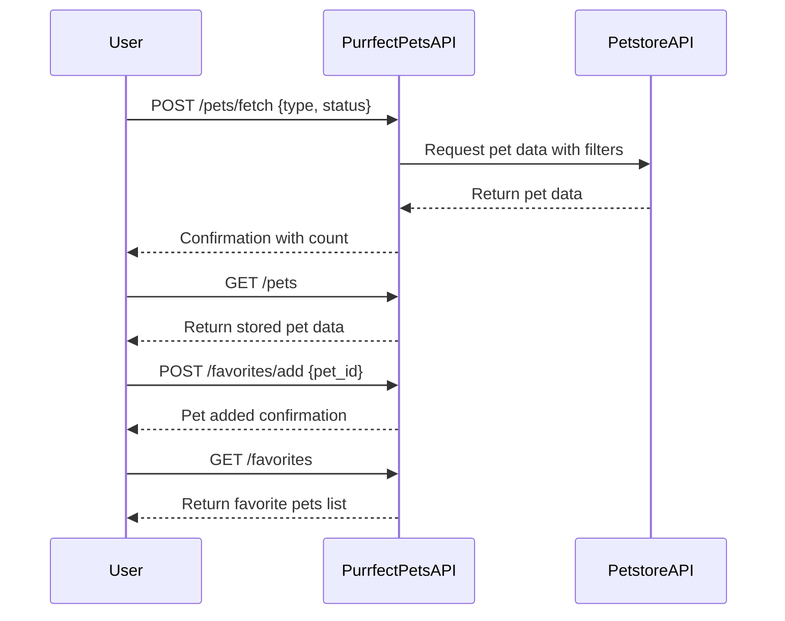

```markdown
# Purrfect Pets API - Functional Requirements

## Overview
The API integrates with the Petstore API to fetch, process, and serve pet data. All external API calls and business logic run in POST endpoints, while GET endpoints serve stored or processed data for retrieval.

---

## API Endpoints

### 1. Fetch Pets Data (POST)
- **Endpoint:** `/pets/fetch`
- **Description:** Retrieves pet data from the Petstore API based on optional filters, processes and stores it internally.
- **Request Body:**  
```json
{
  "type": "string (optional, e.g., 'cat', 'dog')",
  "status": "string (optional, e.g., 'available', 'sold')"
}
```
- **Response:**  
```json
{
  "message": "Pets data fetched and updated successfully",
  "count": "number of pets fetched"
}
```

---

### 2. Get All Pets (GET)
- **Endpoint:** `/pets`
- **Description:** Returns all stored pets data with enriched descriptions or fun facts.
- **Response:**  
```json
[
  {
    "id": "string",
    "name": "string",
    "type": "string",
    "status": "string",
    "description": "string"
  },
  ...
]
```

---

### 3. Add Favorite Pet (POST)
- **Endpoint:** `/favorites/add`
- **Description:** Adds a pet to the user's favorites.
- **Request Body:**  
```json
{
  "pet_id": "string"
}
```
- **Response:**  
```json
{
  "message": "Pet added to favorites"
}
```

---

### 4. Get Favorite Pets (GET)
- **Endpoint:** `/favorites`
- **Description:** Retrieves the list of favorite pets saved by the user.
- **Response:**  
```json
[
  {
    "id": "string",
    "name": "string",
    "type": "string",
    "status": "string",
    "description": "string"
  },
  ...
]
```

---

## User-App Interaction Sequence


```mermaid
sequenceDiagram
    participant User
    participant PurrfectPetsAPI
    participant PetstoreAPI

    User->>PurrfectPetsAPI: POST /pets/fetch {type, status}
    PurrfectPetsAPI->>PetstoreAPI: Request pet data with filters
    PetstoreAPI-->>PurrfectPetsAPI: Return pet data
    PurrfectPetsAPI-->>User: Confirmation with count

    User->>PurrfectPetsAPI: GET /pets
    PurrfectPetsAPI-->>User: Return stored pet data

    User->>PurrfectPetsAPI: POST /favorites/add {pet_id}
    PurrfectPetsAPI-->>User: Pet added confirmation

    User->>PurrfectPetsAPI: GET /favorites
    PurrfectPetsAPI-->>User: Return favorite pets list
```

---

## Notes
- POST endpoints handle external API calls and business logic.
- GET endpoints return cached or processed data without external calls.
- Pet descriptions may include playful facts or enrichment to keep it fun.
```
