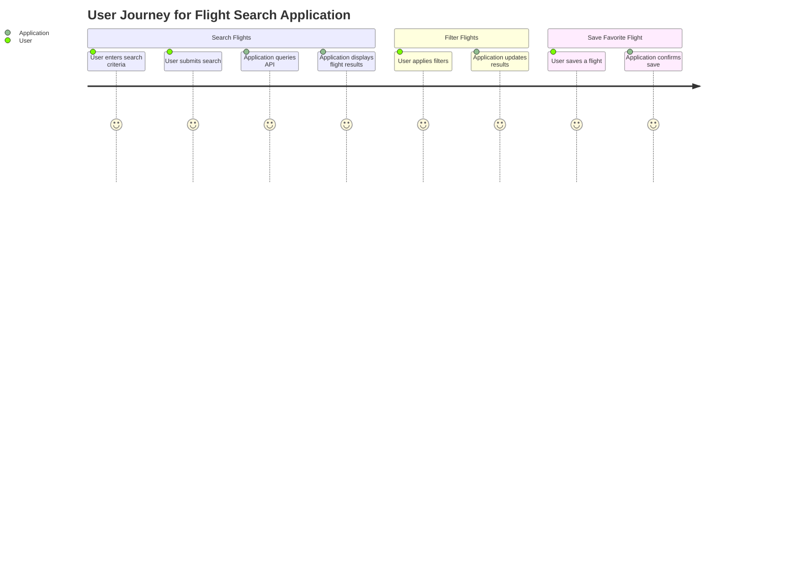

Here are the well-formatted final functional requirements for your flight search application:

### Functional Requirements for Flight Search Application

#### User Stories

1. **Search for Flights**
   - **As a user**, I want to search for flights by specifying:
     - Departure airport (IATA code)
     - Arrival airport (IATA code)
     - Travel dates (departure and return)
     - Number of passengers
   - **Outcome**: Users can find suitable flights based on their criteria.

2. **View Flight Details**
   - **As a user**, I want to view a list of flights that includes:
     - Airline name
     - Flight number
     - Departure and arrival times
     - Price
     - Number of layovers
   - **Outcome**: Users can compare different flight options.

3. **Filter Flight Results**
   - **As a user**, I want to filter flight results by:
     - Price range
     - Airline preference
     - Number of layovers
   - **Outcome**: Users can refine their search to find the best options.

4. **Error Handling**
   - **As a user**, I want to receive clear error messages when:
     - No flights are found
     - There is an issue with the API
   - **Outcome**: Users understand what went wrong during their search.

5. **Save Favorite Flights**
   - **As a user**, I want to save my favorite flights for later reference.
   - **Outcome**: Users can easily access saved flights.

#### API Endpoints

1. **Search Flights**
   - **Endpoint**: `POST /flights/search`
   - **Request Format**:
     ```json
     {
       "departureAirport": "GKA",
       "arrivalAirport": "LAX",
       "departureDate": "2023-12-01",
       "returnDate": "2023-12-10",
       "passengers": 1
     }
     ```
   - **Response Format**:
     ```json
     {
       "flights": [
         {
           "airline": "Airline Name",
           "flightNumber": "1234",
           "departureTime": "2023-12-01T10:00:00Z",
           "arrivalTime": "2023-12-01T15:00:00Z",
           "price": 200.00,
           "layovers": 1
         }
       ],
       "message": "Flights retrieved successfully."
     }
     ```

2. **Get Flight Details**
   - **Endpoint**: `GET /flights/{flightId}`
   - **Response Format**:
     ```json
     {
       "flight": {
         "airline": "Airline Name",
         "flightNumber": "1234",
         "departureTime": "2023-12-01T10:00:00Z",
         "arrivalTime": "2023-12-01T15:00:00Z",
         "price": 200.00,
         "layovers": 1,
         "details": "Additional flight details."
       }
     }
     ```

3. **Filter Flights**
   - **Endpoint**: `GET /flights/filter`
   - **Request Format**:
     ```json
     {
       "priceRange": {
         "min": 100,
         "max": 500
       },
       "airline": "Airline Name",
       "layovers": 0
     }
     ```
   - **Response Format**:
     ```json
     {
       "filteredFlights": [ /* array of flight objects */ ],
       "message": "Filtered flights retrieved successfully."
     }
     ```

4. **Save Favorite Flight**
   - **Endpoint**: `POST /flights/favorites`
   - **Request Format**:
     ```json
     {
       "flightId": "1234"
     }
     ```
   - **Response Format**:
     ```json
     {
       "message": "Flight added to favorites."
     }
     ```

#### User Journey Diagram


```mermaid
journey
    title User Journey for Flight Search Application
    section Search Flights
      User enters search criteria: 5: User
      User submits search: 5: User
      Application queries API: 5: Application
      Application displays flight results: 5: Application
    section Filter Flights
      User applies filters: 5: User
      Application updates results: 5: Application
    section Save Favorite Flight
      User saves a flight: 5: User
      Application confirms save: 5: Application
```

This comprehensive set of functional requirements outlines the user stories, API endpoints, and user interactions for your flight search application. If there are any additional aspects or modifications you'd like to discuss, just let me know!