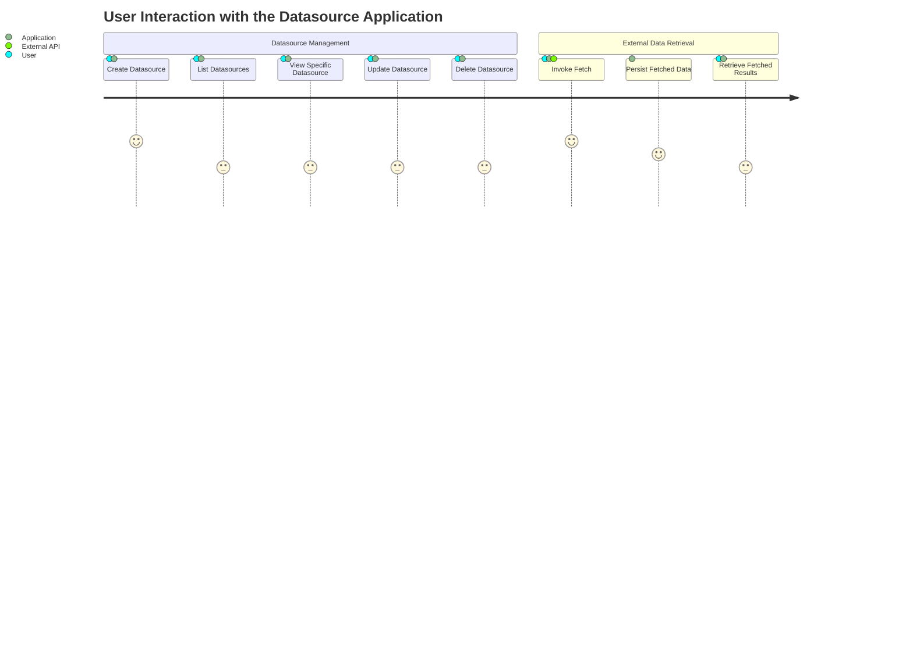
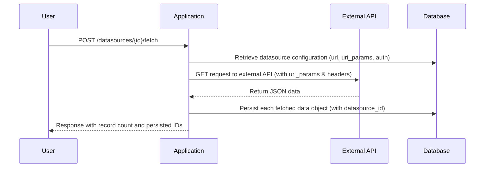

# Functional Requirements Document

## 1. Overview
This document outlines the functional requirements for a backend application that manages datasources and fetches data from external APIs. The application allows users to create, read, update, and delete datasources and to fetch and persist data from external sources.

## 2. API Endpoints

### 2.1 Datasource Management

#### POST /datasources
- **Description:** Create a new datasource.
- **Request Format (JSON):**
  ```json
  {
    "datasource_name": "Example Datasource",
    "url": "http://api.example.com/data",
    "uri_params": { "key1": "value1", "key2": "value2" },
    "Authorization_Header": "Bearer token"
  }
  ```
- **Response Format (JSON):**
  ```json
  {
    "datasource_id": 1,
    "datasource_name": "Example Datasource",
    "url": "http://api.example.com/data",
    "uri_params": { "key1": "value1", "key2": "value2" },
    "Authorization_Header": "Bearer token",
    "created_at": "2023-01-01T12:00:00Z"
  }
  ```

#### GET /datasources
- **Description:** Retrieve all datasources.
- **Response Format (JSON):**
  ```json
  [
    { ...datasource object... },
    { ...datasource object... }
  ]
  ```

#### GET /datasources/{id}
- **Description:** Retrieve a datasource by its ID.
- **Response Format (JSON):**
  ```json
  { ...datasource object... }
  ```

#### PUT /datasources/{id}
- **Description:** Update an existing datasource.
- **Request Format (JSON):** (fields same as POST, only changed values sent)
- **Response Format (JSON):**
  ```json
  { ...updated datasource object... }
  ```

#### DELETE /datasources/{id}
- **Description:** Delete a datasource.
- **Response Format (JSON):**
  ```json
  { "message": "Datasource deleted successfully" }
  ```

### 2.2 External Data Retrieval & Persistence

#### POST /datasources/{id}/fetch
- **Description:** Invoke external API call using the datasource configuration. This endpoint executes business logic, fetches data, and persists each fetched object as a separate entity.
- **Request Format:** No request body is necessary.
- **Response Format (JSON):**
  ```json
  {
    "datasource_id": 1,
    "records_fetched": 10,
    "fetched_data_ids": [101, 102, ..., 110],
    "message": "Data fetched and persisted successfully"
  }
  ```

#### GET /datasources/{id}/fetched_data
- **Description:** Retrieve persisted fetched data records for a given datasource.
- **Response Format (JSON):**
  ```json
  [
    { "fetched_data_id": 101, "datasource_id": 1, "data": { ... }, "fetched_at": "2023-01-01T12:00:00Z" },
    { "fetched_data_id": 102, "datasource_id": 1, "data": { ... }, "fetched_at": "2023-01-01T12:01:00Z" },
    ...
  ]
  ```

## 3. Business Logic Summary
- All external API calls, data retrieval, and any calculations are executed in the `POST /datasources/{id}/fetch` endpoint.
- The `GET` endpoints are strictly used for reading application results (datasource details and fetched data).
- Each object retrieved from an external API call is persisted individually with a reference to the originating datasource.

## 4. User-App Interaction Journey


```mermaid
journey
    title User Interaction with the Datasource Application
    section Datasource Management
      Create Datasource: 5: User, Application
      List Datasources: 3: User, Application
      View Specific Datasource: 3: User, Application
      Update Datasource: 3: User, Application
      Delete Datasource: 3: User, Application
    section External Data Retrieval
      Invoke Fetch: 5: User, Application, External API
      Persist Fetched Data: 4: Application
      Retrieve Fetched Results: 3: User, Application
```

## 5. Sequence Diagram for Data Fetching


```mermaid
sequenceDiagram
    participant U as User
    participant A as Application
    participant E as External API
    participant DB as Database

    U->>A: POST /datasources/{id}/fetch
    A->>DB: Retrieve datasource configuration (url, uri_params, auth)
    A->>E: GET request to external API (with uri_params & headers)
    E-->>A: Return JSON data
    A->>DB: Persist each fetched data object (with datasource_id)
    A-->>U: Response with record count and persisted IDs
```