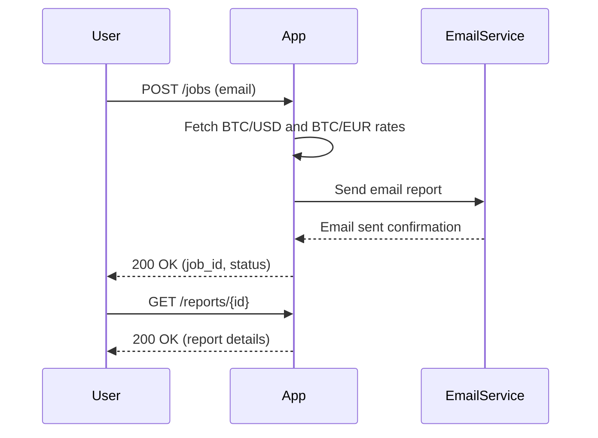

Here are the well-formatted final functional requirements for your project:

### Functional Requirements

#### User Stories

1. **Report Creation**
   - **As a user, I want to initiate the report creation process so that I can receive the latest Bitcoin conversion rates.**
     - **Endpoint**: `POST /jobs`
     - **Request Format**: 
       ```json
       {
         "email": "user@example.com"
       }
       ```
     - **Response Format**: 
       ```json
       {
         "job_id": "12345",
         "status": "processing"
       }
       ```

2. **Retrieve Report**
   - **As a user, I want to retrieve a stored report by its ID so that I can view the conversion rates.**
     - **Endpoint**: `GET /reports/{id}`
     - **Response Format**: 
       ```json
       {
         "id": "12345",
         "btc_usd": "50000",
         "btc_eur": "42000",
         "timestamp": "2023-10-01T12:00:00Z",
         "email": "user@example.com"
       }
       ```

#### API Endpoints

- **POST /jobs**
  - **Description**: Initiates the report creation process.
  - **Request Body**: Contains the user's email.
  - **Response**: Returns a job ID and the status of the report creation process.

- **GET /reports/{id}**
  - **Description**: Retrieves the stored report by its ID.
  - **Response**: Returns the conversion rates along with additional report details.

#### Sequence Diagram


```mermaid
sequenceDiagram
    participant User
    participant App
    participant EmailService

    User->>App: POST /jobs (email)
    App->>App: Fetch BTC/USD and BTC/EUR rates
    App->>EmailService: Send email report
    EmailService-->>App: Email sent confirmation
    App-->>User: 200 OK (job_id, status)

    User->>App: GET /reports/{id}
    App-->>User: 200 OK (report details)
```

### Notes
- Ensure the application handles errors gracefully (e.g., failure to fetch rates, issues sending emails).
- Consider implementing authentication for the endpoints to secure access.
- Define how reports will be stored for retrieval (e.g., in-memory, database).

This structured overview provides a clear guide for your application's functional requirements. If you have further modifications or additions, let me know!