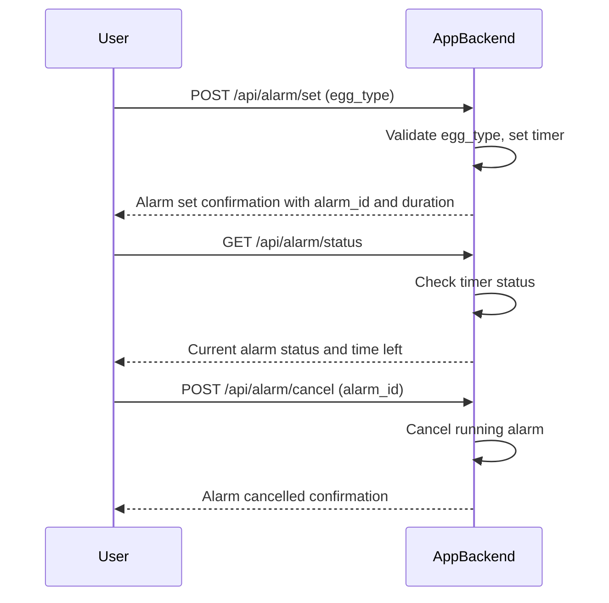
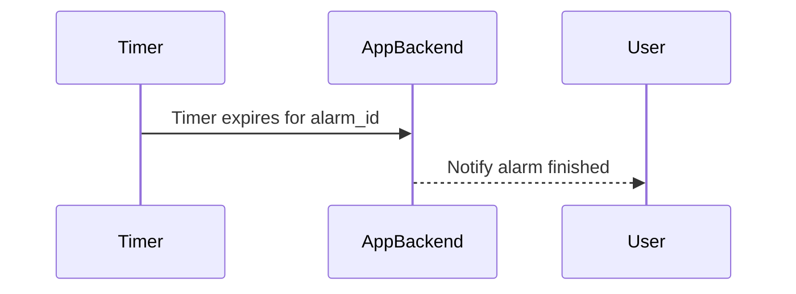

```markdown
# Egg Alarm App - Functional Requirements & API Design

## Functional Requirements
1. User selects egg type: soft-boiled, medium-boiled, or hard-boiled.
2. User sets an alarm based on the selected egg type.
3. Alarm triggers after the predefined cooking time for the egg type.
4. User can retrieve the status of the current alarm (active, time left, or finished).
5. Only one alarm can be active at a time.
6. Alarm timings are fixed per egg type:
   - Soft-boiled: 4 minutes (240 seconds)
   - Medium-boiled: 7 minutes (420 seconds)
   - Hard-boiled: 10 minutes (600 seconds)

---

## API Endpoints

### 1. Set Alarm (POST)
**URL:** `/api/alarm/set`

**Request Body:**
```json
{
  "egg_type": "soft" | "medium" | "hard"
}
```

**Response:**
```json
{
  "status": "success",
  "message": "Alarm set for soft-boiled egg",
  "alarm_id": "string",
  "duration_seconds": 240
}
```

---

### 2. Get Alarm Status (GET)  
**URL:** `/api/alarm/status`

**Response:**
```json
{
  "alarm_id": "string",
  "egg_type": "soft" | "medium" | "hard",
  "time_left_seconds": 180,
  "status": "active" | "finished" | "none"
}
```

---

### 3. Cancel Alarm (POST)  
**URL:** `/api/alarm/cancel`

**Request Body:**
```json
{
  "alarm_id": "string"
}
```

**Response:**
```json
{
  "status": "success",
  "message": "Alarm cancelled"
}
```

---

## User-App Interaction Sequence


```mermaid
sequenceDiagram
    participant User
    participant AppBackend

    User->>AppBackend: POST /api/alarm/set (egg_type)
    AppBackend->>AppBackend: Validate egg_type, set timer
    AppBackend-->>User: Alarm set confirmation with alarm_id and duration

    User->>AppBackend: GET /api/alarm/status
    AppBackend->>AppBackend: Check timer status
    AppBackend-->>User: Current alarm status and time left

    User->>AppBackend: POST /api/alarm/cancel (alarm_id)
    AppBackend->>AppBackend: Cancel running alarm
    AppBackend-->>User: Alarm cancelled confirmation
```

---

## Alarm Trigger Flow


```mermaid
sequenceDiagram
    participant Timer
    participant AppBackend
    participant User

    Timer->>AppBackend: Timer expires for alarm_id
    AppBackend-->>User: Notify alarm finished
```
```