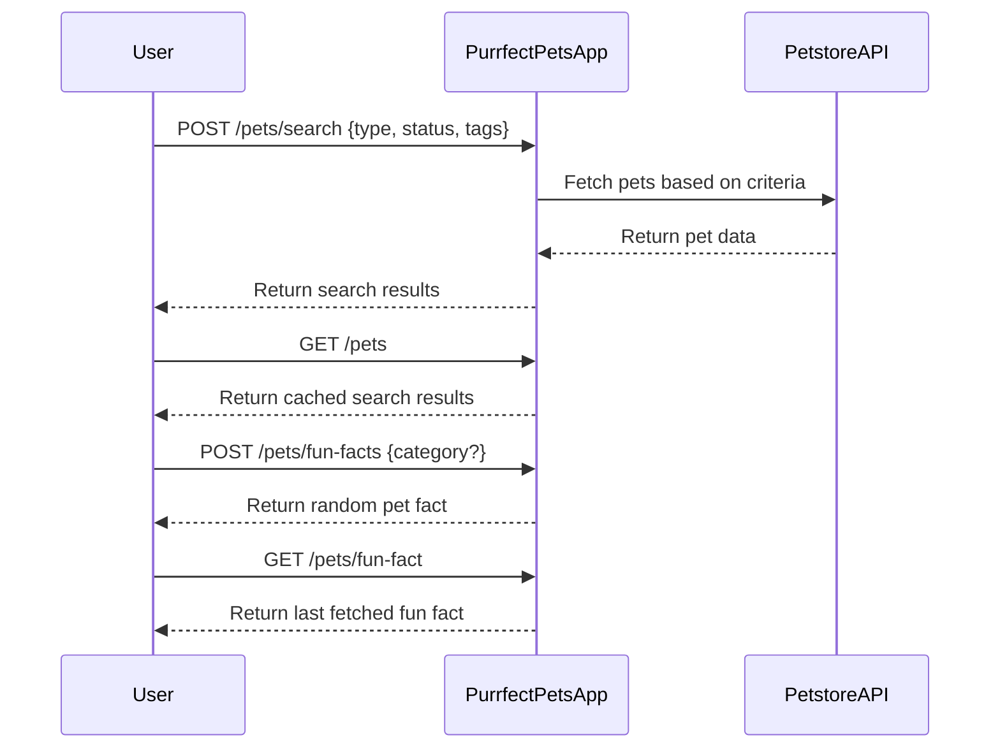
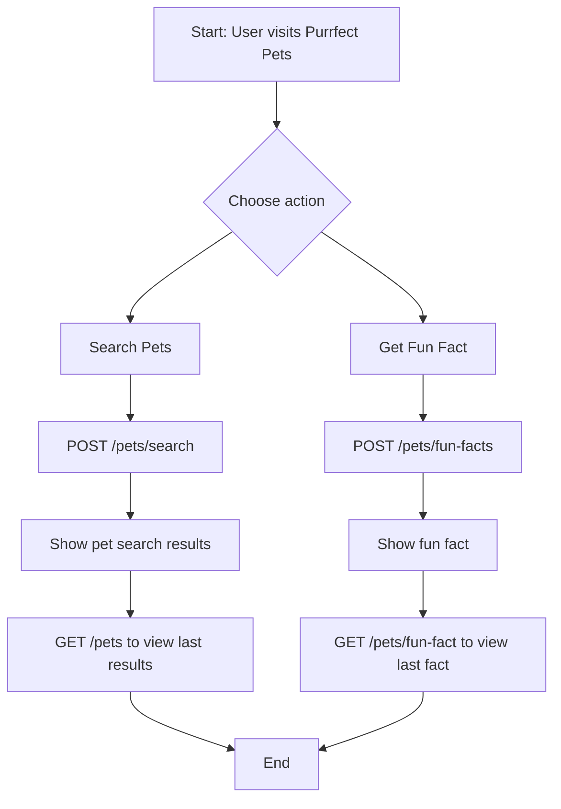

```markdown
# Purrfect Pets API - Functional Requirements

## API Endpoints

### 1. `POST /pets/search`
- **Description:** Search pets based on criteria by invoking Petstore API.
- **Request:**
  ```json
  {
    "type": "string",          // e.g., "dog", "cat", optional
    "status": "string",        // e.g., "available", "sold", optional
    "tags": ["string"]         // optional list of tags
  }
  ```
- **Response:**
  ```json
  {
    "pets": [
      {
        "id": "integer",
        "name": "string",
        "type": "string",
        "status": "string",
        "tags": ["string"]
      },
      ...
    ]
  }
  ```

### 2. `POST /pets/fun-facts`
- **Description:** Retrieve a random fun fact related to pets.
- **Request:** Empty or optional category filter
  ```json
  {
    "category": "string"  // optional, e.g., "cats", "dogs"
  }
  ```
- **Response:**
  ```json
  {
    "fact": "string"
  }
  ```

### 3. `GET /pets`
- **Description:** Retrieve cached or last searched pet data for the user session.
- **Response:**
  ```json
  {
    "pets": [
      {
        "id": "integer",
        "name": "string",
        "type": "string",
        "status": "string",
        "tags": ["string"]
      },
      ...
    ]
  }
  ```

### 4. `GET /pets/fun-fact`
- **Description:** Retrieve the last fetched fun fact for the user session.
- **Response:**
  ```json
  {
    "fact": "string"
  }
  ```

---

## User-App Interaction Sequence Diagram


```mermaid
sequenceDiagram
    participant User
    participant PurrfectPetsApp
    participant PetstoreAPI

    User->>PurrfectPetsApp: POST /pets/search {type, status, tags}
    PurrfectPetsApp->>PetstoreAPI: Fetch pets based on criteria
    PetstoreAPI-->>PurrfectPetsApp: Return pet data
    PurrfectPetsApp-->>User: Return search results

    User->>PurrfectPetsApp: GET /pets
    PurrfectPetsApp-->>User: Return cached search results

    User->>PurrfectPetsApp: POST /pets/fun-facts {category?}
    PurrfectPetsApp-->>User: Return random pet fact

    User->>PurrfectPetsApp: GET /pets/fun-fact
    PurrfectPetsApp-->>User: Return last fetched fun fact
```

---

## User Journey Diagram


```mermaid
flowchart TD
    A[Start: User visits Purrfect Pets] --> B{Choose action}
    B --> C[Search Pets]
    B --> D[Get Fun Fact]
    C --> E[POST /pets/search]
    E --> F[Show pet search results]
    F --> G[GET /pets to view last results]
    D --> H[POST /pets/fun-facts]
    H --> I[Show fun fact]
    I --> J[GET /pets/fun-fact to view last fact]
    G --> K[End]
    J --> K
```
```