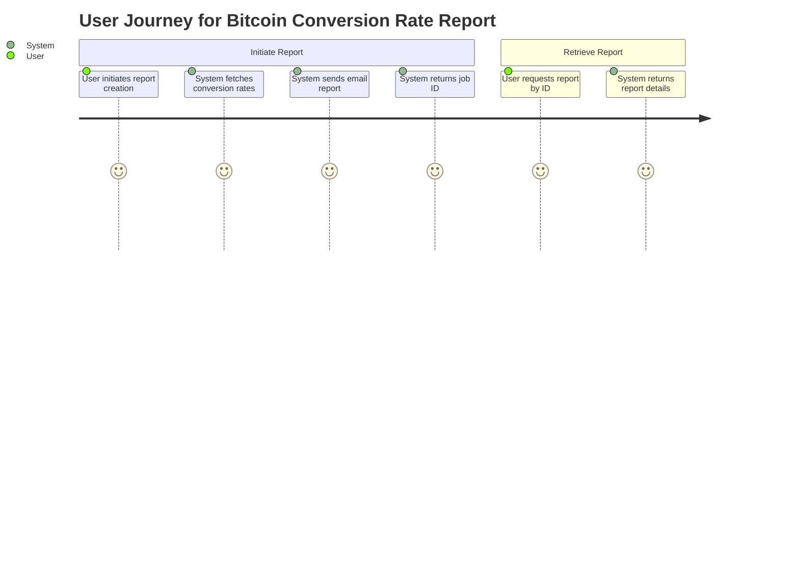

Here’s a well-formatted outline of the final functional requirements for your application:

---

## Functional Requirements for Bitcoin Conversion Rate Report Application

### User Stories

1. **User Story 1: Initiate Report Creation**
   - **Description**: As a user, I want to initiate the report creation process so that I can receive the latest Bitcoin conversion rates via email.
   - **Acceptance Criteria**:
     - The user sends a POST request to `/job`.
     - The system fetches the latest BTC/USD and BTC/EUR rates.
     - The system sends an email report to the user.
     - The response includes a job ID and a success message.

2. **User Story 2: Retrieve Report**
   - **Description**: As a user, I want to retrieve the report by its ID so that I can view the conversion rates that were sent in the email.
   - **Acceptance Criteria**:
     - The user sends a GET request to `/report/{id}`.
     - The system returns the report details, including conversion rates and the timestamp.
     - If the report ID does not exist, the system returns a 404 error.

### API Endpoints

1. **POST /job**
   - **Request Format**:
     - **Body**: 
       ```json
       {
         "email": "user@example.com"
       }
       ```
   - **Response Format**:
     - **Success**: 
       ```json
       {
         "job_id": "12345",
         "message": "Report creation initiated."
       }
       ```
     - **Error**: 
       ```json
       {
         "error": "Error message"
       }
       ```

2. **GET /report/{id}**
   - **Request Format**:
     - **URL**: `/report/12345`
   - **Response Format**:
     - **Success**: 
       ```json
       {
         "id": "12345",
         "timestamp": "2023-10-01T12:00:00Z",
         "btc_usd": 50000,
         "btc_eur": 42000
       }
       ```
     - **Error**: 
       ```json
       {
         "error": "Report not found."
       }
       ```

### Visual Representations

#### User Journey Diagram


```mermaid
journey
    title User Journey for Bitcoin Conversion Rate Report
    section Initiate Report
      User initiates report creation: 5: User
      System fetches conversion rates: 5: System
      System sends email report: 5: System
      System returns job ID: 5: System
    section Retrieve Report
      User requests report by ID: 5: User
      System returns report details: 5: System
```

#### Sequence Diagram

```mermaid
sequenceDiagram
    participant User
    participant API
    participant EmailService
    participant RateService

    User->>API: POST /job
    API->>RateService: Fetch BTC/USD and BTC/EUR rates
    RateService-->>API: Return rates
    API->>EmailService: Send email report
    EmailService-->>API: Email sent confirmation
    API-->>User: Return job ID and success message

    User->>API: GET /report/{id}
    API--