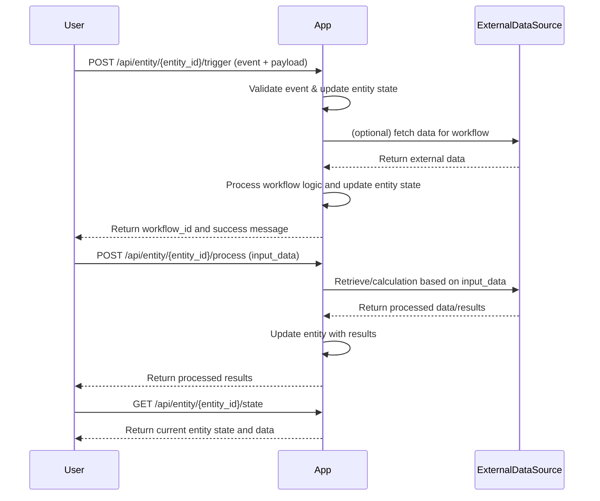

```markdown
# Functional Requirements for Project

## API Endpoints

### 1. Trigger Workflow (POST `/api/entity/{entity_id}/trigger`)
- **Purpose**: Trigger the workflow of an entity by sending an event that may include external data or parameters.
- **Request Format** (JSON):
  ```json
  {
    "event_type": "string",          // Type of event triggering the workflow
    "payload": {                     // Optional data relevant to the event
      "key1": "value1",
      "key2": "value2"
    }
  }
  ```
- **Response Format** (JSON):
  ```json
  {
    "status": "success",
    "message": "Workflow triggered",
    "workflow_id": "string"          // Identifier of the workflow instance triggered
  }
  ```

### 2. Get Entity State (GET `/api/entity/{entity_id}/state`)
- **Purpose**: Retrieve the current state and data of the entity after workflow execution(s).
- **Request Parameters**: 
  - `entity_id` (path) — identifier of the entity
- **Response Format** (JSON):
  ```json
  {
    "entity_id": "string",
    "current_state": "string",
    "data": {                       // Current data/state of the entity
      "key1": "value1",
      "key2": "value2"
    },
    "last_updated": "ISO8601 timestamp"
  }
  ```

### 3. Submit Data for Processing (POST `/api/entity/{entity_id}/process`)
- **Purpose**: Submit external data or parameters that require business logic processing (e.g., data retrieval, calculations).
- **Request Format** (JSON):
  ```json
  {
    "input_data": {
      "param1": "value1",
      "param2": "value2"
    }
  }
  ```
- **Response Format** (JSON):
  ```json
  {
    "status": "success",
    "result": {                      // Results of processing or calculations
      "output1": "value1",
      "output2": "value2"
    }
  }
  ```

---

## User-App Interaction Sequence Diagram


```mermaid
sequenceDiagram
    participant User
    participant App
    participant ExternalDataSource

    User->>App: POST /api/entity/{entity_id}/trigger (event + payload)
    App->>App: Validate event & update entity state
    App->>ExternalDataSource: (optional) fetch data for workflow
    ExternalDataSource-->>App: Return external data
    App->>App: Process workflow logic and update entity state
    App-->>User: Return workflow_id and success message

    User->>App: POST /api/entity/{entity_id}/process (input_data)
    App->>ExternalDataSource: Retrieve/calculation based on input_data
    ExternalDataSource-->>App: Return processed data/results
    App->>App: Update entity with results
    App-->>User: Return processed results

    User->>App: GET /api/entity/{entity_id}/state
    App-->>User: Return current entity state and data
```
```