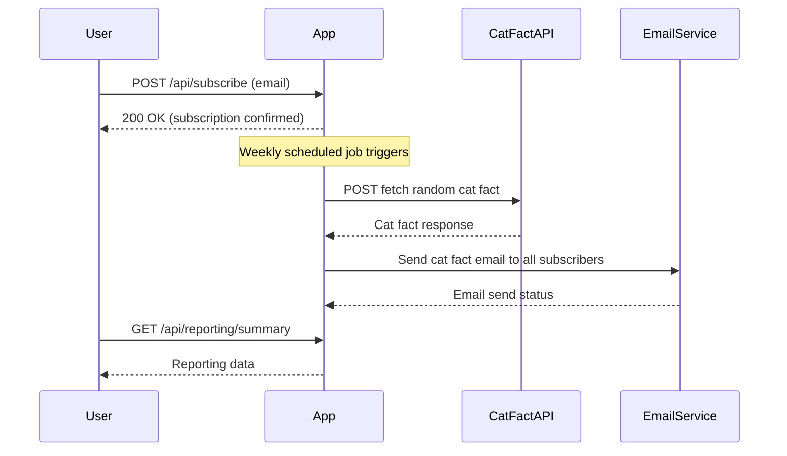

```markdown
# Functional Requirements for Weekly Cat Fact Subscription Application

## Overview
An application that sends subscribers a new cat fact every week using the Cat Fact API. It includes data ingestion, user interaction, publishing, and reporting features.

---

## Functional Requirements

1. **User Sign-up**  
   - Users can subscribe by submitting their email address.
   - No authentication or profile management required.

2. **Weekly Data Ingestion**  
   - Once a week, the system fetches a new cat fact from the Cat Fact API (https://catfact.ninja/#/Facts/getRandomFact).

3. **Publishing**  
   - The same weekly cat fact is sent via email to all subscribers on a fixed schedule.

4. **Reporting**  
   - The system tracks and reports the total number of subscribers.
   - Tracks the number of emails sent.
   - (Optional) Tracks user interactions such as email opens and clicks.

---

## API Endpoints

### 1. Subscribe User

- **POST** `/api/subscribe`  
- Request Body:
  ```json
  {
    "email": "user@example.com"
  }
  ```
- Response Body:
  ```json
  {
    "message": "Subscription successful",
    "subscriberId": "uuid-string"
  }
  ```

### 2. Fetch Cat Fact and Send Emails

- **POST** `/api/fetch-and-send`  
- Triggered once a week (e.g., by scheduler).  
- Request Body:
  ```json
  {}
  ```
- Response Body:
  ```json
  {
    "message": "Cat fact fetched and emails sent",
    "fact": "Cats have five toes on their front paws..."
  }
  ```

### 3. Reporting Summary

- **GET** `/api/reporting/summary`  
- Response Body:
  ```json
  {
    "totalSubscribers": 100,
    "emailsSent": 200,
    "emailsOpened": 50,
    "clicks": 20
  }
  ```

---

## User-App Interaction Sequence


```mermaid
sequenceDiagram
    participant User
    participant App
    participant CatFactAPI
    participant EmailService

    User->>App: POST /api/subscribe (email)
    App-->>User: 200 OK (subscription confirmed)

    Note over App: Weekly scheduled job triggers

    App->>CatFactAPI: POST fetch random cat fact
    CatFactAPI-->>App: Cat fact response

    App->>EmailService: Send cat fact email to all subscribers
    EmailService-->>App: Email send status

    User->>App: GET /api/reporting/summary
    App-->>User: Reporting data
```
```
If you’re happy with this, we can proceed to implementation!