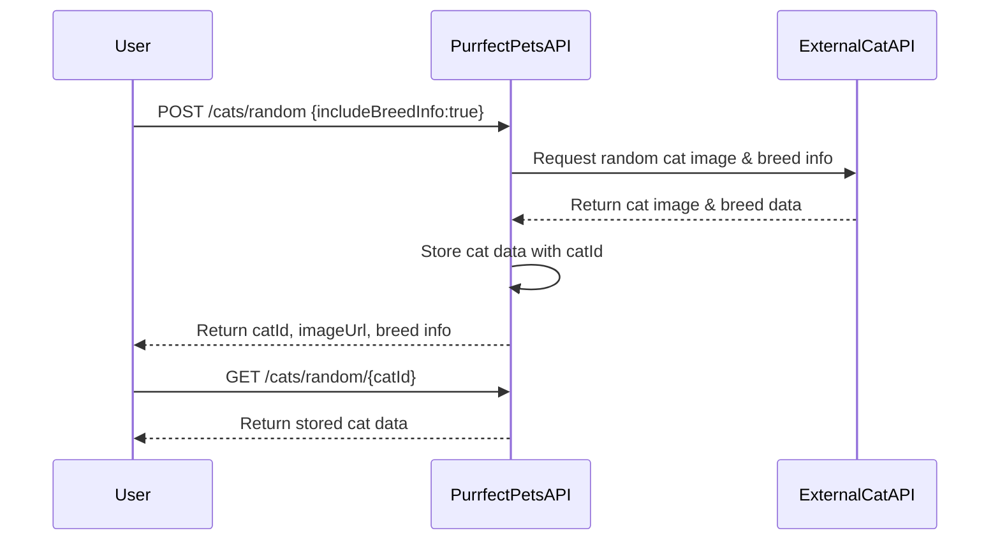

```markdown
# Purrfect Pets API - Functional Requirements

## Overview
The API provides random cat images and detailed breed information. It follows RESTful principles where:
- `POST` endpoints trigger business logic (e.g., fetch data from external sources).
- `GET` endpoints retrieve stored results.

---

## API Endpoints

### 1. Fetch Random Cat Image and Breed Info  
**POST** `/cats/random`  
Triggers retrieval of a random cat image and breed info from external sources.

**Request:**
```json
{
  "includeBreedInfo": true  // optional, default true
}
```

**Response:**
```json
{
  "catId": "abc123",
  "imageUrl": "https://example.com/cat.jpg",
  "breed": {
    "name": "Siberian",
    "origin": "Russia",
    "temperament": "Playful, Loyal, Intelligent",
    "description": "The Siberian cat is a domestic breed..."
  }
}
```

---

### 2. Retrieve Last Fetched Cat Data  
**GET** `/cats/random/{catId}`  
Returns the last fetched cat image and breed info by `catId`.

**Response:**
```json
{
  "catId": "abc123",
  "imageUrl": "https://example.com/cat.jpg",
  "breed": {
    "name": "Siberian",
    "origin": "Russia",
    "temperament": "Playful, Loyal, Intelligent",
    "description": "The Siberian cat is a domestic breed..."
  }
}
```

---

## Business Logic Notes
- The `POST /cats/random` endpoint calls external APIs (e.g., TheCatAPI) to fetch live data.
- Responses are cached/stored with a unique `catId` for retrieval via `GET`.
- No user authentication or interaction is required.

---

## User-App Interaction Sequence


```mermaid
sequenceDiagram
    participant User
    participant PurrfectPetsAPI
    participant ExternalCatAPI

    User->>PurrfectPetsAPI: POST /cats/random {includeBreedInfo:true}
    PurrfectPetsAPI->>ExternalCatAPI: Request random cat image & breed info
    ExternalCatAPI-->>PurrfectPetsAPI: Return cat image & breed data
    PurrfectPetsAPI->>PurrfectPetsAPI: Store cat data with catId
    PurrfectPetsAPI-->>User: Return catId, imageUrl, breed info

    User->>PurrfectPetsAPI: GET /cats/random/{catId}
    PurrfectPetsAPI-->>User: Return stored cat data
```
```