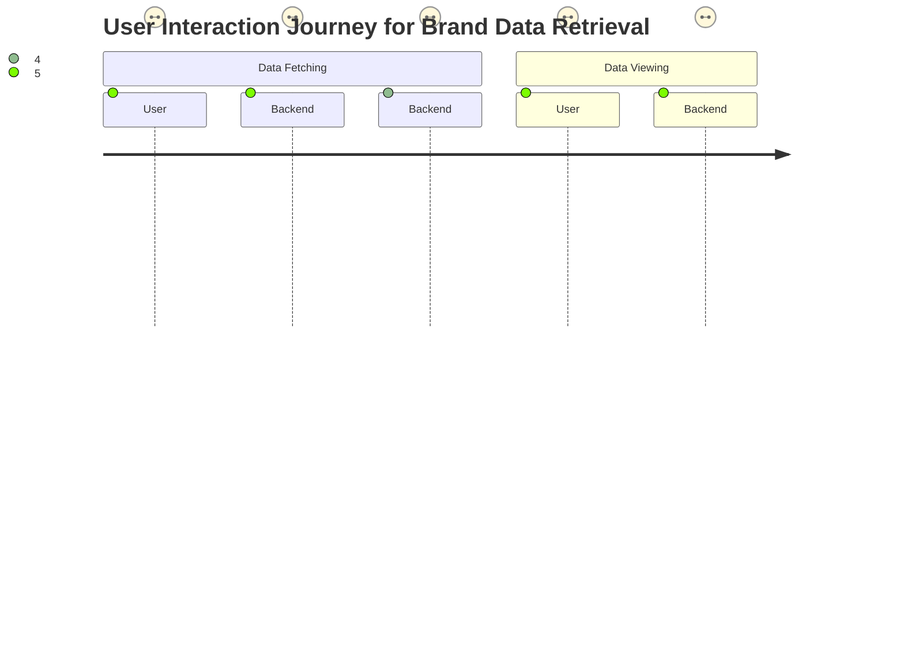
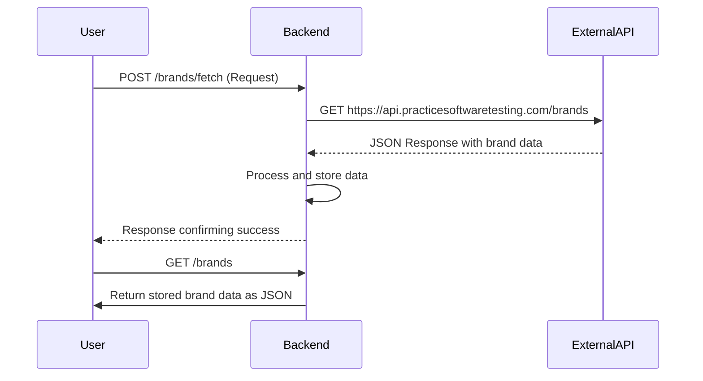

# Functional Requirements Specification

## Overview
The application is designed to retrieve brand data from an external API and display it through a RESTful interface. All external API interactions and business logic to compute or retrieve data must be implemented within POST endpoints, while GET endpoints are solely used for retrieving and displaying the results stored within the application.

## API Endpoints

### 1. POST /brands/fetch
- **Purpose:**  
  Invoke the external API to retrieve brand data and process it within the application.

- **Request Format:**
  - **URL:** `/brands/fetch`
  - **Method:** POST
  - **Headers:**  
    - `Content-Type: application/json`
  - **Body (optional):**  
    An empty JSON object can be sent if no parameters are needed, e.g., `{}`.

- **Processing:**  
  - Validate the request (if any parameters are provided).
  - Trigger an external API call to `https://api.practicesoftwaretesting.com/brands`.
  - Retrieve and parse the JSON response.
  - Optionally, store the data in an internal data store for subsequent retrieval.
  - Handle errors (e.g., API downtime or unexpected responses) and respond with appropriate error messages and HTTP status codes.

- **Response Format:**
  - **Success (HTTP 200 or 201):**  
    ```json
    {
      "status": "success",
      "message": "External data retrieved and processed successfully."
    }
    ```
  - **Error (HTTP 400/500):**  
    ```json
    {
      "status": "error",
      "message": "Detailed error message describing the issue."
    }
    ```

### 2. GET /brands
- **Purpose:**  
  Retrieve the processed/stored brand data from the application.

- **Request Format:**
  - **URL:** `/brands`
  - **Method:** GET

- **Response Format:**
  - **Success (HTTP 200):**  
    ```json
    [
      {
        "id": "01JMWZK3N7PT3XMTMXMQTBACRV",
        "name": "ForgeFlex Tools",
        "slug": "forgeflex-tools"
      },
      {
        "id": "01JMWZK3N7PT3XMTMXMQTBACRW",
        "name": "MightyCraft Hardware",
        "slug": "mightycraft-hardware"
      }
    ]
    ```
  - **Error (in case data is not available or another issue arises):**  
    ```json
    {
      "status": "error",
      "message": "Data retrieval error message."
    }
    ```

## User-App Interaction Diagrams

### User Journey Diagram

```mermaid
journey
    title User Interaction Journey for Brand Data Retrieval
    section Data Fetching
      User: Initiates POST /brands/fetch: 5: Backend triggers external API call
      Backend: Retrieves data from external API: 5: Business logic processes data
      Backend: Confirms successful data processing: 4: Data stored internally
    section Data Viewing
      User: Initiates GET /brands: 5: Backend retrieves stored data
      Backend: Returns JSON formatted data: 5: User views brand data
```

### Sequence Diagram for Data Flow

```mermaid
sequenceDiagram
    participant User
    participant Backend
    participant ExternalAPI
    User->>Backend: POST /brands/fetch (Request)
    Backend->>ExternalAPI: GET https://api.practicesoftwaretesting.com/brands
    ExternalAPI-->>Backend: JSON Response with brand data
    Backend->>Backend: Process and store data
    Backend-->>User: Response confirming success
    User->>Backend: GET /brands
    Backend->>User: Return stored brand data as JSON
```

This document details the functional requirements, API endpoints, request/response formats, and visual diagrams of user interactions, providing a comprehensive guide for the application development process.