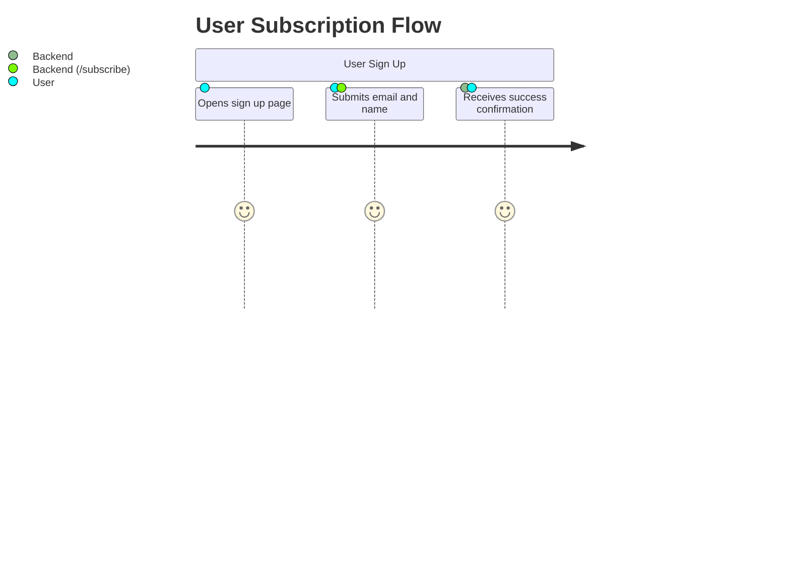
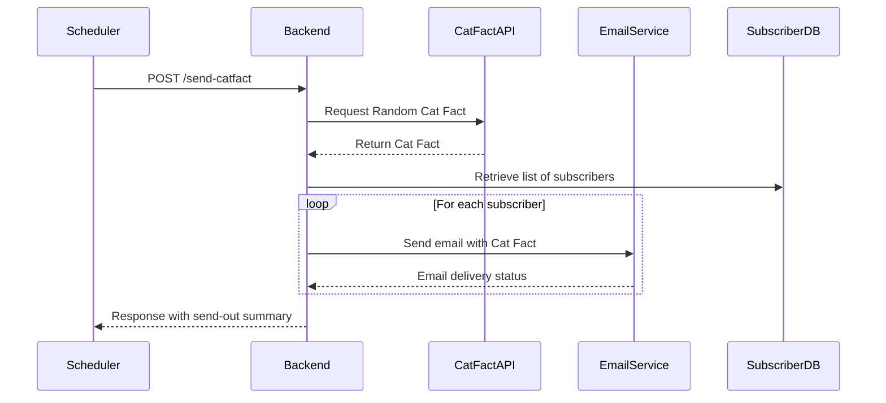
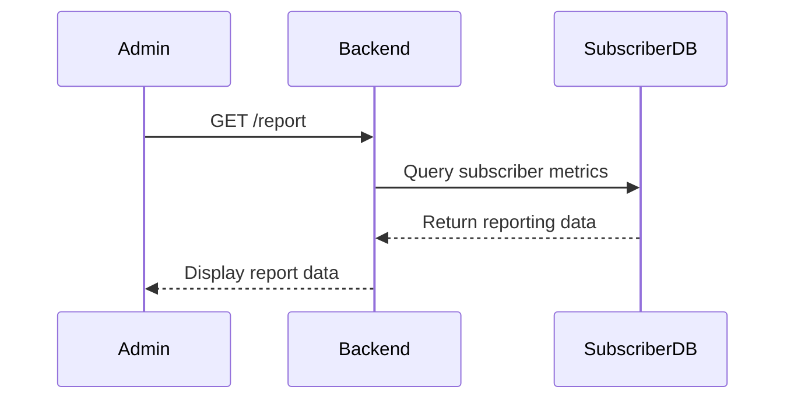

# Weekly Cat Fact Subscription - Functional Requirements

## 1. API Endpoints

### 1.1 POST /subscribe
- **Description**: Subscribe a user for weekly cat facts.
- **Request Body (JSON)**:
  - `email` (string, required)
  - `name` (string, optional)
- **Example**:
  ```json
  {
    "email": "user@example.com",
    "name": "John Doe"
  }
  ```
- **Response (JSON)**:
  - `message` (string)
  - `subscriberId` (string/number)
- **Business Logic**: Validate email uniqueness and store subscriber information.

### 1.2 GET /subscribers
- **Description**: Retrieve the list of subscribers.
- **Response (JSON)**:
  - `subscribers` (array of subscriber objects)
  - `count` (number)
- **Example**:
  ```json
  {
    "count": 120,
    "subscribers": [
      { "id": 1, "email": "user@example.com", "name": "John Doe" },
      ...
    ]
  }
  ```

### 1.3 POST /send-catfact
- **Description**: Trigger the weekly cat fact send-out.
- **Request Body**: (Optionally trigger with specific configurations; can be empty)
- **Business Logic**:
  - Retrieve a new cat fact from the external Cat Fact API.
  - Iterate through all subscribers and send the retrieved fact via email.
- **Response (JSON)**:
  - `message` (string)
  - `details` (object with information about the send-out process)
- **Note**: External data retrieval (from Cat Fact API) happens inside this POST endpoint.

### 1.4 GET /report
- **Description**: Retrieve reporting data for subscriber interactions and publishing.
- **Response (JSON)**:
  - `totalSubscribers` (number)
  - `totalEmailsSent` (number)
  - `additionalMetrics` (object: e.g., open rates, click rates if available)
- **Example**:
  ```json
  {
    "totalSubscribers": 120,
    "totalEmailsSent": 118,
    "additionalMetrics": {...}
  }
  ```

## 2. User-App Interaction Diagrams

### 2.1 User Subscription Journey

```mermaid
journey
    title User Subscription Flow
    section User Sign Up
      Opens sign up page: 5: User
      Submits email and name: 5: User, Backend (/subscribe)
      Receives success confirmation: 5: Backend, User
```

### 2.2 Weekly Cat Fact Sending Sequence

```mermaid
sequenceDiagram
    participant Scheduler
    participant Backend
    participant CatFactAPI
    participant EmailService
    participant SubscriberDB

    Scheduler->>Backend: POST /send-catfact
    Backend->>CatFactAPI: Request Random Cat Fact
    CatFactAPI-->>Backend: Return Cat Fact
    Backend->>SubscriberDB: Retrieve list of subscribers
    loop For each subscriber
        Backend->>EmailService: Send email with Cat Fact
        EmailService-->>Backend: Email delivery status
    end
    Backend-->>Scheduler: Response with send-out summary
```

### 2.3 Reporting Retrieval Process

```mermaid
sequenceDiagram
    participant Admin
    participant Backend
    participant SubscriberDB

    Admin->>Backend: GET /report
    Backend->>SubscriberDB: Query subscriber metrics
    SubscriberDB-->>Backend: Return reporting data
    Backend-->>Admin: Display report data
```