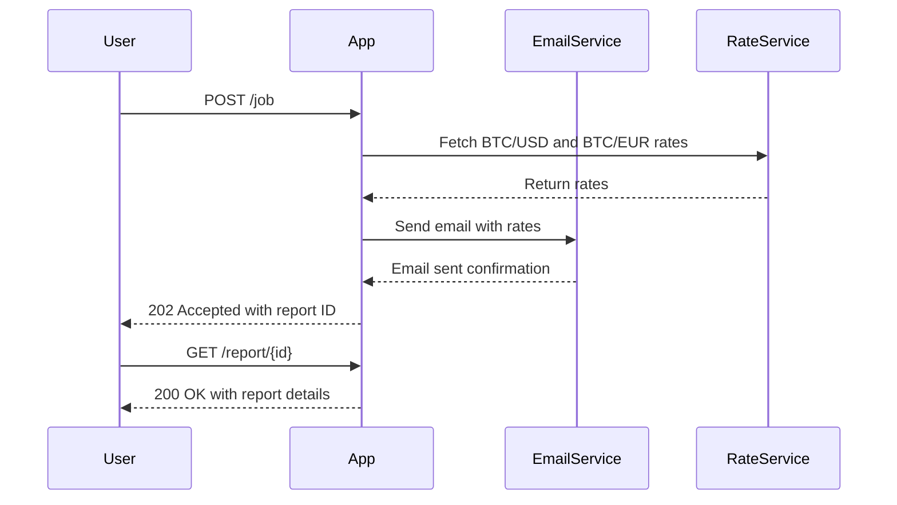

Here are the well-formatted final functional requirements for your application:

### Functional Requirements for Bitcoin Conversion Rate Reporting Application

#### User Stories

1. **User Story 1: Initiate Report Creation**
   - **As a** user, 
   - **I want to** initiate the report creation process 
   - **So that** I can receive the latest Bitcoin conversion rates via email.
   - **Acceptance Criteria**:
     - A POST request to `/job` initiates the report creation.
     - The system fetches the latest BTC/USD and BTC/EUR rates.
     - An email is sent with the conversion rates.

2. **User Story 2: Retrieve Stored Report**
   - **As a** user, 
   - **I want to** retrieve a stored report by its ID 
   - **So that** I can view the conversion rates at any time.
   - **Acceptance Criteria**:
     - A GET request to `/report/{id}` retrieves the report.
     - The response includes the conversion rates and metadata.

#### API Endpoints

1. **POST /job**
   - **Description**: Initiates the report creation process for Bitcoin conversion rates.
   - **Request**:
     - No body required.
   - **Response**:
     - **Status**: 202 Accepted
     - **Body**: 
       ```json
       {
         "report_id": "12345",
         "message": "Report creation initiated. You will receive an email shortly."
       }
       ```

2. **GET /report/{id}**
   - **Description**: Retrieves a stored report by its ID.
   - **Request**:
     - **Path Parameter**: `id` (string) - The ID of the report to retrieve.
   - **Response**:
     - **Status**: 200 OK
     - **Body**:
       ```json
       {
         "report_id": "12345",
         "btc_usd_rate": "XXXX.XX",
         "btc_eur_rate": "XXXX.XX",
         "timestamp": "2023-10-01T12:00:00Z"
       }
       ```

#### User Interaction Flow (Mermaid Sequence Diagram)


```mermaid
sequenceDiagram
    participant User
    participant App
    participant EmailService
    participant RateService

    User->>App: POST /job
    App->>RateService: Fetch BTC/USD and BTC/EUR rates
    RateService-->>App: Return rates
    App->>EmailService: Send email with rates
    EmailService-->>App: Email sent confirmation
    App-->>User: 202 Accepted with report ID

    User->>App: GET /report/{id}
    App-->>User: 200 OK with report details
```

### Summary

This document outlines the functional requirements for your Bitcoin conversion rate reporting application, including user stories, API endpoints, and a visual representation of user interactions. If you have any further adjustments or additional requirements, feel free to let me know!