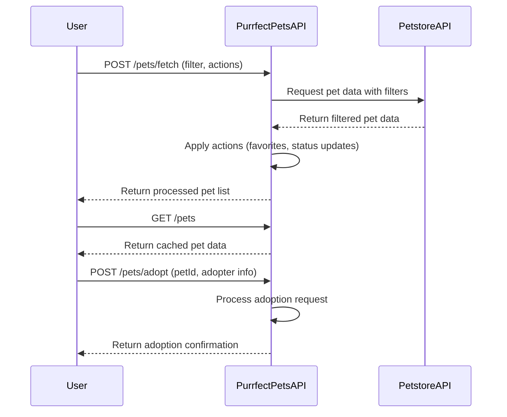
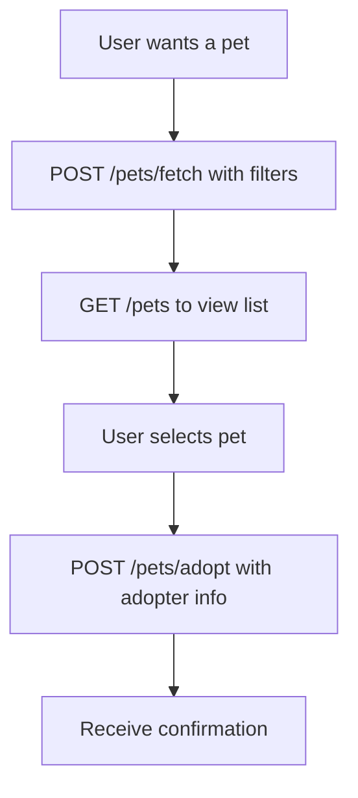

```markdown
# Purrfect Pets API - Functional Requirements

## Overview
The API provides a fun interface to interact with pet data sourced from the Petstore API. All external data retrieval and business logic (like filtering, calculations) are performed via POST endpoints. GET endpoints are reserved for retrieving processed results from our app.

---

## API Endpoints

### 1. POST `/pets/fetch`
- **Purpose:** Fetch pets from Petstore API and apply any requested filters or actions.
- **Request Body:**
```json
{
  "filter": {
    "type": "cat" | "dog" | "all",
    "status": "available" | "pending" | "sold" | "all"
  },
  "actions": {
    "markFavorite": ["petId1", "petId2"],
    "updateAdoptionStatus": {
      "petId": "newStatus"
    }
  }
}
```
- **Response:**
```json
{
  "pets": [
    {
      "id": "string",
      "name": "string",
      "type": "cat" | "dog" | "other",
      "status": "available" | "pending" | "sold",
      "photoUrls": ["string"],
      "isFavorite": true | false
    }
  ],
  "message": "string"
}
```

---

### 2. GET `/pets`
- **Purpose:** Retrieve the latest processed pet data stored or cached in the app.
- **Response:**
```json
{
  "pets": [
    {
      "id": "string",
      "name": "string",
      "type": "cat" | "dog" | "other",
      "status": "available" | "pending" | "sold",
      "photoUrls": ["string"],
      "isFavorite": true | false
    }
  ]
}
```

---

### 3. POST `/pets/adopt`
- **Purpose:** Submit an adoption request for a pet.
- **Request Body:**
```json
{
  "petId": "string",
  "adopter": {
    "name": "string",
    "contact": "string"
  }
}
```
- **Response:**
```json
{
  "success": true | false,
  "message": "string"
}
```

---

## Business Logic Notes
- The POST `/pets/fetch` endpoint is the main integration point to the external Petstore API.
- Filtering happens inside the POST request to avoid heavy data transfer.
- Marking favorites or updating pet statuses happens within the same POST request.
- The GET `/pets` endpoint only returns the last known processed data for quick access.
- Adoption requests via `/pets/adopt` trigger internal state changes or notifications.

---

## User-App Interaction Sequence


```mermaid
sequenceDiagram
    participant User
    participant PurrfectPetsAPI
    participant PetstoreAPI

    User->>PurrfectPetsAPI: POST /pets/fetch (filter, actions)
    PurrfectPetsAPI->>PetstoreAPI: Request pet data with filters
    PetstoreAPI-->>PurrfectPetsAPI: Return filtered pet data
    PurrfectPetsAPI->>PurrfectPetsAPI: Apply actions (favorites, status updates)
    PurrfectPetsAPI-->>User: Return processed pet list

    User->>PurrfectPetsAPI: GET /pets
    PurrfectPetsAPI-->>User: Return cached pet data

    User->>PurrfectPetsAPI: POST /pets/adopt (petId, adopter info)
    PurrfectPetsAPI->>PurrfectPetsAPI: Process adoption request
    PurrfectPetsAPI-->>User: Return adoption confirmation
```

---

## User Journey for Pet Adoption


```mermaid
flowchart TD
    Start[User wants a pet]
    FetchPets[POST /pets/fetch with filters]
    ViewPets[GET /pets to view list]
    ChoosePet[User selects pet]
    SubmitAdoption[POST /pets/adopt with adopter info]
    Confirm[Receive confirmation]

    Start --> FetchPets --> ViewPets --> ChoosePet --> SubmitAdoption --> Confirm
```
```