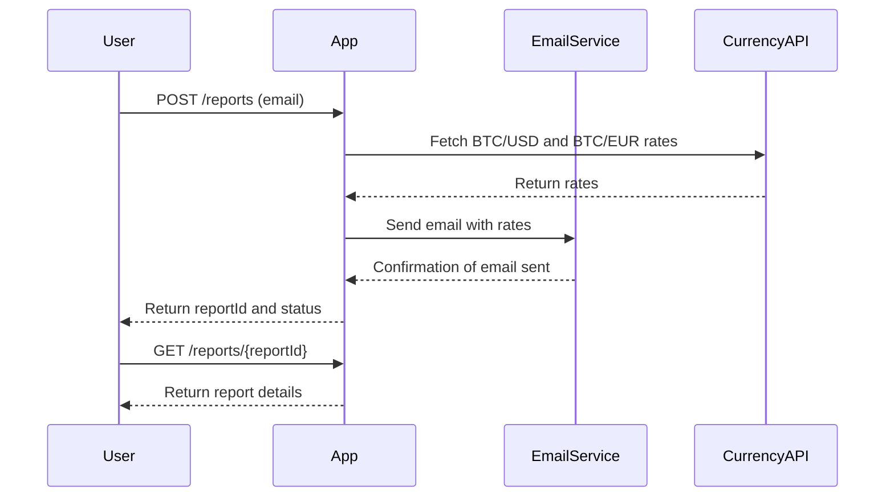

Here are the well-formatted final functional requirements for your application, structured into user stories and API specifications:

### Functional Requirements

#### User Stories

1. **Report Initiation**
   - **As a user**, I want to initiate a report creation process so that I can receive the latest Bitcoin conversion rates via email.
     - **Acceptance Criteria**:
       - The system accepts a `POST` request to `/reports` with an email address.
       - A unique report ID is generated and returned.
       - The system fetches the latest Bitcoin-to-USD and Bitcoin-to-EUR rates.
       - An email is sent to the specified address with the conversion rates.

2. **Retrieve Report**
   - **As a user**, I want to retrieve a previously generated report by its ID so that I can view the conversion rates.
     - **Acceptance Criteria**:
       - The system accepts a `GET` request to `/reports/{reportId}`.
       - The report details, including conversion rates and status, are returned.
       - If the report ID does not exist, a proper error message is returned.

#### API Endpoints

1. **POST /reports**
   - **Description**: Initiates the report creation process.
   - **Request Format**:
     ```json
     {
       "email": "user@example.com"
     }
     ```
   - **Response Format**:
     ```json
     {
       "reportId": "12345",
       "status": "pending"
     }
     ```

2. **GET /reports/{reportId}**
   - **Description**: Retrieves the stored report by its ID.
   - **Response Format**:
     ```json
     {
       "reportId": "12345",
       "btcToUsd": "50000",
       "btcToEur": "42000",
       "timestamp": "2023-10-01T12:00:00Z",
       "status": "completed"
     }
     ```
   - **Error Response Format** (if report not found):
     ```json
     {
       "error": "Report not found."
     }
     ```

### Data Storage
- **Persistence Service**: 
  - Recommended options include:
    - **Relational Database** (e.g., PostgreSQL, MySQL) for structured data and complex queries.
    - **NoSQL Database** (e.g., MongoDB) for flexibility and evolving data structures.
    - **Key-Value Store** (e.g., Redis) for caching frequently accessed data.

### Visual Representation
A sequence diagram can illustrate user-app interactions as follows:


```mermaid
sequenceDiagram
    participant User
    participant App
    participant EmailService
    participant CurrencyAPI

    User->>App: POST /reports (email)
    App->>CurrencyAPI: Fetch BTC/USD and BTC/EUR rates
    CurrencyAPI-->>App: Return rates
    App->>EmailService: Send email with rates
    EmailService-->>App: Confirmation of email sent
    App-->>User: Return reportId and status

    User->>App: GET /reports/{reportId}
    App-->>User: Return report details
```

### Summary
These functional requirements provide a clear framework for your application, detailing how users will interact with the system and specifying the necessary API endpoints and data storage considerations. This structured approach will facilitate development and ensure that all key functionalities are addressed.