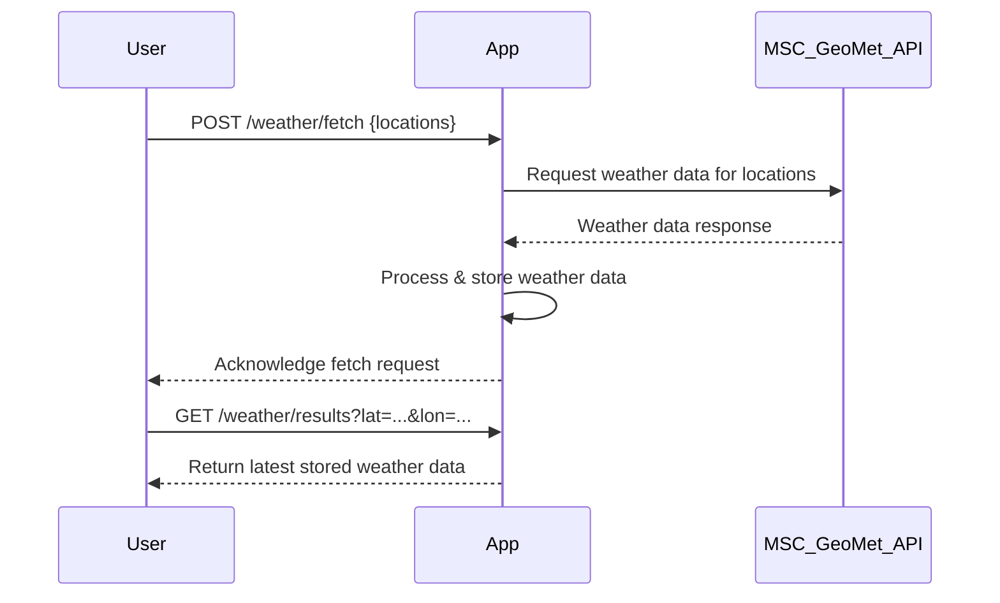
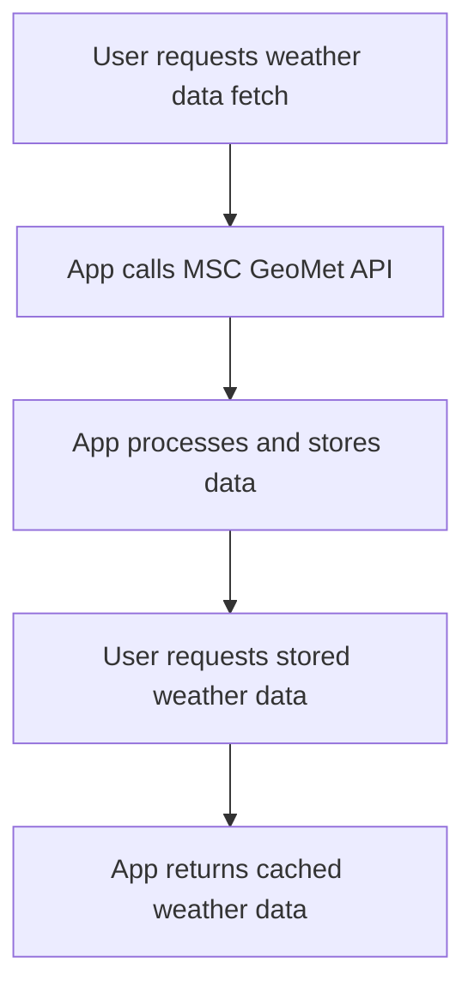

```markdown
# Functional Requirements for Weather Data App

## API Endpoints

### 1. POST `/weather/fetch`
- **Purpose:** Trigger fetching weather data from MSC GeoMet API for one or more locations.
- **Request:**
  ```json
  {
    "locations": [
      {
        "latitude": 12.34,
        "longitude": 56.78
      },
      {
        "latitude": 90.12,
        "longitude": 34.56
      }
    ]
  }
  ```
- **Response:**
  ```json
  {
    "status": "success",
    "message": "Weather data fetching initiated",
    "requested_locations": 2
  }
  ```
- **Notes:** This endpoint performs the external API call and any necessary data processing.

---

### 2. GET `/weather/results`
- **Purpose:** Retrieve the latest fetched weather data stored in the app for specific locations.
- **Request Parameters:**  
  - `lat` (float) - required  
  - `lon` (float) - required  
- **Response:**
  ```json
  {
    "location": {
      "latitude": 12.34,
      "longitude": 56.78
    },
    "weather": {
      "temperature": 25.6,
      "humidity": 80,
      "wind_speed": 5.4,
      "description": "Clear sky"
    },
    "timestamp": "2024-06-01T12:00:00Z"
  }
  ```
- **Notes:** Returns cached or last fetched data for the queried location.

---

## Business Logic Summary
- POST `/weather/fetch` triggers external API calls to MSC GeoMet.
- Data is processed and stored in the app’s state.
- GET `/weather/results` only retrieves stored data with no external calls.

---

## User-App Interaction Sequence Diagram


```mermaid
sequenceDiagram
    participant User
    participant App
    participant MSC_GeoMet_API

    User->>App: POST /weather/fetch {locations}
    App->>MSC_GeoMet_API: Request weather data for locations
    MSC_GeoMet_API-->>App: Weather data response
    App->>App: Process & store weather data
    App-->>User: Acknowledge fetch request

    User->>App: GET /weather/results?lat=...&lon=...
    App-->>User: Return latest stored weather data
```

---

## User Journey Diagram


```mermaid
graph TD
    A[User requests weather data fetch] --> B[App calls MSC GeoMet API]
    B --> C[App processes and stores data]
    C --> D[User requests stored weather data]
    D --> E[App returns cached weather data]
```
```