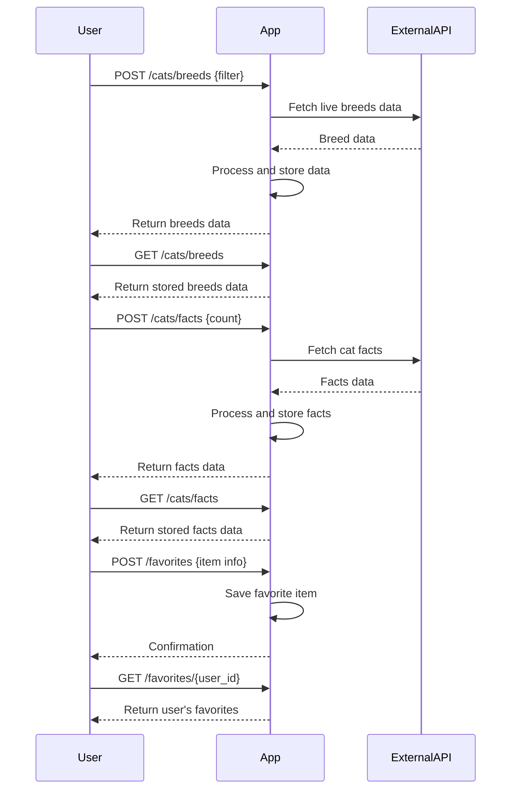

```markdown
# Functional Requirements for 'Purrfect Pets' API App

## Overview
The 'Purrfect Pets' API app provides live cat data by integrating with external data sources. Following RESTful principles:
- **POST** endpoints handle business logic, including external data retrieval and any calculations.
- **GET** endpoints serve only application results stored or processed internally.

---

## API Endpoints

### 1. `POST /cats/breeds`
- **Purpose:** Fetch and process live cat breed data from external sources.
- **Request Body:**  
  ```json
  {
    "filter": {
      "origin": "string",       // optional filter for breed origin
      "temperament": "string"   // optional temperament filter
    }
  }
  ```
- **Response:**  
  ```json
  {
    "breeds": [
      {
        "id": "string",
        "name": "string",
        "origin": "string",
        "temperament": "string",
        "description": "string",
        "image_url": "string"
      }
    ]
  }
  ```

### 2. `GET /cats/breeds`
- **Purpose:** Retrieve previously fetched and stored cat breed data.
- **Response:** Same as POST response.

---

### 3. `POST /cats/facts`
- **Purpose:** Retrieve live cat facts from an external API, optionally filtered.
- **Request Body:**  
  ```json
  {
    "count": integer // number of facts requested
  }
  ```
- **Response:**  
  ```json
  {
    "facts": [
      "string"
    ]
  }
  ```

### 4. `GET /cats/facts`
- **Purpose:** Retrieve cached or previously fetched cat facts.
- **Response:** Same as POST response.

---

### 5. `POST /cats/images`
- **Purpose:** Fetch live cat images from external sources with optional filters.
- **Request Body:**  
  ```json
  {
    "breed_id": "string",   // optional filter by breed
    "limit": integer        // number of images to fetch
  }
  ```
- **Response:**  
  ```json
  {
    "images": [
      {
        "id": "string",
        "url": "string",
        "breed_id": "string"
      }
    ]
  }
  ```

### 6. `GET /cats/images`
- **Purpose:** Retrieve stored cat images.
- **Response:** Same as POST response.

---

### 7. `POST /favorites`
- **Purpose:** Add a cat (breed/image/fact) to user's favorites.
- **Request Body:**  
  ```json
  {
    "user_id": "string",
    "item_type": "breed" | "fact" | "image",
    "item_id": "string"
  }
  ```
- **Response:**  
  ```json
  {
    "success": true,
    "message": "Added to favorites"
  }
  ```

### 8. `GET /favorites/{user_id}`
- **Purpose:** Retrieve user's favorite cats items.
- **Response:**  
  ```json
  {
    "favorites": [
      {
        "item_type": "breed" | "fact" | "image",
        "item": {}
      }
    ]
  }
  ```

---

## Data Formats
- All requests and responses use JSON format.
- Content-Type: `application/json`

---

## User-App Interaction Sequence


```mermaid
sequenceDiagram
    participant User
    participant App
    participant ExternalAPI

    User->>App: POST /cats/breeds {filter}
    App->>ExternalAPI: Fetch live breeds data
    ExternalAPI-->>App: Breed data
    App->>App: Process and store data
    App-->>User: Return breeds data

    User->>App: GET /cats/breeds
    App-->>User: Return stored breeds data

    User->>App: POST /cats/facts {count}
    App->>ExternalAPI: Fetch cat facts
    ExternalAPI-->>App: Facts data
    App->>App: Process and store facts
    App-->>User: Return facts data
    
    User->>App: GET /cats/facts
    App-->>User: Return stored facts data

    User->>App: POST /favorites {item info}
    App->>App: Save favorite item
    App-->>User: Confirmation

    User->>App: GET /favorites/{user_id}
    App-->>User: Return user's favorites
```

---

## Summary
This specification ensures separation of concerns:
- POST endpoints perform external integration and processing.
- GET endpoints provide access to processed or cached data.
- JSON is used throughout for consistency.
- User favorites are supported with basic CRUD operations.

This foundation can be expanded with authentication, pagination, or additional features in future iterations.
```