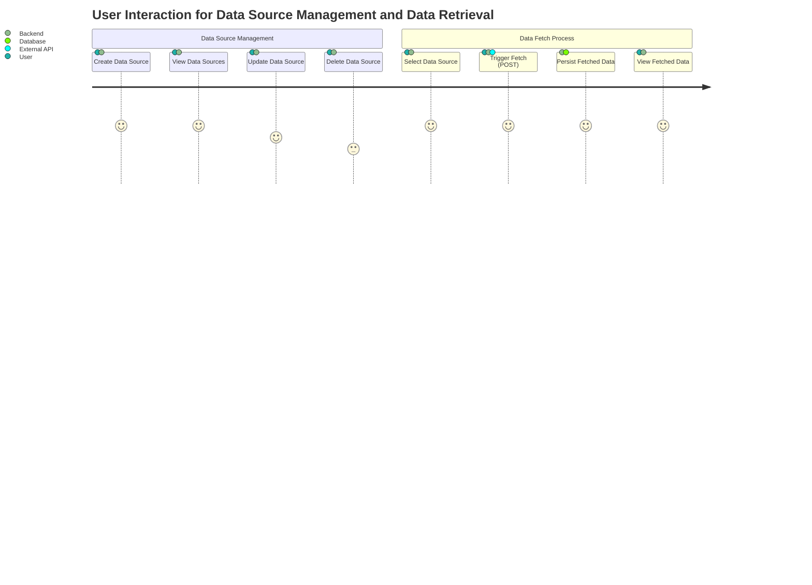
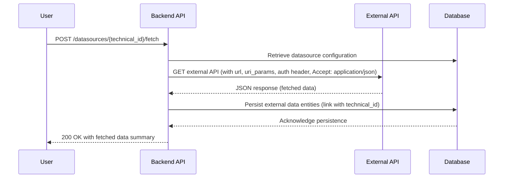

# Functional Requirements Documentation

## 1. Endpoints Overview

### Data Source Management (CRUD)

- **Create Data Source**
  - **Endpoint:** `POST /datasources`
  - **Request Body:**
    ```json
    {
      "datasource_name": "string (required)",
      "url": "string (required, must be a valid URL)",
      "uri_params": "object (optional, key-value pairs)",
      "authorization_header": "string (optional)"
    }
    ```
  - **Response:**
    - **201 Created** with JSON of the created datasource entity:
    ```json
    {
      "technical_id": "string",
      "datasource_name": "string",
      "url": "string",
      "uri_params": "object",
      "authorization_header": "string",
      "created_at": "string (ISO 8601 format)"
    }
    ```

- **Retrieve All Data Sources**
  - **Endpoint:** `GET /datasources`
  - **Response:**
    - **200 OK** with JSON array of datasource entities:
    ```json
    [
      {
        "technical_id": "string",
        "datasource_name": "string",
        "url": "string",
        "uri_params": "object",
        "authorization_header": "string",
        "created_at": "string (ISO 8601 format)"
      },
      ...
    ]
    ```

- **Retrieve Single Data Source**
  - **Endpoint:** `GET /datasources/{technical_id}`
  - **Response:**
    - **200 OK** with JSON of the datasource entity or **404 Not Found** if not found:
    ```json
    {
      "technical_id": "string",
      "datasource_name": "string",
      "url": "string",
      "uri_params": "object",
      "authorization_header": "string",
      "created_at": "string (ISO 8601 format)"
    }
    ```

- **Update Data Source**
  - **Endpoint:** `PUT /datasources/{technical_id}`
  - **Request Body:**
    ```json
    {
      "datasource_name": "string (optional)",
      "url": "string (optional)",
      "uri_params": "object (optional)",
      "authorization_header": "string (optional)"
    }
    ```
  - **Response:**
    - **200 OK** with updated datasource JSON or **404 Not Found** if not found:
    ```json
    {
      "technical_id": "string",
      "datasource_name": "string",
      "url": "string",
      "uri_params": "object",
      "authorization_header": "string",
      "created_at": "string (ISO 8601 format)"
    }
    ```

- **Delete Data Source**
  - **Endpoint:** `DELETE /datasources/{technical_id}`
  - **Response:**
    - **204 No Content** on successful deletion or **404 Not Found** if not found.

### External API Data Fetch and Persistence

- **Fetch Data from External API and Persist**
  - **Endpoint:** `POST /datasources/{technical_id}/fetch`
  - **Business Logic:**
    - Retrieve the datasource configuration using `technical_id`.
    - Use the configured URL, applying any specified `uri_params` and `authorization_header`.
    - Ensure the header `"Accept": "application/json"` is applied.
    - Perform the GET request to the external API.
    - Validate that the response is in JSON format.
    - Persist the fetched objects as separate entities, linking them to the datasource via `entity_model = technical_id`.
  - **Response:**
    - **200 OK** with JSON representing the persisted external data entities:
    ```json
    {
      "message": "Data successfully retrieved and persisted.",
      "fetched_records": "number",
      "datasource_id": "string"
    }
    ```
    - **400/500** on failure with appropriate error message.

### Fetched Data Retrieval

- **Retrieve Fetched External Data**
  - **Endpoint:** `GET /datasources/{technical_id}/data`
  - **Response:**
    - **200 OK** with JSON array of persisted external data entities related to the datasource:
    ```json
    [
      {
        "company_num": "number",
        "company_bus_ind": "string",
        "company_name": "string",
        "company_addr_1": "string",
        "company_addr_2": "string",
        "company_addr_3": "string",
        "company_addr_4": "string",
        "company_reg_date": "string (ISO 8601 format)",
        "company_status_desc": "string",
        "company_status_date": "string (ISO 8601 format)",
        "last_ar_date": "string (ISO 8601 format)",
        "next_ar_date": "string (ISO 8601 format)",
        "last_acc_date": "string (ISO 8601 format)",
        "comp_type_desc": "string",
        "company_type_code": "number",
        "company_status_code": "number",
        "place_of_business": "string",
        "eircode": "string"
      },
      ...
    ]
    ```

## 2. Visual Representations

### User-App Interaction Journey


```mermaid
journey
    title User Interaction for Data Source Management and Data Retrieval
    section Data Source Management
      Create Data Source: 5: User, Backend
      View Data Sources: 5: User, Backend
      Update Data Source: 4: User, Backend
      Delete Data Source: 3: User, Backend
    section Data Fetch Process
      Select Data Source: 5: User, Backend
      Trigger Fetch (POST): 5: User, Backend, External API
      Persist Fetched Data: 5: Backend, Database
      View Fetched Data: 5: User, Backend
```

### Sequence Diagram for Fetch and Persistence Process


```mermaid
sequenceDiagram
    participant U as User
    participant B as Backend API
    participant E as External API
    participant DB as Database

    U->>B: POST /datasources/{technical_id}/fetch
    B->>DB: Retrieve datasource configuration
    B->>E: GET external API (with url, uri_params, auth header, Accept: application/json)
    E-->>B: JSON response (fetched data)
    B->>DB: Persist external data entities (link with technical_id)
    DB-->>B: Acknowledge persistence
    B-->>U: 200 OK with fetched data summary
```