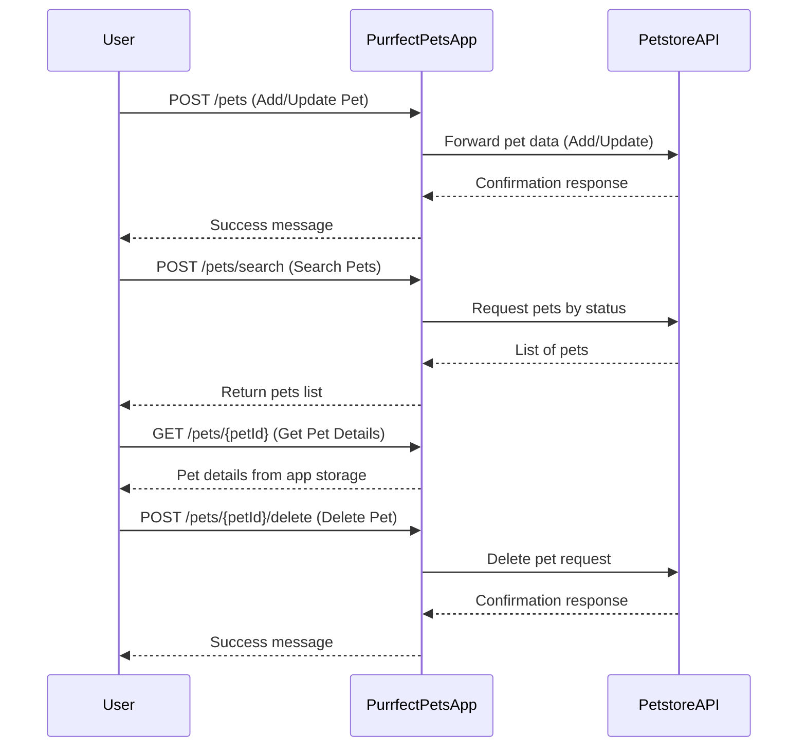

```markdown
# Purrfect Pets API - Functional Requirements

## API Endpoints

### 1. Add or Update Pet (POST `/pets`)
- **Description:** Add a new pet or update existing pet information. This endpoint invokes external Petstore API to create or update pets.
- **Request:**
```json
{
  "id": "string (optional, for update)",
  "name": "string",
  "category": {
    "id": "integer",
    "name": "string"
  },
  "photoUrls": ["string"],
  "tags": [{"id": "integer", "name": "string"}],
  "status": "string (available | pending | sold)"
}
```
- **Response:**
```json
{
  "id": "string",
  "message": "Pet added/updated successfully"
}
```

---

### 2. Search Pets by Status (POST `/pets/search`)
- **Description:** Search pets by their status. This endpoint queries external Petstore API and returns matched pets.
- **Request:**
```json
{
  "status": ["available", "pending", "sold"]
}
```
- **Response:**
```json
[
  {
    "id": "string",
    "name": "string",
    "category": {"id": "integer", "name": "string"},
    "photoUrls": ["string"],
    "tags": [{"id": "integer", "name": "string"}],
    "status": "string"
  },
  ...
]
```

---

### 3. Get Pet by ID (GET `/pets/{petId}`)
- **Description:** Retrieve pet details stored in the app (no external calls).
- **Response:**
```json
{
  "id": "string",
  "name": "string",
  "category": {"id": "integer", "name": "string"},
  "photoUrls": ["string"],
  "tags": [{"id": "integer", "name": "string"}],
  "status": "string"
}
```

---

### 4. Delete Pet (POST `/pets/{petId}/delete`)
- **Description:** Delete a pet by ID, invoking external Petstore API.
- **Request:** Empty body
- **Response:**
```json
{
  "message": "Pet deleted successfully"
}
```

---

## User-App Interaction Sequence Diagram


```mermaid
sequenceDiagram
    participant User
    participant PurrfectPetsApp
    participant PetstoreAPI

    User->>PurrfectPetsApp: POST /pets (Add/Update Pet)
    PurrfectPetsApp->>PetstoreAPI: Forward pet data (Add/Update)
    PetstoreAPI-->>PurrfectPetsApp: Confirmation response
    PurrfectPetsApp-->>User: Success message

    User->>PurrfectPetsApp: POST /pets/search (Search Pets)
    PurrfectPetsApp->>PetstoreAPI: Request pets by status
    PetstoreAPI-->>PurrfectPetsApp: List of pets
    PurrfectPetsApp-->>User: Return pets list

    User->>PurrfectPetsApp: GET /pets/{petId} (Get Pet Details)
    PurrfectPetsApp-->>User: Pet details from app storage

    User->>PurrfectPetsApp: POST /pets/{petId}/delete (Delete Pet)
    PurrfectPetsApp->>PetstoreAPI: Delete pet request
    PetstoreAPI-->>PurrfectPetsApp: Confirmation response
    PurrfectPetsApp-->>User: Success message
```

---

## Notes
- POST endpoints handle all external API interactions and any business logic.
- GET endpoints only retrieve data stored or cached within the app.
```
