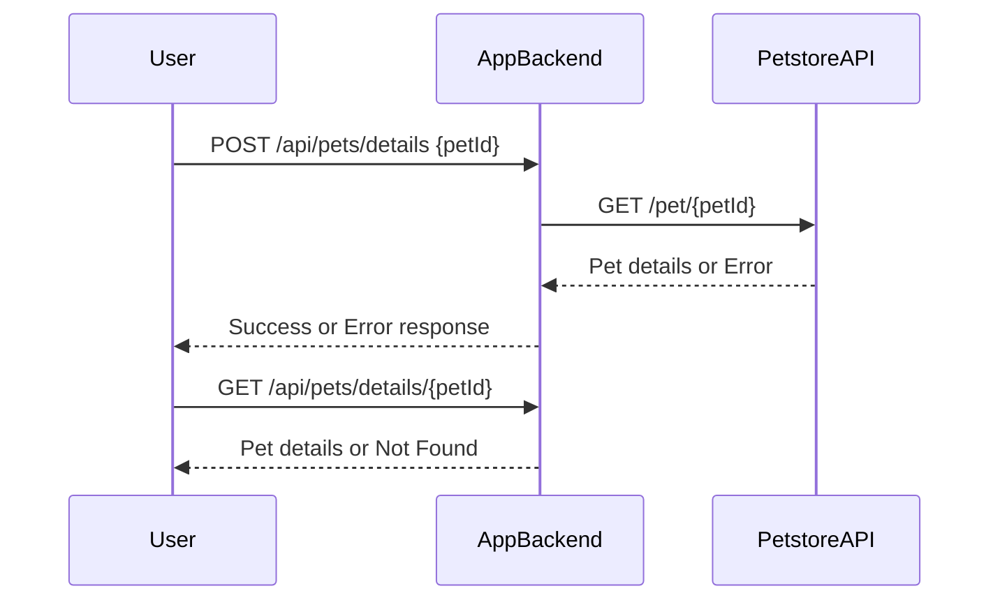
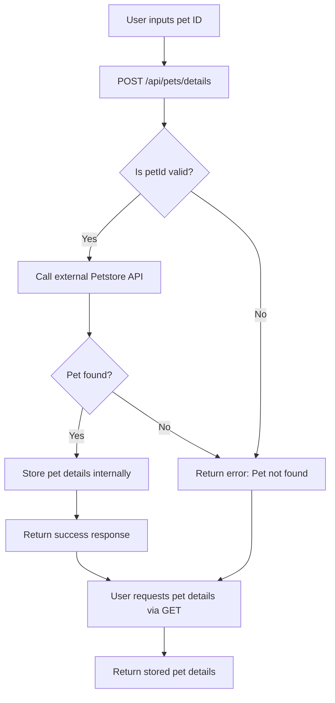

```markdown
# Functional Requirements for Pet Details Viewer Application

## API Endpoints

### 1. POST /api/pets/details
- **Purpose:** Retrieve pet details from the external Petstore API by pet ID.
- **Description:** This endpoint accepts a pet ID, calls the external Petstore API to fetch pet details, processes the response, and stores the result internally for later retrieval.
- **Request:**
  ```json
  {
    "petId": 123
  }
  ```
- **Response (Success - 200):**
  ```json
  {
    "status": "success",
    "pet": {
      "id": 123,
      "name": "Doggie",
      "category": "Dogs",
      "status": "available",
      "photoUrls": [
        "https://example.com/photo1.jpg"
      ]
    }
  }
  ```
- **Response (Error - 400 or 404):**
  ```json
  {
    "status": "error",
    "message": "Invalid or not found pet ID"
  }
  ```

### 2. GET /api/pets/details/{petId}
- **Purpose:** Retrieve previously fetched pet details by pet ID.
- **Description:** Returns pet details previously retrieved and stored by the POST endpoint.
- **Request:** No body required. Pet ID is passed as a path parameter.
- **Response (Success - 200):**
  ```json
  {
    "pet": {
      "id": 123,
      "name": "Doggie",
      "category": "Dogs",
      "status": "available",
      "photoUrls": [
        "https://example.com/photo1.jpg"
      ]
    }
  }
  ```
- **Response (Error - 404):**
  ```json
  {
    "status": "error",
    "message": "Pet details not found. Please fetch via POST /api/pets/details first."
  }
  ```

---

## Business Logic

- **POST `/api/pets/details`**  
  - Validate the input `petId`.  
  - Call external Petstore API endpoint `GET /pet/{petId}` to fetch pet details.  
  - If successful, parse and store pet data internally.  
  - Return success response with pet details.  
  - If the pet ID is invalid or not found, return an error response.

- **GET `/api/pets/details/{petId}`**  
  - Retrieve and return stored pet details if available.  
  - If not found, return an error indicating that details need to be fetched first.

---

## User-App Interaction Sequence Diagram


```mermaid
sequenceDiagram
    participant User
    participant AppBackend
    participant PetstoreAPI

    User->>AppBackend: POST /api/pets/details {petId}
    AppBackend->>PetstoreAPI: GET /pet/{petId}
    PetstoreAPI-->>AppBackend: Pet details or Error
    AppBackend-->>User: Success or Error response

    User->>AppBackend: GET /api/pets/details/{petId}
    AppBackend-->>User: Pet details or Not Found
```

---

## User Journey Diagram


```mermaid
flowchart TD
    A[User inputs pet ID] --> B[POST /api/pets/details]
    B --> C{Is petId valid?}
    C -- Yes --> D[Call external Petstore API]
    D --> E{Pet found?}
    E -- Yes --> F[Store pet details internally]
    F --> G[Return success response]
    E -- No --> H[Return error: Pet not found]
    C -- No --> H

    G --> I[User requests pet details via GET]
    I --> J[Return stored pet details]
    H --> I
```
```