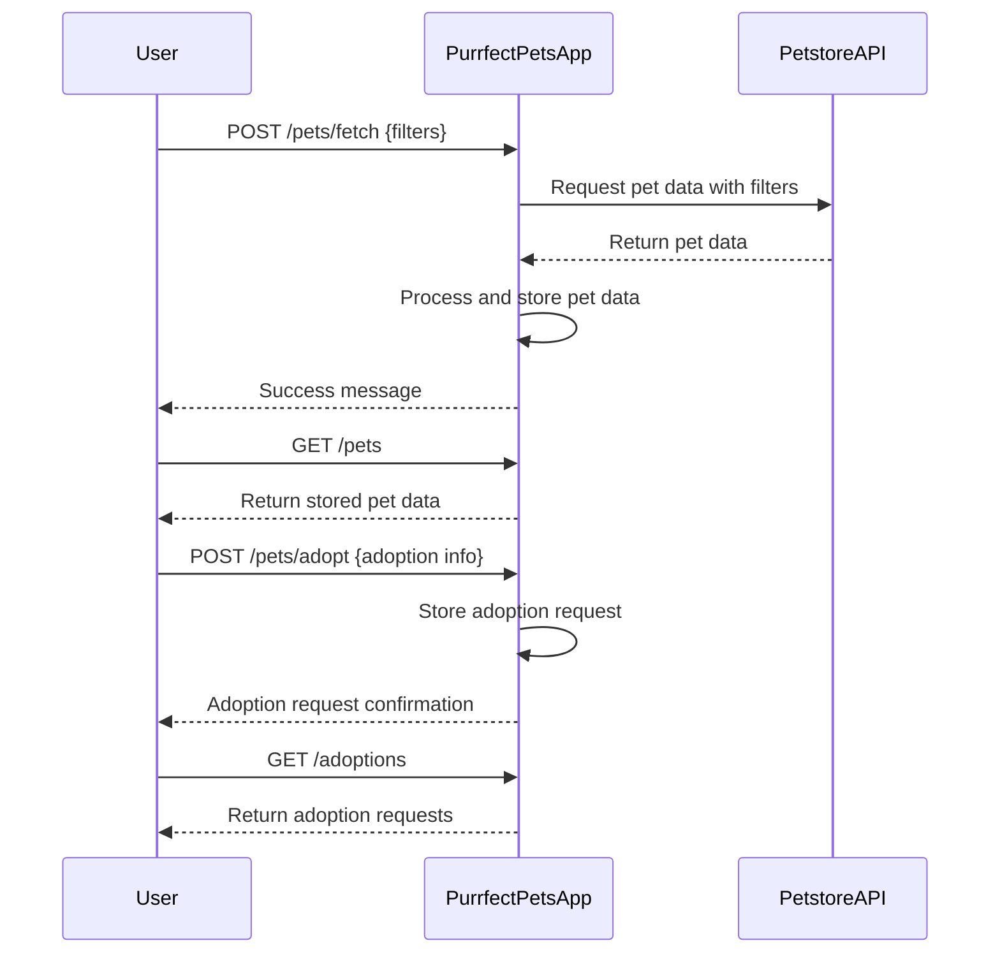

```markdown
# Purrfect Pets API - Functional Requirements

## Overview
The "Purrfect Pets" API app interacts with an external Petstore API to fetch and process pet data. The app follows RESTful principles where:

- **POST endpoints** handle all external data fetching, business logic, or calculations.
- **GET endpoints** provide retrieval of the processed or stored application data.

---

## API Endpoints

### 1. POST `/pets/fetch`

- **Purpose:** Fetch pet data from the external Petstore API, apply optional filters, process, and store it.
- **Request Body:**
  ```json
  {
    "status": "available|pending|sold",  // optional filter by pet status
    "tags": ["tag1", "tag2"]             // optional filter by tags
  }
  ```
- **Response:**
  ```json
  {
    "message": "Pets fetched and processed successfully",
    "count": 25
  }
  ```

---

### 2. GET `/pets`

- **Purpose:** Retrieve the list of processed and stored pet data.
- **Response:**
  ```json
  [
    {
      "id": 1,
      "name": "Fluffy",
      "status": "available",
      "category": "cat",
      "tags": ["cute", "white"]
    },
    ...
  ]
  ```

---

### 3. POST `/pets/adopt`

- **Purpose:** Submit an adoption request for a pet.
- **Request Body:**
  ```json
  {
    "petId": 1,
    "adopterName": "John Doe",
    "contact": "john@example.com"
  }
  ```
- **Response:**
  ```json
  {
    "message": "Adoption request submitted",
    "requestId": 123
  }
  ```

---

### 4. GET `/adoptions`

- **Purpose:** Retrieve all submitted adoption requests.
- **Response:**
  ```json
  [
    {
      "requestId": 123,
      "petId": 1,
      "adopterName": "John Doe",
      "contact": "john@example.com",
      "status": "pending"
    },
    ...
  ]
  ```

---

## User-App Interaction Sequence


```mermaid
sequenceDiagram
    participant User
    participant PurrfectPetsApp
    participant PetstoreAPI

    User->>PurrfectPetsApp: POST /pets/fetch {filters}
    PurrfectPetsApp->>PetstoreAPI: Request pet data with filters
    PetstoreAPI-->>PurrfectPetsApp: Return pet data
    PurrfectPetsApp->>PurrfectPetsApp: Process and store pet data
    PurrfectPetsApp-->>User: Success message

    User->>PurrfectPetsApp: GET /pets
    PurrfectPetsApp-->>User: Return stored pet data

    User->>PurrfectPetsApp: POST /pets/adopt {adoption info}
    PurrfectPetsApp->>PurrfectPetsApp: Store adoption request
    PurrfectPetsApp-->>User: Adoption request confirmation

    User->>PurrfectPetsApp: GET /adoptions
    PurrfectPetsApp-->>User: Return adoption requests
```

---

## Summary

- POST endpoints trigger external API calls and handle business logic.
- GET endpoints serve stored results and app data.
- Adoption workflow adds a fun interactive feature.
- Filters for status and tags improve data querying in fetch.

This design ensures separation of concerns and efficient use of external data sources.
```