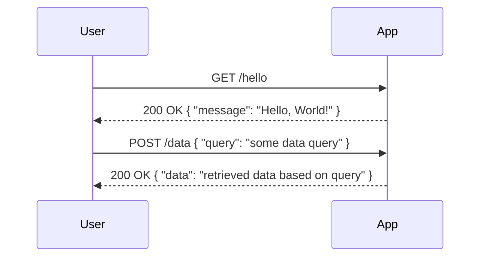

```markdown
# Final Functional Requirements for Hello World Application

## API Endpoints

### 1. Hello Endpoint

- **Endpoint**: `/hello`
- **Method**: `GET`
- **Description**: Retrieves a simple greeting message.
- **Request Format**: 
  - No request body required.
- **Response Format**:
  - **Content-Type**: `application/json`
  - **Example Response**:
    ```json
    {
      "message": "Hello, World!"
    }
    ```

### 2. External Data Retrieval Endpoint

- **Endpoint**: `/data`
- **Method**: `POST`
- **Description**: Accepts a query to retrieve external data.
- **Request Format**:
  - **Content-Type**: `application/json`
  - **Example Request**:
    ```json
    {
      "query": "some data query"
    }
    ```
- **Response Format**:
  - **Content-Type**: `application/json`
  - **Example Response**:
    ```json
    {
      "data": "retrieved data based on query"
    }
    ```

## User-App Interaction Diagram


```mermaid
sequenceDiagram
    participant User
    participant App
    User->>App: GET /hello
    App-->>User: 200 OK { "message": "Hello, World!" }
    
    User->>App: POST /data { "query": "some data query" }
    App-->>User: 200 OK { "data": "retrieved data based on query" }
```
```