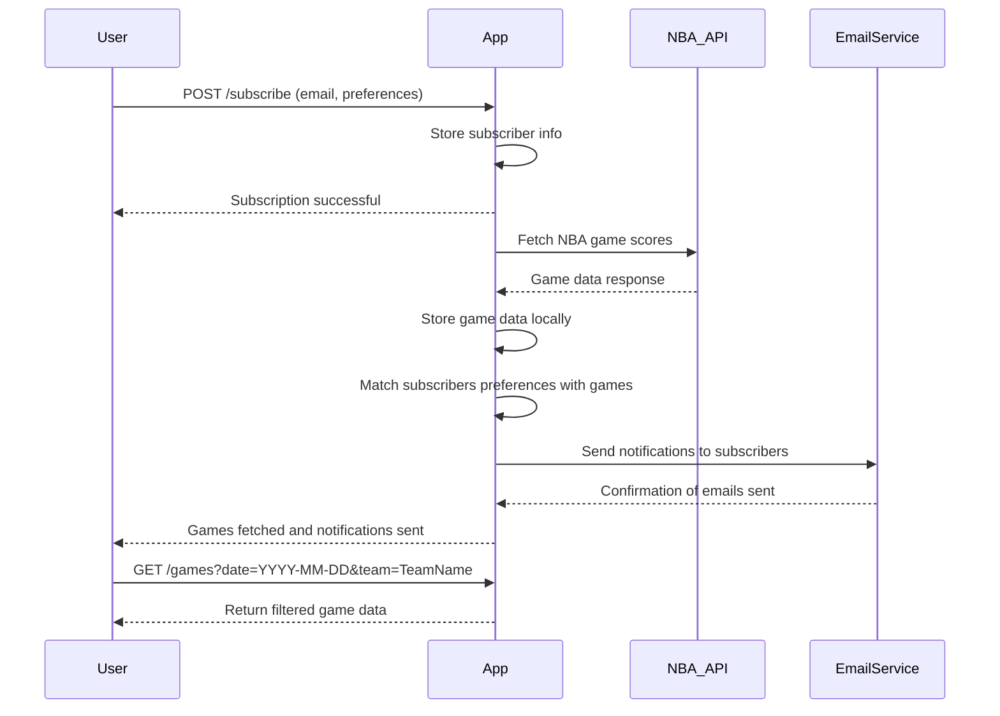

```markdown
# Functional Requirements and API Endpoints

## 1. User Subscription Management

### POST /subscribe  
- **Description:** Register a new subscriber  
- **Request:**  
```json
{
  "email": "user@example.com",
  "preferences": {
    "favoriteTeams": ["Lakers", "Celtics"]
  }
}
```  
- **Response:**  
```json
{
  "message": "Subscription successful",
  "subscriberId": "abc123"
}
```

### POST /unsubscribe  
- **Description:** Remove a subscriber  
- **Request:**  
```json
{
  "email": "user@example.com"
}
```  
- **Response:**  
```json
{
  "message": "Unsubscribed successfully"
}
```

### GET /subscribers  
- **Description:** Retrieve all subscribers (for admin/management)  
- **Response:**  
```json
[
  {
    "email": "user@example.com",
    "preferences": {
      "favoriteTeams": ["Lakers"]
    }
  }
]
```

---

## 2. NBA Game Data Management

### POST /fetch-games  
- **Description:** Trigger fetching NBA game scores from external API and store locally, then send notifications  
- **Request:**  
```json
{}
```  
- **Response:**  
```json
{
  "message": "Games fetched, stored, and notifications sent"
}
```

### GET /games  
- **Description:** Retrieve stored NBA game scores (optionally filter by date or team)  
- **Query parameters:**  
- `date` (optional, format: YYYY-MM-DD)  
- `team` (optional)  
- **Response:**  
```json
[
  {
    "gameId": "game123",
    "date": "2024-04-27",
    "homeTeam": "Lakers",
    "awayTeam": "Celtics",
    "homeScore": 102,
    "awayScore": 99,
    "status": "finished"
  }
]
```

---

## 3. Notification System

- Notifications are sent automatically after `/fetch-games` is triggered.
- Emails include relevant game scores based on subscriber preferences.

---

# User-App Interaction Sequence Diagram


```mermaid
sequenceDiagram
    participant User
    participant App
    participant NBA_API
    participant EmailService

    User->>App: POST /subscribe (email, preferences)
    App->>App: Store subscriber info
    App-->>User: Subscription successful

    App->>NBA_API: Fetch NBA game scores
    NBA_API-->>App: Game data response
    App->>App: Store game data locally
    App->>App: Match subscribers preferences with games
    App->>EmailService: Send notifications to subscribers
    EmailService-->>App: Confirmation of emails sent
    App-->>User: Games fetched and notifications sent

    User->>App: GET /games?date=YYYY-MM-DD&team=TeamName
    App-->>User: Return filtered game data
```

---

# Summary Table of Endpoints

| Method | Endpoint       | Description                              |
|--------|----------------|------------------------------------------|
| POST   | /subscribe     | Add new subscriber                       |
| POST   | /unsubscribe   | Remove subscriber                        |
| GET    | /subscribers   | List all subscribers                     |
| POST   | /fetch-games   | Fetch and store NBA games, send emails  |
| GET    | /games         | Retrieve stored NBA game scores          |
```
