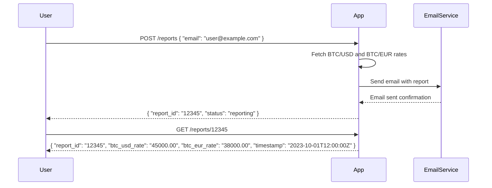

Here are the final functional requirements for your application, formatted clearly for easy reference:

### Functional Requirements

#### User Stories

1. **Report Creation**
   - **User Story**: As a user, I want to initiate the report creation process so that I can receive the latest Bitcoin conversion rates.
   - **Endpoint**: `POST /reports`
   - **Request Format**:
     ```json
     {
       "email": "user@example.com"
     }
     ```
   - **Response Format**:
     ```json
     {
       "report_id": "12345",
       "status": "reporting"
     }
     ```

2. **Report Retrieval**
   - **User Story**: As a user, I want to retrieve my report by its ID so that I can view the conversion rates.
   - **Endpoint**: `GET /reports/{report_id}`
   - **Response Format**:
     ```json
     {
       "report_id": "12345",
       "btc_usd_rate": "45000.00",
       "btc_eur_rate": "38000.00",
       "timestamp": "2023-10-01T12:00:00Z"
     }
     ```

#### API Endpoints

1. **POST /reports**
   - **Description**: Initiates the report creation process by fetching the latest Bitcoin conversion rates and sending an email report to the user.
   - **Request Body**: Contains the user's email address.
   - **Response**: Returns a report ID and the current status of the report generation.

2. **GET /reports/{report_id}**
   - **Description**: Retrieves the stored report by its ID, providing the conversion rates and the timestamp of when they were fetched.
   - **Response**: Returns the Bitcoin conversion rates (BTC/USD and BTC/EUR) along with the report ID and timestamp.

#### User-App Interaction (Mermaid Diagram)


```mermaid
sequenceDiagram
    participant User
    participant App
    participant EmailService

    User->>App: POST /reports { "email": "user@example.com" }
    App->>App: Fetch BTC/USD and BTC/EUR rates
    App->>EmailService: Send email with report
    EmailService-->>App: Email sent confirmation
    App-->>User: { "report_id": "12345", "status": "reporting" }

    User->>App: GET /reports/12345
    App-->>User: { "report_id": "12345", "btc_usd_rate": "45000.00", "btc_eur_rate": "38000.00", "timestamp": "2023-10-01T12:00:00Z" }
```

This documentation outlines the core functional requirements for your application, ensuring clarity in the expected behavior and interactions. If you need further adjustments or have additional requirements, please let me know!