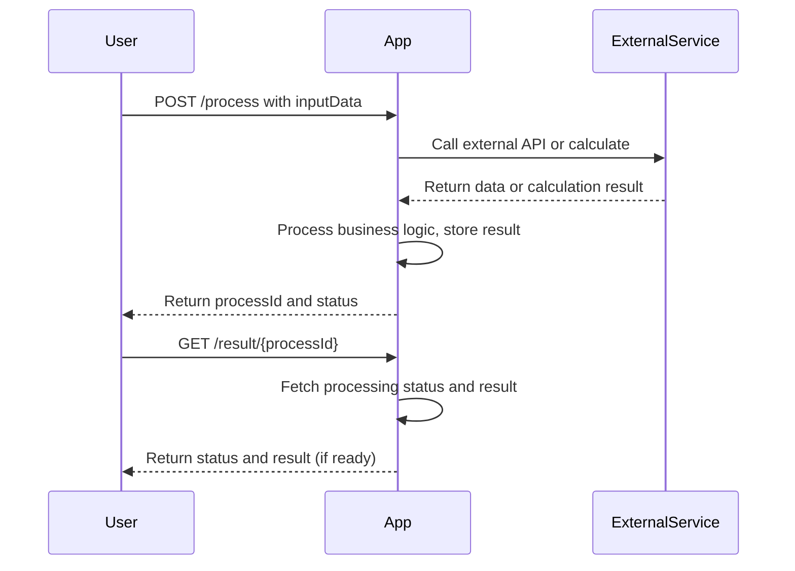

```markdown
# Functional Requirements and API Design

## API Endpoints

### 1. POST /process
- **Purpose:** Accept input data, invoke external data sources or perform calculations, and process business logic.
- **Request:**
  ```json
  {
    "inputData": { /* application-specific input */ }
  }
  ```
- **Response:**
  ```json
  {
    "processId": "string",   // unique identifier for the processed request
    "status": "processing" | "completed" | "failed",
    "message": "optional status message"
  }
  ```
- **Notes:** This endpoint triggers the workflow, including any external calls or calculations.

---

### 2. GET /result/{processId}
- **Purpose:** Retrieve the result of a previously processed request identified by processId.
- **Request:** No body, processId as URL path parameter.
- **Response:**
  ```json
  {
    "processId": "string",
    "status": "completed" | "processing" | "failed",
    "result": { /* application-specific result data, if completed */ },
    "message": "optional status or error message"
  }
  ```
- **Notes:** Returns the current state or final results of the processing.

---

## User-App Interaction Sequence Diagram


```mermaid
sequenceDiagram
    participant User
    participant App
    participant ExternalService

    User->>App: POST /process with inputData
    App->>ExternalService: Call external API or calculate
    ExternalService-->>App: Return data or calculation result
    App->>App: Process business logic, store result
    App-->>User: Return processId and status

    User->>App: GET /result/{processId}
    App->>App: Fetch processing status and result
    App-->>User: Return status and result (if ready)
```

---

## Summary

- Use **POST /process** to submit data and start processing (external data retrieval or calculations happen here).
- Use **GET /result/{processId}** to check and retrieve results.
- Request and response formats are JSON.
- The application workflow is event-driven, triggered by POST, and stateful results are retrieved by GET.
```