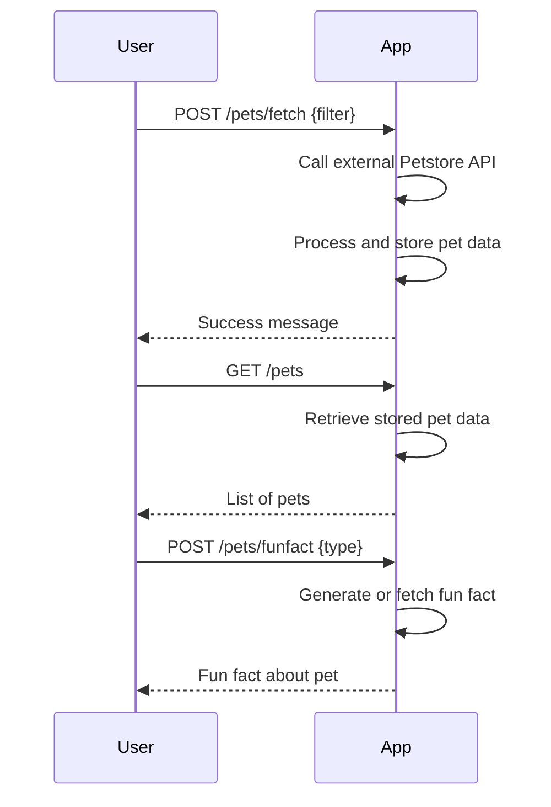

```markdown
# Purrfect Pets API - Functional Requirements

## API Endpoints

### 1. POST /pets/fetch
- **Description:** Fetch pet data from external Petstore API and apply any business logic or calculations.
- **Request:**
  ```json
  {
    "filter": {
      "status": "available",   // optional: available, pending, sold
      "type": "dog"            // optional: pet type (dog, cat, etc.)
    }
  }
  ```
- **Response:**
  ```json
  {
    "message": "Pets fetched and processed successfully",
    "count": 10
  }
  ```

### 2. GET /pets
- **Description:** Retrieve the list of pets previously fetched and stored in the application.
- **Response:**
  ```json
  [
    {
      "id": 1,
      "name": "Fluffy",
      "type": "cat",
      "status": "available",
      "funFact": "Cats sleep for 70% of their lives."
    },
    ...
  ]
  ```

### 3. POST /pets/funfact
- **Description:** Generate or retrieve a random fun fact about pets.
- **Request:**
  ```json
  {
    "type": "cat"  // optional: pet type filter for fun fact
  }
  ```
- **Response:**
  ```json
  {
    "funFact": "Dogs have a sense of time and can miss you."
  }
  ```

---

## User-App Interaction Sequence


```mermaid
sequenceDiagram
    participant User
    participant App

    User->>App: POST /pets/fetch {filter}
    App->>App: Call external Petstore API
    App->>App: Process and store pet data
    App-->>User: Success message

    User->>App: GET /pets
    App->>App: Retrieve stored pet data
    App-->>User: List of pets

    User->>App: POST /pets/funfact {type}
    App->>App: Generate or fetch fun fact
    App-->>User: Fun fact about pet
```
```