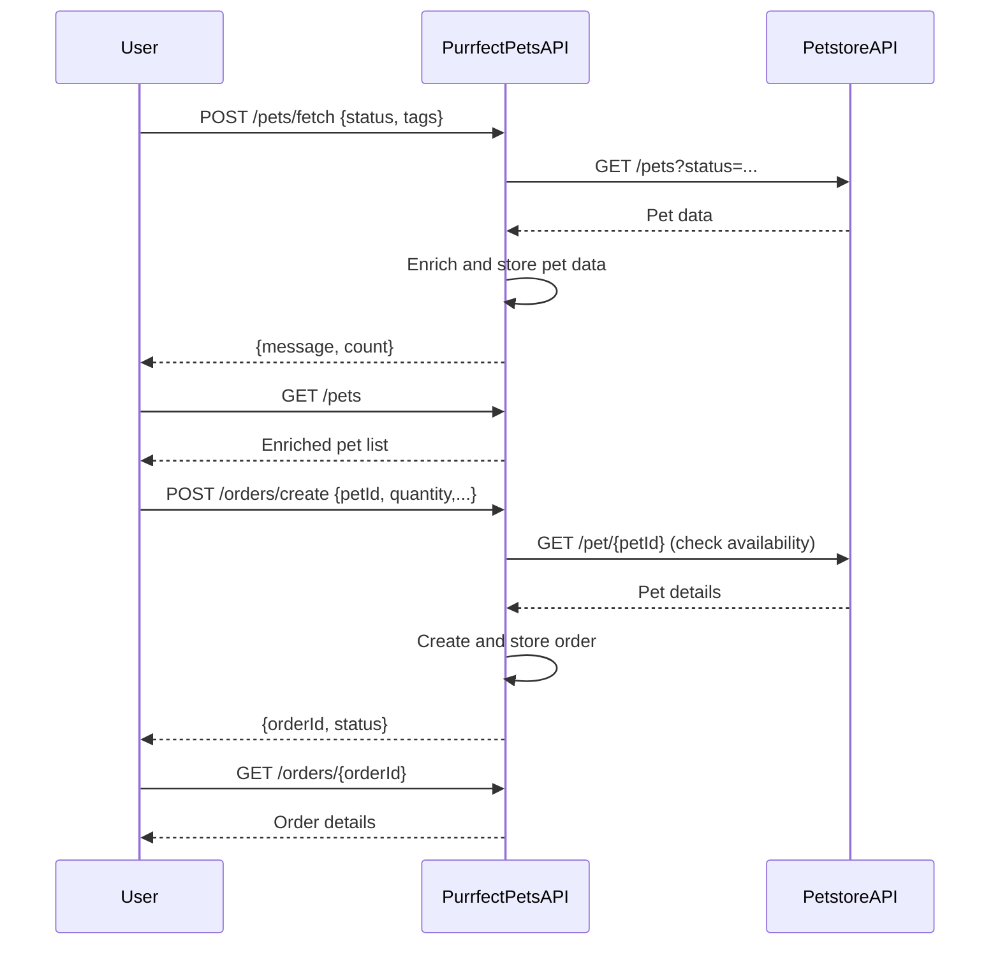

```markdown
# Purrfect Pets API - Functional Requirements

## Overview
"Purrfect Pets" API exposes pet-related data enriched from the external Petstore API. It follows RESTful design with these rules:
- **POST endpoints**: invoke external Petstore API, perform business logic, calculations, or data enrichment.
- **GET endpoints**: retrieve results stored or processed by the application.

---

## API Endpoints

### 1. POST /pets/fetch
- **Description**: Fetches pet data from Petstore API, enriches it with fun facts or computed fields, stores results internally.
- **Request Body**:
  ```json
  {
    "status": "available" | "pending" | "sold",
    "tags": ["string"]
  }
  ```
- **Response**:
  ```json
  {
    "message": "Pets fetched and enriched",
    "count": 10
  }
  ```

### 2. GET /pets
- **Description**: Retrieves the enriched pet data previously fetched and stored.
- **Response**:
  ```json
  [
    {
      "id": 123,
      "name": "Fluffy",
      "status": "available",
      "tags": ["cute", "small"],
      "funFact": "Loves chasing laser pointers"
    },
    ...
  ]
  ```

### 3. POST /orders/create
- **Description**: Creates an order for a pet, validating availability via Petstore API.
- **Request Body**:
  ```json
  {
    "petId": 123,
    "quantity": 1,
    "shipDate": "2024-07-01T10:00:00Z",
    "complete": false
  }
  ```
- **Response**:
  ```json
  {
    "orderId": 456,
    "status": "placed"
  }
  ```

### 4. GET /orders/{orderId}
- **Description**: Retrieves stored order details.
- **Response**:
  ```json
  {
    "orderId": 456,
    "petId": 123,
    "quantity": 1,
    "shipDate": "2024-07-01T10:00:00Z",
    "status": "placed"
  }
  ```

---

## Business Logic Highlights
- POST `/pets/fetch` triggers external Petstore API call to retrieve pet data filtered by status/tags.
- Enrich pet data with fun facts or computed attributes before saving internally.
- POST `/orders/create` validates pet availability by querying Petstore API before creating order.
- GET endpoints serve stored data without calling external APIs.

---

## User-App Interaction Sequence


```mermaid
sequenceDiagram
    participant User
    participant PurrfectPetsAPI
    participant PetstoreAPI

    User->>PurrfectPetsAPI: POST /pets/fetch {status, tags}
    PurrfectPetsAPI->>PetstoreAPI: GET /pets?status=...
    PetstoreAPI-->>PurrfectPetsAPI: Pet data
    PurrfectPetsAPI->>PurrfectPetsAPI: Enrich and store pet data
    PurrfectPetsAPI-->>User: {message, count}

    User->>PurrfectPetsAPI: GET /pets
    PurrfectPetsAPI-->>User: Enriched pet list

    User->>PurrfectPetsAPI: POST /orders/create {petId, quantity,...}
    PurrfectPetsAPI->>PetstoreAPI: GET /pet/{petId} (check availability)
    PetstoreAPI-->>PurrfectPetsAPI: Pet details
    PurrfectPetsAPI->>PurrfectPetsAPI: Create and store order
    PurrfectPetsAPI-->>User: {orderId, status}

    User->>PurrfectPetsAPI: GET /orders/{orderId}
    PurrfectPetsAPI-->>User: Order details
```

---

## Summary
- POST endpoints handle all external API calls and business logic.
- GET endpoints provide access to stored/enriched data.
- Entities: Pets and Orders with workflows triggered by respective POST requests.
```
