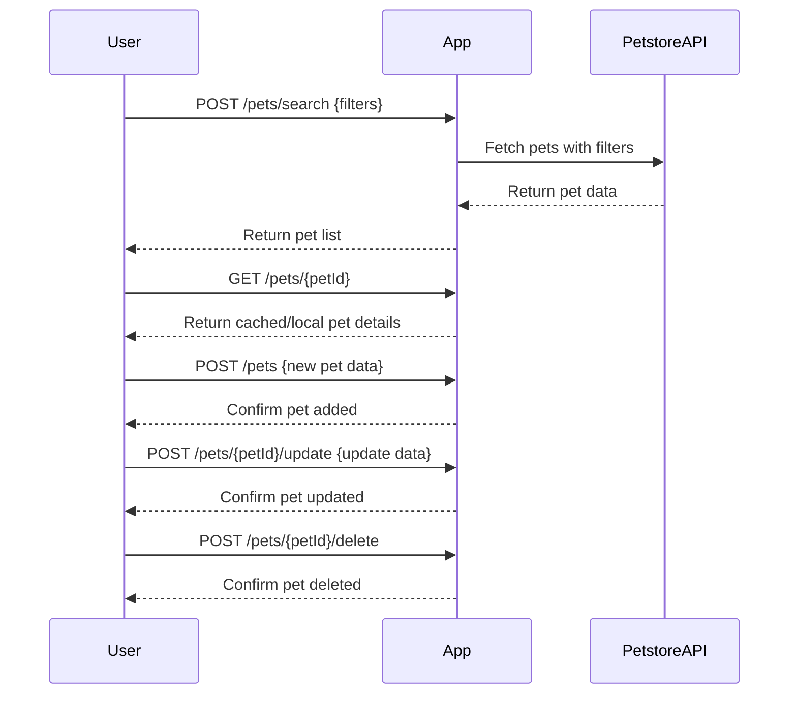

```markdown
# Purrfect Pets API - Functional Requirements

## Overview
This API allows users to browse and manage pet records, integrating live with the Petstore API for data retrieval. Users can add, update, and delete pets locally only (no synchronization back to Petstore API). The API follows RESTful principles with POST endpoints handling external data retrieval and business logic, while GET endpoints serve cached or local results.

---

## API Endpoints

### 1. Search Pets (Fetch live data from Petstore)
- **POST /pets/search**
  - Description: Search and filter pets using live Petstore API data.
  - Request:
    ```json
    {
      "type": "string (optional)",
      "status": "string (optional)",
      "name": "string (optional)"
    }
    ```
  - Response:
    ```json
    {
      "pets": [
        {
          "id": "integer",
          "name": "string",
          "type": "string",
          "status": "string",
          "photoUrls": ["string"]
        }
      ]
    }
    ```

### 2. Get Pet Details (Local/cached data)
- **GET /pets/{petId}**
  - Description: Retrieve details of a specific pet from local storage or cache.
  - Response:
    ```json
    {
      "id": "integer",
      "name": "string",
      "type": "string",
      "status": "string",
      "photoUrls": ["string"]
    }
    ```

### 3. Add Pet (Local only)
- **POST /pets**
  - Description: Add a new pet record locally.
  - Request:
    ```json
    {
      "name": "string",
      "type": "string",
      "status": "string",
      "photoUrls": ["string"]
    }
    ```
  - Response:
    ```json
    {
      "id": "integer",
      "message": "Pet added successfully"
    }
    ```

### 4. Update Pet (Local only)
- **POST /pets/{petId}/update**
  - Description: Update an existing local pet record.
  - Request:
    ```json
    {
      "name": "string (optional)",
      "type": "string (optional)",
      "status": "string (optional)",
      "photoUrls": ["string"] (optional)
    }
    ```
  - Response:
    ```json
    {
      "message": "Pet updated successfully"
    }
    ```

### 5. Delete Pet (Local only)
- **POST /pets/{petId}/delete**
  - Description: Delete a pet record locally.
  - Response:
    ```json
    {
      "message": "Pet deleted successfully"
    }
    ```

---

## Business Logic Notes
- External Petstore API data retrieval and filtering happen only in POST /pets/search.
- Local pet records are managed independently from the Petstore API.
- GET endpoints serve only cached or locally stored data for performance and consistency.

---

## User-App Interaction Sequence


```mermaid
sequenceDiagram
    participant User
    participant App
    participant PetstoreAPI

    User->>App: POST /pets/search {filters}
    App->>PetstoreAPI: Fetch pets with filters
    PetstoreAPI-->>App: Return pet data
    App-->>User: Return pet list

    User->>App: GET /pets/{petId}
    App-->>User: Return cached/local pet details

    User->>App: POST /pets {new pet data}
    App-->>User: Confirm pet added

    User->>App: POST /pets/{petId}/update {update data}
    App-->>User: Confirm pet updated

    User->>App: POST /pets/{petId}/delete
    App-->>User: Confirm pet deleted
```

---

## User Browsing Journey

```mermaid
flowchart TD
    A[User opens app] --> B{Search pets?}
    B -- Yes --> C[Send POST /pets/search]
    C --> D[Show list of pets]
    D --> E{Select pet?}
    E -- Yes --> F[GET /pets/{petId}]
    F --> G[Show pet details]
    G --> H{Add / Update / Delete?}
    H -- Add --> I[POST /pets]
    H -- Update --> J[POST /pets/{petId}/update]
    H -- Delete --> K[POST /pets/{petId}/delete]
    I & J & K --> D
    E -- No --> B
    B -- No --> L[End session]
```
```
