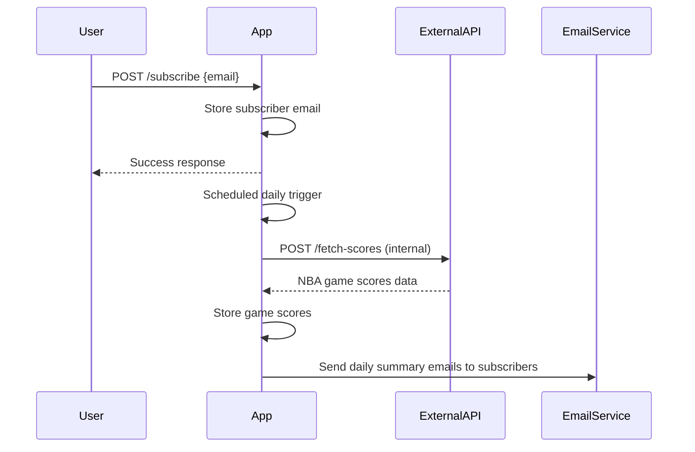
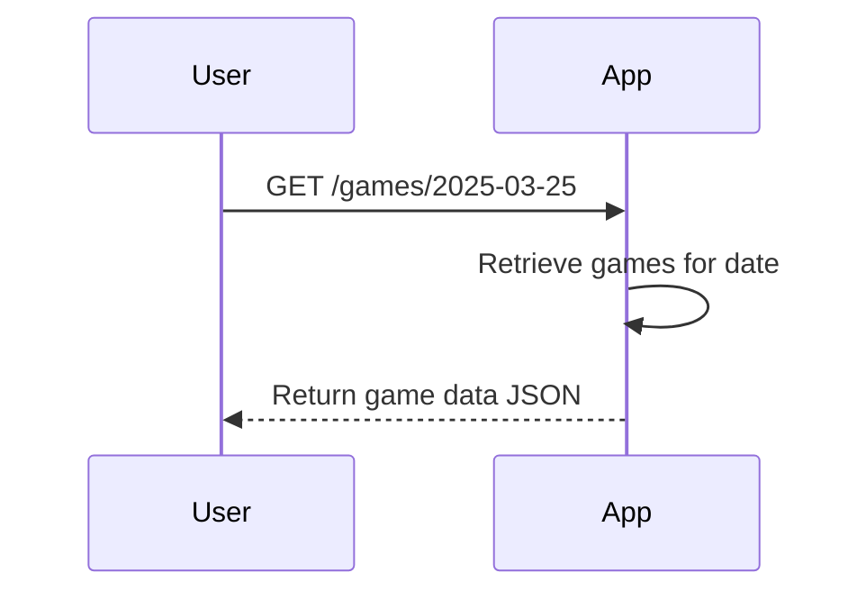
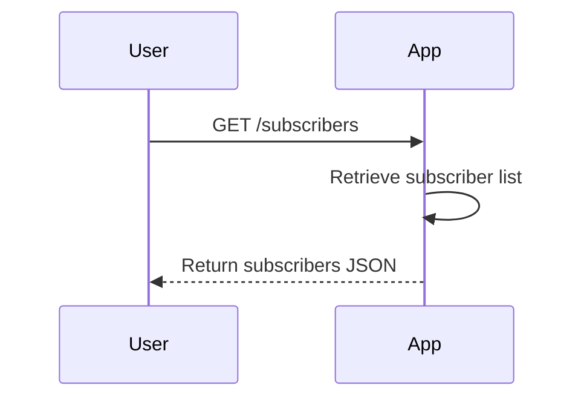

```markdown
# NBA Score Application - Functional Requirements and API Design

## Functional Requirements

1. **Data Fetching & Storage**
   - Fetch NBA game scores daily from an external API using a scheduled POST endpoint.
   - Store game data locally, including date, team names, scores, and relevant information.

2. **Subscription System**
   - Allow users to subscribe with their email to receive daily notifications.
   - Store subscriber emails in the system.

3. **Notification System**
   - After fetching and storing scores, send daily email notifications to all subscribers with a summary of the games.

4. **API Endpoints**
   - POST endpoints handle external data fetching and business logic.
   - GET endpoints provide retrieval of stored data and subscription information.

---

## API Endpoints

### POST `/fetch-scores`
- **Description:** Trigger fetching NBA scores from external API, store them, and send notifications.
- **Request Body:** None
- **Response:**
  ```json
  {
    "status": "success",
    "message": "Scores fetched, stored, and notifications sent."
  }
  ```

### POST `/subscribe`
- **Description:** Subscribe a user to daily notifications.
- **Request Body:**
  ```json
  {
    "email": "user@example.com"
  }
  ```
- **Response:**
  ```json
  {
    "status": "success",
    "message": "Subscription successful for user@example.com"
  }
  ```

### GET `/subscribers`
- **Description:** Retrieve list of all subscriber emails.
- **Response:**
  ```json
  {
    "subscribers": [
      "user1@example.com",
      "user2@example.com"
    ]
  }
  ```

### GET `/games/all`
- **Description:** Retrieve all stored NBA games.
- **Optional Query Params:** Pagination/filtering (e.g., `?page=1&limit=20`)
- **Response:**
  ```json
  {
    "games": [
      {
        "date": "2025-03-25",
        "home_team": "Lakers",
        "away_team": "Celtics",
        "home_score": 102,
        "away_score": 99,
        "status": "final"
      }
    ]
  }
  ```

### GET `/games/{date}`
- **Description:** Retrieve all games for a specific date.
- **Path Parameter:** `date` in `YYYY-MM-DD` format.
- **Response:**
  ```json
  {
    "date": "2025-03-25",
    "games": [
      {
        "home_team": "Lakers",
        "away_team": "Celtics",
        "home_score": 102,
        "away_score": 99,
        "status": "final"
      }
    ]
  }
  ```

---

## User-App Interaction Sequence Diagram


```mermaid
sequenceDiagram
    participant User
    participant App
    participant ExternalAPI
    participant EmailService

    User->>App: POST /subscribe {email}
    App->>App: Store subscriber email
    App-->>User: Success response

    App->>App: Scheduled daily trigger
    App->>ExternalAPI: POST /fetch-scores (internal)
    ExternalAPI-->>App: NBA game scores data
    App->>App: Store game scores
    App->>EmailService: Send daily summary emails to subscribers
```

---

## User Fetching Game Data Sequence Diagram


```mermaid
sequenceDiagram
    participant User
    participant App
    User->>App: GET /games/2025-03-25
    App->>App: Retrieve games for date
    App-->>User: Return game data JSON
```

---

## User Retrieving Subscribers Sequence Diagram


```mermaid
sequenceDiagram
    participant User
    participant App
    User->>App: GET /subscribers
    App->>App: Retrieve subscriber list
    App-->>User: Return subscribers JSON
```
```