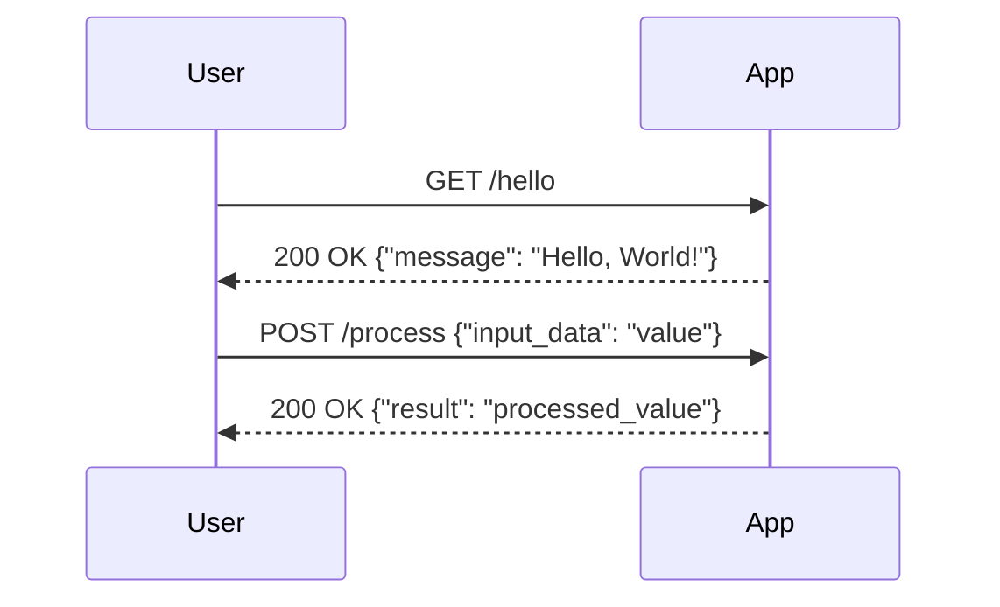

```markdown
# Functional Requirements for "Hello World" Application

## API Endpoints

### 1. Hello Endpoint
- **Method**: GET
- **Endpoint**: `/hello`
- **Description**: Returns a greeting message.
- **Request Format**: None
- **Response Format**:
  - **200 OK**
    ```json
    {
      "message": "Hello, World!"
    }
    ```

### 2. Process User Input
- **Method**: POST
- **Endpoint**: `/process`
- **Description**: Accepts user input for processing (e.g., calculations, data retrieval).
- **Request Format**:
  ```json
  {
    "input_data": "value"  // Replace with relevant data
  }
  ```
- **Response Format**:
  - **200 OK**
    ```json
    {
      "result": "processed_value"  // The result of the processing
    }
    ```
  - **400 Bad Request**
    ```json
    {
      "error": "Invalid input"
    }
    ```

## User-App Interaction Diagram


```mermaid
sequenceDiagram
    participant User
    participant App
    User->>App: GET /hello
    App-->>User: 200 OK {"message": "Hello, World!"}
    
    User->>App: POST /process {"input_data": "value"}
    App-->>User: 200 OK {"result": "processed_value"}
```
```