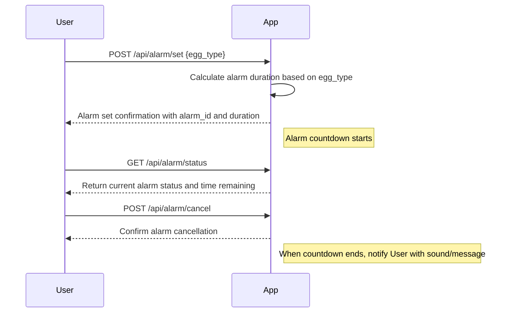

```markdown
# Egg Alarm App - Functional Requirements and API Design

## Functional Requirements

1. **Set Alarm**
   - User selects egg type: soft-boiled, medium-boiled, or hard-boiled.
   - System calculates alarm time based on egg type:
     - Soft-boiled: 4 minutes (240 seconds)
     - Medium-boiled: 7 minutes (420 seconds)
     - Hard-boiled: 10 minutes (600 seconds)
   - User confirms setting the alarm.
   - Alarm starts counting down.
   - User receives notification (sound and message) when the alarm goes off.

2. **Get Alarm Status**
   - User can retrieve the current active alarm status, including time remaining.
   - If no alarm active, status reflects that.

3. **Cancel Alarm**
   - User can cancel the active alarm at any time.

---

## API Endpoints

### 1. Set Alarm (POST `/api/alarm/set`)

- **Description**: Sets a new alarm based on egg type.
- **Request Body** (JSON):
  ```json
  {
    "egg_type": "soft" | "medium" | "hard"
  }
  ```
- **Response Body** (JSON):
  ```json
  {
    "alarm_id": "string",
    "egg_type": "soft" | "medium" | "hard",
    "duration_seconds": 240 | 420 | 600,
    "status": "active"
  }
  ```

---

### 2. Get Alarm Status (GET `/api/alarm/status`)

- **Description**: Retrieves the current alarm status.
- **Response Body** (JSON):
  ```json
  {
    "alarm_id": "string" | null,
    "egg_type": "soft" | "medium" | "hard" | null,
    "time_remaining_seconds": number | null,
    "status": "active" | "inactive"
  }
  ```

---

### 3. Cancel Alarm (POST `/api/alarm/cancel`)

- **Description**: Cancels the currently active alarm.
- **Request Body**: Empty
- **Response Body** (JSON):
  ```json
  {
    "alarm_id": "string" | null,
    "status": "cancelled"
  }
  ```

---

## User-App Interaction Sequence Diagram


```mermaid
sequenceDiagram
    participant User
    participant App

    User->>App: POST /api/alarm/set {egg_type}
    App->>App: Calculate alarm duration based on egg_type
    App-->>User: Alarm set confirmation with alarm_id and duration

    Note right of App: Alarm countdown starts

    User->>App: GET /api/alarm/status
    App-->>User: Return current alarm status and time remaining

    User->>App: POST /api/alarm/cancel
    App-->>User: Confirm alarm cancellation

    Note right of App: When countdown ends, notify User with sound/message
```

---

## User Journey Diagram

```mermaid
flowchart TD
    A[Start] --> B[Select Egg Type]
    B --> C[Set Alarm]
    C --> D{Alarm Active?}
    D -- Yes --> E[Show Countdown]
    D -- No --> B
    E --> F[User waits]
    F --> G{Time up?}
    G -- Yes --> H[Notify User (sound and message)]
    G -- No --> E
    H --> I[Alarm ends]
    I --> B
```
```