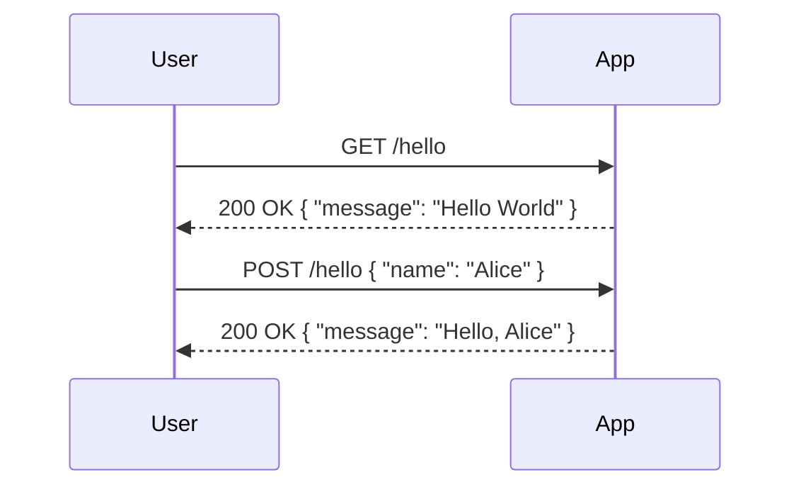

```markdown
# Final Functional Requirements for Hello World Application

## API Endpoints

### 1. GET /hello
- **Description**: Retrieves a "Hello World" message.
- **Request Format**:
  - **Method**: GET
  - **Headers**: 
    - `Content-Type: application/json`
- **Response Format**:
  - **Status Code**: 200 OK
  - **Body**:
    ```json
    {
      "message": "Hello World"
    }
    ```

### 2. POST /hello
- **Description**: Invokes business logic to generate a "Hello World" message with optional parameters.
- **Request Format**:
  - **Method**: POST
  - **Headers**: 
    - `Content-Type: application/json`
  - **Body** (optional):
    ```json
    {
      "name": "string"  // Optional, to customize the greeting
    }
    ```
- **Response Format**:
  - **Status Code**: 200 OK
  - **Body**:
    ```json
    {
      "message": "Hello, {name}" // If name is provided, otherwise "Hello World"
    }
    ```

## User-App Interaction Diagram


```mermaid
sequenceDiagram
    participant User
    participant App

    User->>App: GET /hello
    App-->>User: 200 OK { "message": "Hello World" }

    User->>App: POST /hello { "name": "Alice" }
    App-->>User: 200 OK { "message": "Hello, Alice" }
```
```