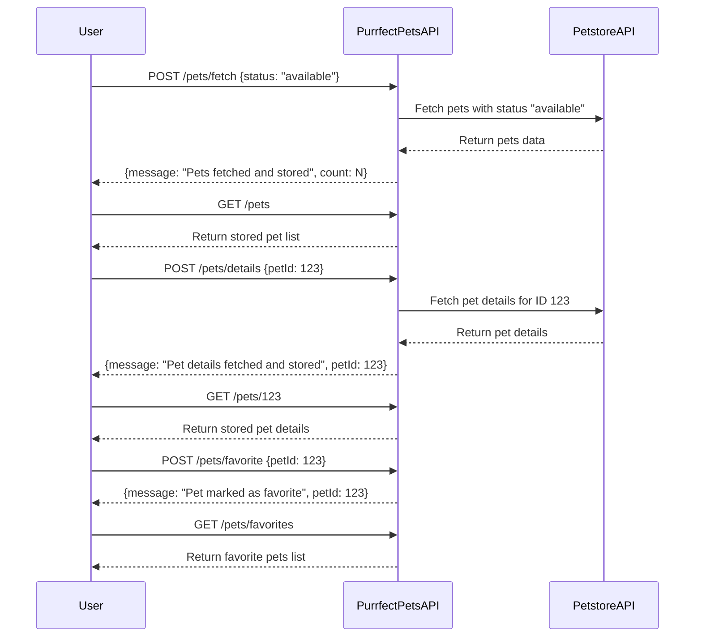
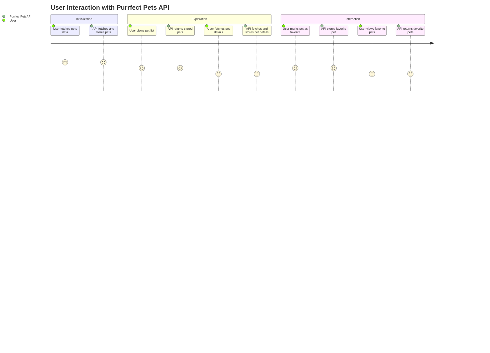

```markdown
# Purrfect Pets API - Functional Requirements

## Overview
The "Purrfect Pets" API app interacts with the external Petstore API data.  
- **POST endpoints**: invoke external Petstore API, perform business logic, and store results in app state.  
- **GET endpoints**: retrieve processed results or app-specific data (read-only, no external calls).  

---

## API Endpoints

### 1. Fetch and Store Pets  
**POST /pets/fetch**  
- **Purpose**: Fetch list of pets from external Petstore API and store in app state.  
- **Request Body**:  
```json
{
  "status": "available|pending|sold"  // optional filter for external API
}
```  
- **Response**:  
```json
{
  "message": "Pets fetched and stored",
  "count": 42
}
```

---

### 2. Retrieve Stored Pets  
**GET /pets**  
- **Purpose**: Retrieve the list of pets stored in the app (from previous fetch).  
- **Response**:  
```json
[
  {
    "id": 1,
    "name": "Fluffy",
    "category": "cat",
    "status": "available"
  },
  ...
]
```

---

### 3. Fetch and Store Pet Details  
**POST /pets/details**  
- **Purpose**: Given a pet ID, fetch detailed info from external Petstore API and store it.  
- **Request Body**:  
```json
{
  "petId": 123
}
```  
- **Response**:  
```json
{
  "message": "Pet details fetched and stored",
  "petId": 123
}
```

---

### 4. Retrieve Pet Details  
**GET /pets/{petId}**  
- **Purpose**: Get stored detailed info for a specific pet.  
- **Response**:  
```json
{
  "id": 123,
  "name": "Fluffy",
  "category": "cat",
  "status": "available",
  "photoUrls": ["url1", "url2"],
  "tags": ["cute", "playful"]
}
```

---

### 5. Add a Fun Feature - Favorite a Pet  
**POST /pets/favorite**  
- **Purpose**: Mark a pet as favorite in the app state.  
- **Request Body**:  
```json
{
  "petId": 123
}
```  
- **Response**:  
```json
{
  "message": "Pet marked as favorite",
  "petId": 123
}
```

---

### 6. Retrieve Favorite Pets  
**GET /pets/favorites**  
- **Purpose**: Retrieve list of favorite pets stored in the app.  
- **Response**:  
```json
[
  {
    "id": 123,
    "name": "Fluffy",
    "category": "cat",
    "status": "available"
  },
  ...
]
```

---

## Mermaid Sequence Diagram


```mermaid
sequenceDiagram
    participant User
    participant PurrfectPetsAPI
    participant PetstoreAPI

    User->>PurrfectPetsAPI: POST /pets/fetch {status: "available"}
    PurrfectPetsAPI->>PetstoreAPI: Fetch pets with status "available"
    PetstoreAPI-->>PurrfectPetsAPI: Return pets data
    PurrfectPetsAPI-->>User: {message: "Pets fetched and stored", count: N}

    User->>PurrfectPetsAPI: GET /pets
    PurrfectPetsAPI-->>User: Return stored pet list

    User->>PurrfectPetsAPI: POST /pets/details {petId: 123}
    PurrfectPetsAPI->>PetstoreAPI: Fetch pet details for ID 123
    PetstoreAPI-->>PurrfectPetsAPI: Return pet details
    PurrfectPetsAPI-->>User: {message: "Pet details fetched and stored", petId: 123}

    User->>PurrfectPetsAPI: GET /pets/123
    PurrfectPetsAPI-->>User: Return stored pet details

    User->>PurrfectPetsAPI: POST /pets/favorite {petId: 123}
    PurrfectPetsAPI-->>User: {message: "Pet marked as favorite", petId: 123}

    User->>PurrfectPetsAPI: GET /pets/favorites
    PurrfectPetsAPI-->>User: Return favorite pets list
```

---

## Mermaid User Journey Diagram


```mermaid
journey
    title User Interaction with Purrfect Pets API
    section Initialization
      User fetches pets data: 5: User
      API fetches and stores pets: 5: PurrfectPetsAPI
    section Exploration
      User views pet list: 4: User
      API returns stored pets: 4: PurrfectPetsAPI
      User fetches pet details: 3: User
      API fetches and stores pet details: 3: PurrfectPetsAPI
    section Interaction
      User marks pet as favorite: 4: User
      API stores favorite pet: 4: PurrfectPetsAPI
      User views favorite pets: 3: User
      API returns favorite pets: 3: PurrfectPetsAPI
```
```