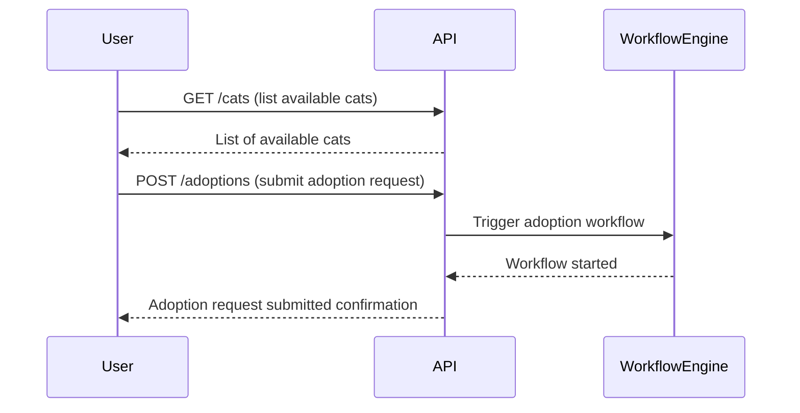
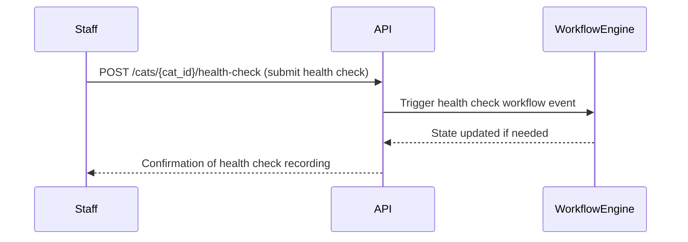
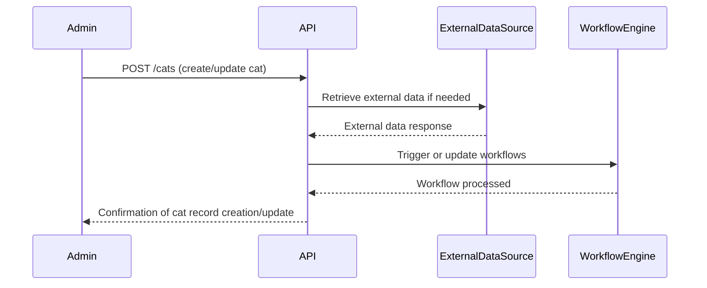

```markdown
# Functional Requirements for Cats API Application on Cyoda Platform

## API Endpoints

### 1. List Cats  
**Endpoint:** `GET /cats`  
**Description:** Retrieve a list of cats with optional filtering by state, breed, or other attributes.  
**Request Parameters (query):**  
- `state` (optional): filter by cat state (e.g., Available, Adopted)  
- `breed` (optional): filter by breed  
- `age` (optional): filter by age range  

**Response (application/json):**  
```json
[
  {
    "id": "cat123",
    "name": "Whiskers",
    "breed": "Siamese",
    "age": 3,
    "state": "Available",
    "health_status": "Healthy"
  }
]
```

---

### 2. Create or Update Cat Record  
**Endpoint:** `POST /cats`  
**Description:** Create a new cat record or update an existing one. Handles business logic, validations, and external data interactions if needed.  
**Request Body (application/json):**  
```json
{
  "id": "cat123",           // optional, if updating
  "name": "Whiskers",
  "breed": "Siamese",
  "age": 3,
  "health_status": "Healthy",
  "state": "Available"
}
```

**Response (application/json):**  
```json
{
  "success": true,
  "cat_id": "cat123",
  "message": "Cat record created/updated successfully"
}
```

---

### 3. Submit Adoption Request  
**Endpoint:** `POST /adoptions`  
**Description:** Submit an adoption application for a cat. Includes validation of cat availability, state updates, and workflow triggers.  
**Request Body (application/json):**  
```json
{
  "cat_id": "cat123",
  "applicant_name": "Jane Doe",
  "contact_info": "jane@example.com"
}
```

**Response (application/json):**  
```json
{
  "success": true,
  "adoption_id": "adopt456",
  "message": "Adoption request submitted"
}
```

---

### 4. Get Adoption Status  
**Endpoint:** `GET /adoptions/{adoption_id}`  
**Description:** Retrieve status and details of a specific adoption application.  

**Response (application/json):**  
```json
{
  "adoption_id": "adopt456",
  "cat_id": "cat123",
  "applicant_name": "Jane Doe",
  "status": "Pending Approval",
  "submitted_at": "2024-04-27T10:00:00Z"
}
```

---

### 5. Update Health Check  
**Endpoint:** `POST /cats/{cat_id}/health-check`  
**Description:** Record or update a health check for a cat, triggering relevant state transitions.  
**Request Body (application/json):**  
```json
{
  "check_date": "2024-04-25",
  "health_status": "Healthy",
  "notes": "Routine check, no issues."
}
```

**Response (application/json):**  
```json
{
  "success": true,
  "message": "Health check recorded"
}
```

---

## Mermaid Diagrams

### User Journey: Adoption Process


```mermaid
sequenceDiagram
    participant User
    participant API
    participant WorkflowEngine

    User->>API: GET /cats (list available cats)
    API-->>User: List of available cats
    User->>API: POST /adoptions (submit adoption request)
    API->>WorkflowEngine: Trigger adoption workflow
    WorkflowEngine-->>API: Workflow started
    API-->>User: Adoption request submitted confirmation
```

---

### Sequence: Cat Health Check Update


```mermaid
sequenceDiagram
    participant Staff
    participant API
    participant WorkflowEngine

    Staff->>API: POST /cats/{cat_id}/health-check (submit health check)
    API->>WorkflowEngine: Trigger health check workflow event
    WorkflowEngine-->>API: State updated if needed
    API-->>Staff: Confirmation of health check recording
```

---

### Sequence: Cat Record Creation/Update


```mermaid
sequenceDiagram
    participant Admin
    participant API
    participant ExternalDataSource
    participant WorkflowEngine

    Admin->>API: POST /cats (create/update cat)
    API->>ExternalDataSource: Retrieve external data if needed
    ExternalDataSource-->>API: External data response
    API->>WorkflowEngine: Trigger or update workflows
    WorkflowEngine-->>API: Workflow processed
    API-->>Admin: Confirmation of cat record creation/update
```
```