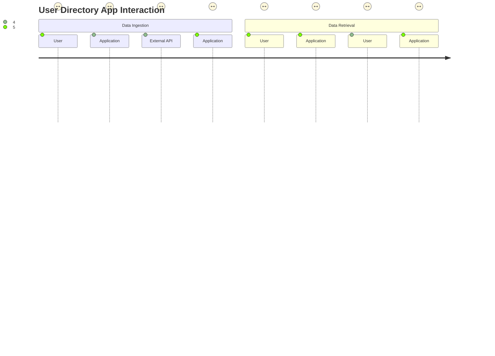
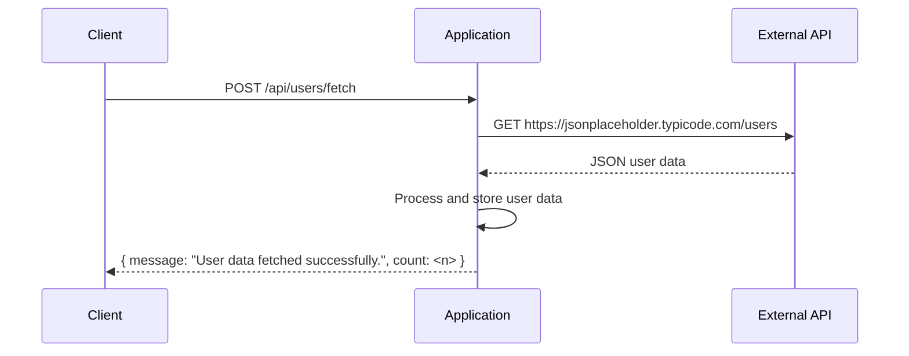

# Functional Requirements for User Directory Application

## Overview

The User Directory application provides a platform for users to view and interact with a list of user profiles fetched from an external API. This document outlines the necessary functional requirements and API specifications.

## Functional Requirements

### Data Ingestion

1. **Fetch User Data**
   - **Endpoint:** `POST /api/users/fetch`
   - **Purpose:** Retrieve user data from the external API at `https://jsonplaceholder.typicode.com/users` and process/store it for later retrieval.
   - **Request:**
     - HTTP Method: POST
     - Body (optional): Parameters for filtering or pagination (e.g., `{"limit": 10}`).
   - **Response:**
     - Status: 200 OK
     - Body: 
       ```json
       {
         "message": "User data fetched successfully.",
         "count": <number_of_users>
       }
       ```

### User Interaction

2. **Retrieve User List**
   - **Endpoint:** `GET /api/users`
   - **Purpose:** Retrieve a list of all users with basic contact details.
   - **Request:**
     - HTTP Method: GET
     - Query Parameters (optional): 
       - `name` (string): Search filter by user name.
       - `email` (string): Search filter by user email.
   - **Response:**
     - Status: 200 OK
     - Body: 
       ```json
       [
         {
           "id": 1,
           "name": "Leanne Graham",
           "email": "Sincere@april.biz",
           "phone": "1-770-736-8031 x56442",
           "website": "hildegard.org"
         },
         ...
       ]
       ```

3. **Retrieve User Detail**
   - **Endpoint:** `GET /api/users/{id}`
   - **Purpose:** Retrieve detailed information for a specific user.
   - **Request:**
     - HTTP Method: GET
     - Path Parameter: `{id}` (integer): The user's unique identifier.
   - **Response:**
     - Status: 200 OK
     - Body: 
       ```json
       {
         "id": 1,
         "name": "Leanne Graham",
         "username": "Bret",
         "email": "Sincere@april.biz",
         "address": {
           "street": "Kulas Light",
           "suite": "Apt. 556",
           "city": "Gwenborough",
           "zipcode": "92998-3874"
         },
         "phone": "1-770-736-8031 x56442",
         "website": "hildegard.org",
         "company": {
           "name": "Romaguera-Crona",
           "catchPhrase": "Multi-layered client-server neural-net",
           "bs": "harness real-time e-markets"
         }
       }
       ```

## User-App Interaction

### Journey Diagram


```mermaid
journey
    title User Directory App Interaction
    section Data Ingestion
      User: Initiates a fetch request for external data: 5: POST /api/users/fetch
      Application: Processes external API call and stores user data: 4: External API call
      External API: Returns user data: 4: JSON data
      Application: Confirms successful data ingestion: 5: Response sent to User
    section Data Retrieval
      User: Requests user list: 5: GET /api/users
      Application: Returns user list with basic details: 5: JSON response
      User: Selects a user for more details: 4: GET /api/users/{id}
      Application: Returns detailed information including address, company: 5: JSON response
```

### Sequence Diagram for Data Ingestion


```mermaid
sequenceDiagram
    participant C as Client
    participant A as Application
    participant E as External API
    C->>A: POST /api/users/fetch
    A->>E: GET https://jsonplaceholder.typicode.com/users
    E-->>A: JSON user data
    A->>A: Process and store user data
    A-->>C: { message: "User data fetched successfully.", count: <n> }
```

This concludes the functional requirements for the User Directory application, detailing the necessary endpoints, request/response formats, and user interactions.