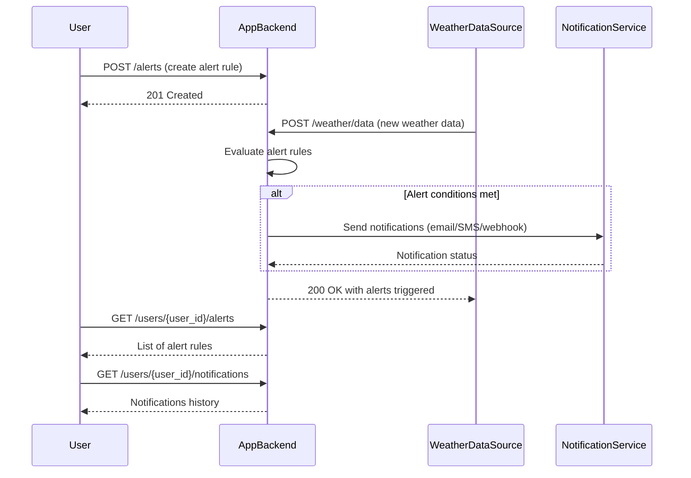

```markdown
# Functional Requirements and API Design for Weather Alert Feature

## API Endpoints

### 1. Create Alert Rule  
**POST /alerts**  
Creates a new alert rule for a user with customizable conditions.

- **Request Body** (application/json):
```json
{
  "user_id": "string",
  "name": "string",
  "conditions": [
    {
      "type": "temperature",
      "operator": "gt|lt|eq",
      "value": "number"
    },
    {
      "type": "rain_forecast",
      "operator": "eq",
      "value": "true|false"
    }
  ],
  "notification_channels": ["email", "sms", "webhook"],
  "notification_targets": {
    "email": "user@example.com",
    "sms": "+1234567890",
    "webhook": "https://example.com/webhook"
  }
}
```

- **Response** (201 Created):
```json
{
  "alert_id": "string",
  "status": "active"
}
```

---

### 2. Update Alert Rule  
**POST /alerts/{alert_id}**  
Update an existing alert rule (conditions, notification channels, targets).

- **Request Body** (application/json):
```json
{
  "name": "string",
  "conditions": [
    {
      "type": "temperature",
      "operator": "gt|lt|eq",
      "value": "number"
    },
    {
      "type": "rain_forecast",
      "operator": "eq",
      "value": "true|false"
    }
  ],
  "notification_channels": ["email", "sms"],
  "notification_targets": {
    "email": "newuser@example.com",
    "sms": "+1987654321"
  }
}
```

- **Response** (200 OK):
```json
{
  "alert_id": "string",
  "status": "updated"
}
```

---

### 3. Delete Alert Rule  
**POST /alerts/{alert_id}/delete**  
Soft-delete or deactivate an alert rule.

- **Response** (200 OK):
```json
{
  "alert_id": "string",
  "status": "deleted"
}
```

---

### 4. Fetch Alert Rules for User  
**GET /users/{user_id}/alerts**  
Retrieve all alert rules for a user.

- **Response** (200 OK):
```json
[
  {
    "alert_id": "string",
    "name": "string",
    "conditions": [
      {
        "type": "temperature",
        "operator": "gt|lt|eq",
        "value": "number"
      }
    ],
    "notification_channels": ["email", "sms"],
    "status": "active|paused|deleted"
  }
]
```

---

### 5. Trigger Weather Data Processing  
**POST /weather/data**  
Submit new weather data for processing; triggers workflows to evaluate alert rules.

- **Request Body** (application/json):
```json
{
  "location": "string",
  "timestamp": "ISO8601 datetime",
  "temperature": "number",
  "rain_forecast": "boolean",
  "additional_data": {}
}
```

- **Response** (200 OK):
```json
{
  "processed_at": "ISO8601 datetime",
  "alerts_triggered": [
    {
      "alert_id": "string",
      "user_id": "string",
      "notification_channels": ["email"],
      "notification_status": "sent|failed"
    }
  ]
}
```

---

### 6. Fetch Notifications History for User  
**GET /users/{user_id}/notifications**  
Retrieve past notifications sent to the user.

- **Response** (200 OK):
```json
[
  {
    "notification_id": "string",
    "alert_id": "string",
    "channel": "email|sms|webhook",
    "status": "sent|failed",
    "timestamp": "ISO8601 datetime"
  }
]
```

---

## Business Logic Notes
- All external data retrieval and alert evaluation are performed in the **POST /weather/data** endpoint.
- Notification sending is triggered as part of the workflow after evaluating alert conditions.
- GET endpoints only retrieve stored data without invoking external services.

---

## User-App Interaction Sequence Diagram


```mermaid
sequenceDiagram
    participant User
    participant AppBackend
    participant WeatherDataSource
    participant NotificationService

    User->>AppBackend: POST /alerts (create alert rule)
    AppBackend-->>User: 201 Created

    WeatherDataSource->>AppBackend: POST /weather/data (new weather data)
    AppBackend->>AppBackend: Evaluate alert rules
    alt Alert conditions met
        AppBackend->>NotificationService: Send notifications (email/SMS/webhook)
        NotificationService-->>AppBackend: Notification status
    end
    AppBackend-->>WeatherDataSource: 200 OK with alerts triggered

    User->>AppBackend: GET /users/{user_id}/alerts
    AppBackend-->>User: List of alert rules

    User->>AppBackend: GET /users/{user_id}/notifications
    AppBackend-->>User: Notifications history
```
```