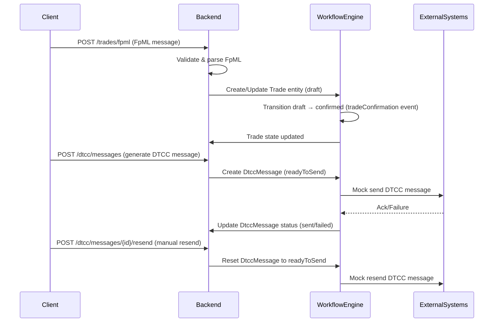

```markdown
# Functional Requirements and API Design for OTC Derivative Trade Backend

## API Endpoints

### 1. Trade Ingestion via FpML

- **POST /trades/fpml**

  - Description: Accepts a full FpML trade confirmation message, validates schema and authenticity, parses and creates/updates a Trade entity, triggers workflow state transitions.
  - Request:
    ```json
    {
      "fpmlMessage": "<FpML XML content as string>",
      "signature": "<optional digital signature>"
    }
    ```
  - Response:
    ```json
    {
      "tradeId": "string",
      "status": "draft|confirmed|amended|cancelled|rejected",
      "message": "Trade processed successfully or error details"
    }
    ```

### 2. Legal Entity Management

- **GET /legal-entities**

  - Description: Query legal entities by LEI, name, jurisdiction, etc.
  - Query parameters: `lei`, `name`, `jurisdiction` (optional)
  - Response:
    ```json
    [
      {
        "lei": "string",
        "name": "string",
        "jurisdiction": "string",
        "status": "active|inactive"
      },
      ...
    ]
    ```

- **POST /legal-entities**

  - Description: Add or update legal entity records (e.g., via GLEIF data import).
  - Request:
    ```json
    {
      "lei": "string",
      "name": "string",
      "jurisdiction": "string",
      "status": "active|inactive"
    }
    ```
  - Response:
    ```json
    {
      "lei": "string",
      "message": "Legal entity added or updated successfully"
    }
    ```

### 3. DTCC Message Handling

- **POST /dtcc/messages**

  - Description: Generate and store DTCC GTR messages (preview/testing). Initiates workflow for sending (mocked).
  - Request:
    ```json
    {
      "tradeId": "string",
      "messageType": "new|modify|cancel"
    }
    ```
  - Response:
    ```json
    {
      "dtccMessageId": "string",
      "status": "readyToSend|sent|failed",
      "message": "DTCC message generated successfully"
    }
    ```

- **POST /dtcc/messages/{id}/resend**

  - Description: Manually trigger resending of a DTCC message in case of failure.
  - Response:
    ```json
    {
      "dtccMessageId": "string",
      "status": "readyToSend",
      "message": "Resend triggered"
    }
    ```

- **GET /dtcc/messages/{id}**

  - Description: Retrieve DTCC message status and audit information.
  - Response:
    ```json
    {
      "dtccMessageId": "string",
      "tradeId": "string",
      "status": "readyToSend|sent|failed",
      "history": [
        {
          "timestamp": "ISO8601 string",
          "event": "string",
          "details": "string"
        }
      ]
    }
    ```

---

## Trade Lifecycle States and Transitions

| State      | Description                                              |
|------------|----------------------------------------------------------|
| draft      | Trade created but not yet confirmed (manual or API).     |
| confirmed  | Trade bilaterally confirmed via FpML tradeConfirmation.  |
| amended    | Trade amended post-confirmation (economic or non-economic). |
| cancelled  | Trade cancelled before activation (e.g., booking error). |
| rejected   | Trade rejected by recipient/internal validation.         |

| Event Type            | Transition                    |
|-----------------------|-------------------------------|
| execution or newTrade  | → draft                       |
| tradeConfirmation      | draft → confirmed             |
| amendment/modification | confirmed → amended           |
| cancel/termination     | Any → cancelled               |
| rejection             | draft or confirmed → rejected |

---

## Workflow Summary Mermaid Sequence Diagram


```mermaid
sequenceDiagram
    participant Client
    participant Backend
    participant WorkflowEngine
    participant ExternalSystems

    Client->>Backend: POST /trades/fpml (FpML message)
    Backend->>Backend: Validate & parse FpML
    Backend->>WorkflowEngine: Create/Update Trade entity (draft)
    WorkflowEngine->>WorkflowEngine: Transition draft → confirmed (tradeConfirmation event)
    WorkflowEngine->>Backend: Trade state updated
    Client->>Backend: POST /dtcc/messages (generate DTCC message)
    Backend->>WorkflowEngine: Create DtccMessage (readyToSend)
    WorkflowEngine->>ExternalSystems: Mock send DTCC message
    ExternalSystems-->>WorkflowEngine: Ack/Failure
    WorkflowEngine->>Backend: Update DtccMessage status (sent/failed)
    Client->>Backend: POST /dtcc/messages/{id}/resend (manual resend)
    Backend->>WorkflowEngine: Reset DtccMessage to readyToSend
    WorkflowEngine->>ExternalSystems: Mock resend DTCC message
```

---

## User Interaction Journey Mermaid Flowchart

```mermaid
flowchart TD
    A[User submits FpML trade confirmation] --> B{FpML validation}
    B -- valid --> C[Create or update Trade in draft state]
    C --> D[Trade transitions to confirmed or amended state]
    B -- invalid --> E[Reject trade with error message]
    D --> F[User requests DTCC message generation]
    F --> G[Generate DTCC message and mark readyToSend]
    G --> H[Workflow sends DTCC message (mock)]
    H --> I{Send successful?}
    I -- yes --> J[DtccMessage status: sent]
    I -- no --> K[DtccMessage status: failed]
    K --> L[User triggers manual resend]
    L --> H
```
```