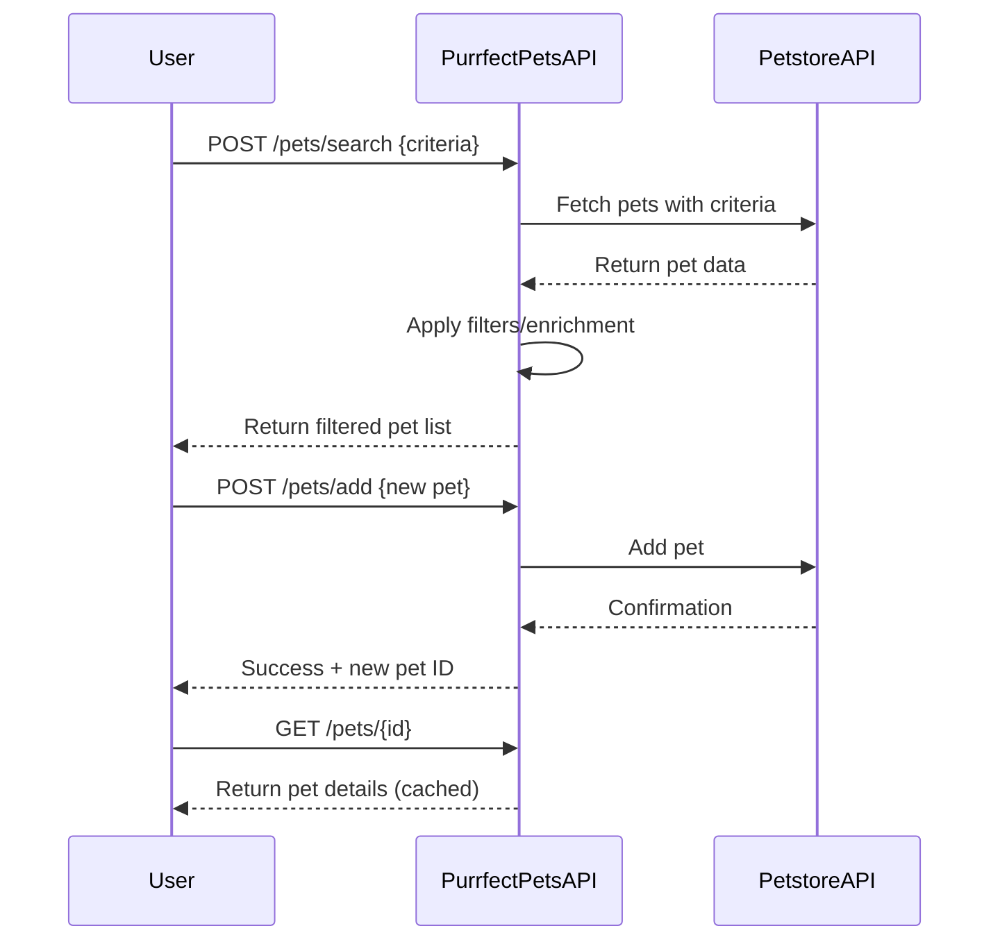

```markdown
# Purrfect Pets API - Functional Requirements

## Overview
The API provides a fun interface to interact with pet data from the Petstore API. Business logic that calls external data sources or performs calculations will be handled in POST endpoints. GET endpoints will only serve data already processed/stored by our app.

---

## API Endpoints

### 1. POST /pets/search  
**Description:** Search pets by criteria, fetch from Petstore API, apply any app-specific logic (e.g., filtering, enrichment).  
**Request:**  
```json
{
  "type": "cat" | "dog" | "all",
  "status": "available" | "pending" | "sold",
  "tags": ["cute", "small"]  // optional filters
}
```  
**Response:**  
```json
{
  "pets": [
    {
      "id": 1,
      "name": "Fluffy",
      "type": "cat",
      "status": "available",
      "tags": ["cute", "small"],
      "description": "A playful kitten"
    }
  ]
}
```

---

### 2. POST /pets/add  
**Description:** Add a new pet (creates entry in Petstore API via business logic).  
**Request:**  
```json
{
  "name": "Whiskers",
  "type": "cat" | "dog",
  "status": "available" | "pending" | "sold",
  "tags": ["friendly", "family"],
  "description": "Loves cuddles"
}
```  
**Response:**  
```json
{
  "success": true,
  "petId": 123
}
```

---

### 3. POST /pets/update  
**Description:** Update pet details (business logic calls Petstore API update).  
**Request:**  
```json
{
  "id": 123,
  "name": "Whiskers",
  "status": "sold"
}
```  
**Response:**  
```json
{
  "success": true
}
```

---

### 4. POST /pets/delete  
**Description:** Delete a pet entry (business logic calls Petstore API delete).  
**Request:**  
```json
{
  "id": 123
}
```  
**Response:**  
```json
{
  "success": true
}
```

---

### 5. GET /pets/{id}  
**Description:** Retrieve pet details from our app cache or database (no external calls).  
**Response:**  
```json
{
  "id": 123,
  "name": "Whiskers",
  "type": "cat",
  "status": "sold",
  "tags": ["friendly", "family"],
  "description": "Loves cuddles"
}
```

---

## User-App Interaction Sequence


```mermaid
sequenceDiagram
    participant User
    participant PurrfectPetsAPI
    participant PetstoreAPI

    User->>PurrfectPetsAPI: POST /pets/search {criteria}
    PurrfectPetsAPI->>PetstoreAPI: Fetch pets with criteria
    PetstoreAPI-->>PurrfectPetsAPI: Return pet data
    PurrfectPetsAPI->>PurrfectPetsAPI: Apply filters/enrichment
    PurrfectPetsAPI-->>User: Return filtered pet list

    User->>PurrfectPetsAPI: POST /pets/add {new pet}
    PurrfectPetsAPI->>PetstoreAPI: Add pet
    PetstoreAPI-->>PurrfectPetsAPI: Confirmation
    PurrfectPetsAPI-->>User: Success + new pet ID

    User->>PurrfectPetsAPI: GET /pets/{id}
    PurrfectPetsAPI-->>User: Return pet details (cached)
```
```