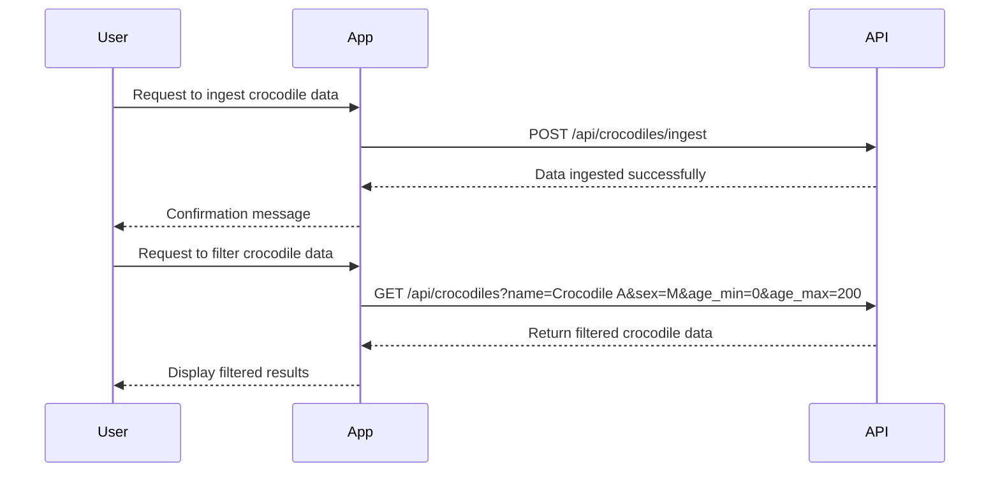

```markdown
# Functional Requirements for Crocodile Data Management Application

## API Endpoints

### 1. Ingest Crocodile Data
- **Endpoint**: `POST /api/crocodiles/ingest`
- **Request Format**:
  ```json
  {
    "api_url": "https://test-api.k6.io/public/crocodiles/"
  }
  ```
- **Response Format**:
  ```json
  {
    "message": "Data ingested successfully",
    "count": 50 // Number of crocodiles ingested
  }
  ```

### 2. Get Filtered Crocodile Data
- **Endpoint**: `GET /api/crocodiles`
- **Query Parameters**:
  - `name` (optional): Filter by crocodile name (substring match).
  - `sex` (optional): Filter by sex ("M" or "F").
  - `age_min` (optional): Minimum age (integer).
  - `age_max` (optional): Maximum age (integer).
- **Response Format**:
  ```json
  {
    "crocodiles": [
      {
        "id": 1,
        "name": "Crocodile A",
        "sex": "M",
        "date_of_birth": "2010-01-01",
        "age": 13
      },
      ...
    ]
  }
  ```

## User-App Interaction


```mermaid
sequenceDiagram
    participant User
    participant App
    participant API

    User->>App: Request to ingest crocodile data
    App->>API: POST /api/crocodiles/ingest
    API-->>App: Data ingested successfully
    App-->>User: Confirmation message
    
    User->>App: Request to filter crocodile data
    App->>API: GET /api/crocodiles?name=Crocodile A&sex=M&age_min=0&age_max=200
    API-->>App: Return filtered crocodile data
    App-->>User: Display filtered results
```
```