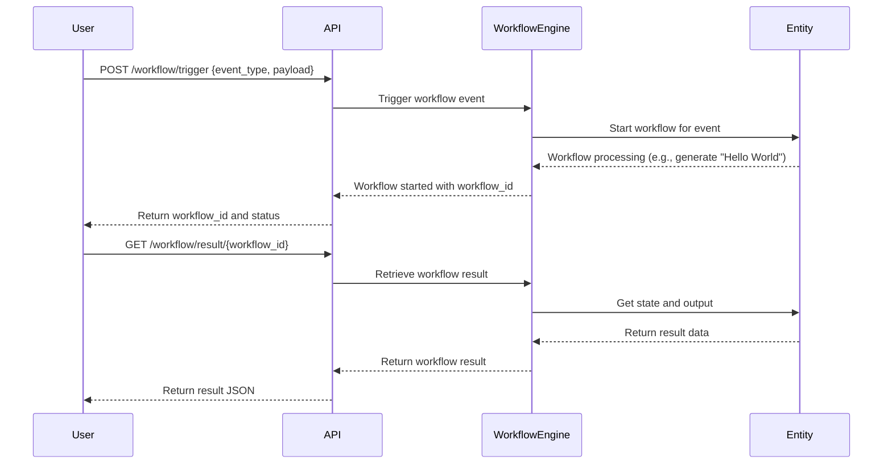

```markdown
# Functional Requirements for Cyoda Hello World Application

## Overview
This backend application follows Cyoda design principles. It includes an entity with a workflow triggered by an event, demonstrating event-driven architecture. The API adheres to RESTful rules:

- **POST** endpoints are used for business logic that involves invoking external data sources, retrieving data, or performing calculations.
- **GET** endpoints are used only to retrieve stored results from the application.

---

## API Endpoints

### 1. Trigger Workflow (POST `/workflow/trigger`)
Triggers the entity workflow by sending an event to start the process.

- **Request**
  ```json
  {
    "event_type": "string",       // Type of event triggering the workflow (e.g., "hello_event")
    "payload": {                  // Optional additional data for the workflow
      "key": "value"
    }
  }
  ```

- **Response**
  ```json
  {
    "status": "string",           // e.g., "started", "failed"
    "workflow_id": "string",      // Unique identifier for the triggered workflow instance
    "message": "string"           // Optional message or error description
  }
  ```

---

### 2. Get Workflow Result (GET `/workflow/result/{workflow_id}`)
Retrieves the result or status of a previously triggered workflow.

- **Request**
  - URL parameter: `workflow_id` – ID of the workflow instance to retrieve.

- **Response**
  ```json
  {
    "workflow_id": "string",
    "status": "string",           // e.g., "completed", "in_progress", "failed"
    "result": {                   // Output data from the workflow, e.g., Hello World message
      "message": "Hello World"
    },
    "started_at": "ISO8601 timestamp",
    "completed_at": "ISO8601 timestamp|null"
  }
  ```

---

## Business Logic

- The POST `/workflow/trigger` endpoint initiates the workflow execution.
- Workflow listens for the event, processes the payload, and produces the output (e.g., "Hello World").
- The result is stored and accessible via GET `/workflow/result/{workflow_id}`.

---

## User-App Interaction Sequence Diagram


```mermaid
sequenceDiagram
    participant User
    participant API
    participant WorkflowEngine
    participant Entity

    User->>API: POST /workflow/trigger {event_type, payload}
    API->>WorkflowEngine: Trigger workflow event
    WorkflowEngine->>Entity: Start workflow for event
    Entity-->>WorkflowEngine: Workflow processing (e.g., generate "Hello World")
    WorkflowEngine-->>API: Workflow started with workflow_id
    API-->>User: Return workflow_id and status

    User->>API: GET /workflow/result/{workflow_id}
    API->>WorkflowEngine: Retrieve workflow result
    WorkflowEngine->>Entity: Get state and output
    Entity-->>WorkflowEngine: Return result data
    WorkflowEngine-->>API: Return workflow result
    API-->>User: Return result JSON
```

---

## Summary

- POST endpoint triggers workflows with events and handles business logic.
- GET endpoint retrieves results of workflows.
- Data exchanged is JSON formatted.
- Workflow engine manages entity state and output.
```