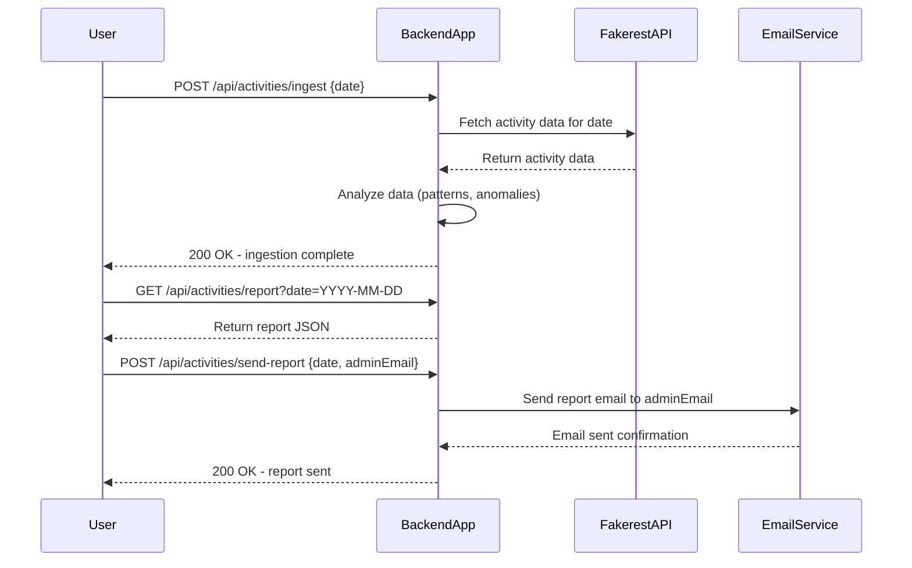
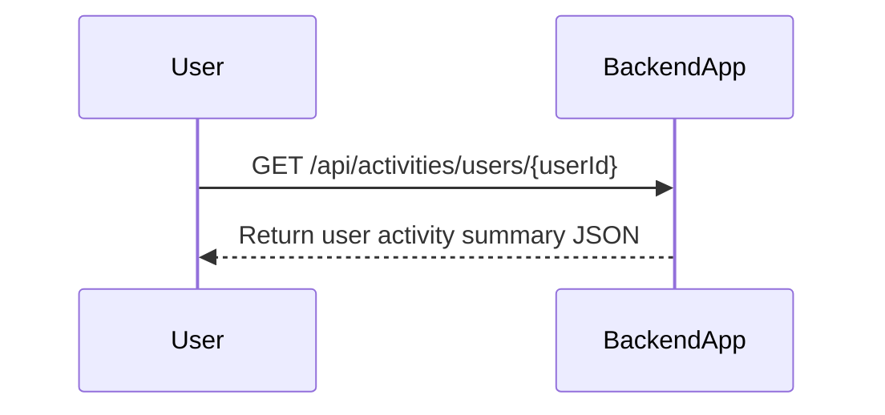

```markdown
# Functional Requirements for Activity Tracker Application

## Overview
The application tracks user activities from the Fakerest API, processes data to identify patterns, generates daily reports, and sends them to the admin email. The data ingestion and processing are triggered via POST endpoints, while GET endpoints provide access to processed results and reports.

---

## API Endpoints

### 1. **POST /api/activities/ingest**
- **Purpose:** Trigger data ingestion from Fakerest API and process user activity data (pattern analysis, anomaly detection).
- **Request:**
  ```json
  {
    "date": "YYYY-MM-DD"  // Optional: date for which to fetch data; defaults to current date if omitted
  }
  ```
- **Response:**
  ```json
  {
    "status": "success",
    "message": "Data ingestion and processing completed for date YYYY-MM-DD",
    "processedRecords": 123
  }
  ```
- **Notes:** This endpoint fetches data from external Fakerest API, performs analysis, and generates the report internally.

---

### 2. **GET /api/activities/report**
- **Purpose:** Retrieve the generated daily report summarizing user activities, trends, and anomalies for a specific date.
- **Request Parameters:**
  - `date` (query param, required): `YYYY-MM-DD`
- **Response:**
  ```json
  {
    "date": "YYYY-MM-DD",
    "totalUsers": 45,
    "totalActivities": 230,
    "activityFrequency": {
      "walking": 120,
      "running": 80,
      "cycling": 30
    },
    "anomalies": [
      {
        "userId": 12,
        "description": "Unusually high activity frequency"
      }
    ]
  }
  ```

---

### 3. **GET /api/activities/users/{userId}**
- **Purpose:** Retrieve activity summary for a specific user.
- **Path Parameter:**
  - `userId`: integer
- **Response:**
  ```json
  {
    "userId": 12,
    "activitySummary": {
      "dateRange": "YYYY-MM-DD to YYYY-MM-DD",
      "totalActivities": 50,
      "activityTypes": {
        "walking": 20,
        "running": 15,
        "cycling": 15
      }
    }
  }
  ```

---

### 4. **POST /api/activities/send-report**
- **Purpose:** Trigger sending the daily report email to the admin.
- **Request:**
  ```json
  {
    "date": "YYYY-MM-DD",
    "adminEmail": "admin@example.com"
  }
  ```
- **Response:**
  ```json
  {
    "status": "success",
    "message": "Report sent to admin@example.com for date YYYY-MM-DD"
  }
  ```

---

## Business Logic Notes
- External data fetching and analysis happen exclusively in POST endpoints (`/ingest`).
- GET endpoints are read-only and serve stored results.
- Daily ingestion should be scheduled, but manual triggering is possible via `/ingest`.
- Reports are generated and stored after ingestion; email sending is triggered separately via `/send-report`.

---

## User-App Interaction Sequence Diagram


```mermaid
sequenceDiagram
    participant User
    participant BackendApp
    participant FakerestAPI
    participant EmailService

    User->>BackendApp: POST /api/activities/ingest {date}
    BackendApp->>FakerestAPI: Fetch activity data for date
    FakerestAPI-->>BackendApp: Return activity data
    BackendApp->>BackendApp: Analyze data (patterns, anomalies)
    BackendApp-->>User: 200 OK - ingestion complete

    User->>BackendApp: GET /api/activities/report?date=YYYY-MM-DD
    BackendApp-->>User: Return report JSON

    User->>BackendApp: POST /api/activities/send-report {date, adminEmail}
    BackendApp->>EmailService: Send report email to adminEmail
    EmailService-->>BackendApp: Email sent confirmation
    BackendApp-->>User: 200 OK - report sent
```

---

## User Activity Summary Retrieval Diagram


```mermaid
sequenceDiagram
    participant User
    participant BackendApp

    User->>BackendApp: GET /api/activities/users/{userId}
    BackendApp-->>User: Return user activity summary JSON
```
```