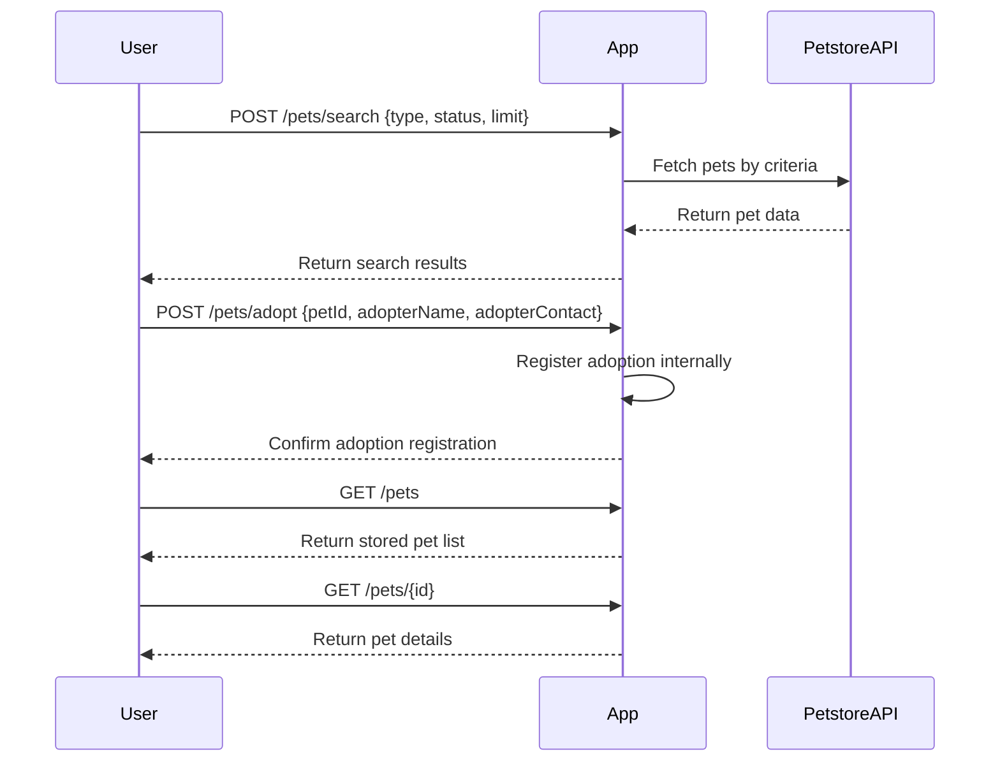

```markdown
# Functional Requirements for 'Purrfect Pets' API App

## Overview
The app integrates with the Petstore API data to provide pet-related functionalities. Following RESTful principles:

- **POST endpoints** perform any business logic, data retrieval from external Petstore API, or calculations.
- **GET endpoints** only retrieve results stored or processed by our application.

---

## API Endpoints

### 1. POST /pets/search
**Purpose:** Search pets using criteria; fetches data from Petstore API and processes it.

**Request Body:**
```json
{
  "type": "string",      // optional: "cat", "dog", etc.
  "status": "string",    // optional: "available", "sold", etc.
  "limit": 10            // optional: max number of results
}
```

**Response:**
```json
{
  "results": [
    {
      "id": "int",
      "name": "string",
      "type": "string",
      "status": "string",
      "description": "string"
    },
    ...
  ]
}
```

---

### 2. POST /pets/adopt
**Purpose:** Register an adoption request for a pet; updates internal records.

**Request Body:**
```json
{
  "petId": "int",
  "adopterName": "string",
  "adopterContact": "string"
}
```

**Response:**
```json
{
  "success": true,
  "message": "Adoption request registered"
}
```

---

### 3. GET /pets
**Purpose:** Retrieve cached or stored list of pets previously fetched or adopted.

**Response:**
```json
{
  "pets": [
    {
      "id": "int",
      "name": "string",
      "type": "string",
      "status": "string"
    },
    ...
  ]
}
```

---

### 4. GET /pets/{id}
**Purpose:** Retrieve details of a specific pet by ID.

**Response:**
```json
{
  "id": "int",
  "name": "string",
  "type": "string",
  "status": "string",
  "description": "string",
  "adoptionStatus": "string"
}
```

---

## User-App Interaction Sequence


```mermaid
sequenceDiagram
    participant User
    participant App
    participant PetstoreAPI

    User->>App: POST /pets/search {type, status, limit}
    App->>PetstoreAPI: Fetch pets by criteria
    PetstoreAPI-->>App: Return pet data
    App-->>User: Return search results

    User->>App: POST /pets/adopt {petId, adopterName, adopterContact}
    App->>App: Register adoption internally
    App-->>User: Confirm adoption registration

    User->>App: GET /pets
    App-->>User: Return stored pet list

    User->>App: GET /pets/{id}
    App-->>User: Return pet details
```

---

## Summary
- **POST** endpoints handle external data calls and processing.
- **GET** endpoints serve cached or internal app data.
- Adoption flow and pet searching are key features.
- Responses are JSON formatted for easy client consumption.
```
