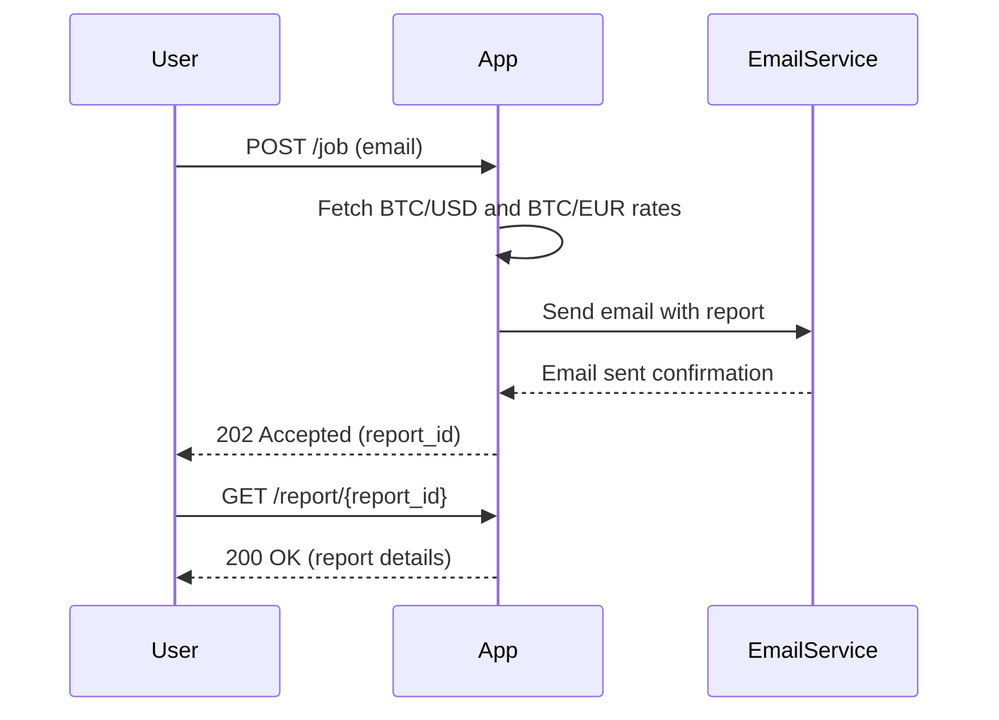

Here’s a well-formatted outline of the final functional requirements for your application, including user stories, API endpoints, and persistence service recommendations.

---

## Functional Requirements

### User Stories

1. **User Story 1: Initiate Report Creation**
   - **As a** user,
   - **I want** to initiate the report creation process,
   - **So that** I can receive the latest Bitcoin conversion rates via email.

2. **User Story 2: Retrieve Report**
   - **As a** user,
   - **I want** to retrieve the stored report by its ID,
   - **So that** I can view the conversion rates.

### API Endpoints

#### 1. POST /job
- **Description**: Initiates the report creation process.
- **Request Format**:
    ```json
    {
      "email": "user@example.com"
    }
    ```
- **Responses**:
  - **Success (HTTP 202)**:
    ```json
    {
      "report_id": "12345",
      "status": "Report is being generated."
    }
    ```
  - **Error (HTTP 400)**:
    ```json
    {
      "error": "Invalid email address."
    }
    ```

#### 2. GET /report/{report_id}
- **Description**: Retrieves the stored report by its ID.
- **Responses**:
  - **Success (HTTP 200)**:
    ```json
    {
      "report_id": "12345",
      "btc_usd": "50000",
      "btc_eur": "42000",
      "timestamp": "2023-10-01T12:00:00Z"
    }
    ```
  - **Error (HTTP 404)**:
    ```json
    {
      "error": "Report not found."
    }
    ```

### Persistence Service

- **Recommended Persistence Service**: **PostgreSQL**
  - **Use Case**: Structured data storage with complex queries and relationships.
  - **Advantages**: 
    - ACID compliance for transactional integrity.
    - Strong querying capabilities with SQL.
    - Support for various data types and relationships.

### Visual Representation of User-App Interaction

#### Sequence Diagram (Mermaid)

```mermaid
sequenceDiagram
    participant User
    participant App
    participant EmailService

    User->>App: POST /job (email)
    App->>App: Fetch BTC/USD and BTC/EUR rates
    App->>EmailService: Send email with report
    EmailService-->>App: Email sent confirmation
    App-->>User: 202 Accepted (report_id)

    User->>App: GET /report/{report_id}
    App-->>User: 200 OK (report details)
```

--- 

This structured outline captures all the essential functional requirements for your application. If you need any more adjustments or additional details, feel free to ask!