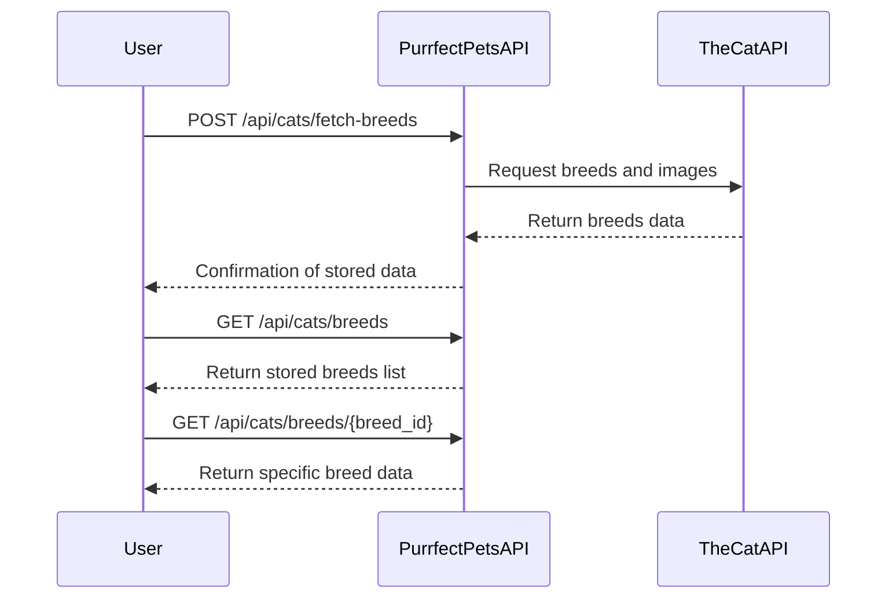

```markdown
# Purrfect Pets API - Functional Requirements

## Overview
The app provides live cat breed information and images fetched from The Cat API. It follows RESTful principles with POST endpoints handling external data fetching and processing, and GET endpoints used only for retrieving stored results.

---

## API Endpoints

### 1. Fetch and Store Cat Breeds Data  
**POST /api/cats/fetch-breeds**  
- Description: Retrieves cat breed data and images from The Cat API and stores it internally for later retrieval.  
- Request Body:  
```json
{}
```  
- Response:  
```json
{
  "status": "success",
  "message": "Breeds data fetched and stored"
}
```

---

### 2. Get All Cat Breeds  
**GET /api/cats/breeds**  
- Description: Returns all stored cat breeds with images.  
- Response:  
```json
[
  {
    "id": "abys",
    "name": "Abyssinian",
    "description": "...",
    "image_url": "https://cdn2.thecatapi.com/images/abys.jpg"
  },
  ...
]
```

---

### 3. Get Cat Breed by ID  
**GET /api/cats/breeds/{breed_id}**  
- Description: Returns specific breed info with image by breed ID.  
- Response:  
```json
{
  "id": "abys",
  "name": "Abyssinian",
  "description": "...",
  "image_url": "https://cdn2.thecatapi.com/images/abys.jpg"
}
```

---

## Data Flow and User Interaction


```mermaid
sequenceDiagram
  participant User
  participant PurrfectPetsAPI
  participant TheCatAPI

  User->>PurrfectPetsAPI: POST /api/cats/fetch-breeds
  PurrfectPetsAPI->>TheCatAPI: Request breeds and images
  TheCatAPI-->>PurrfectPetsAPI: Return breeds data
  PurrfectPetsAPI-->>User: Confirmation of stored data

  User->>PurrfectPetsAPI: GET /api/cats/breeds
  PurrfectPetsAPI-->>User: Return stored breeds list

  User->>PurrfectPetsAPI: GET /api/cats/breeds/{breed_id}
  PurrfectPetsAPI-->>User: Return specific breed data
```

---

## Summary
- POST endpoints trigger external API calls and store data.
- GET endpoints only serve stored data.
- Data includes breed info and images.

---

Example response if you want me to proceed:
```
Please implement the above API endpoints with breed info and images, starting with basic fetch and retrieval.
```
```