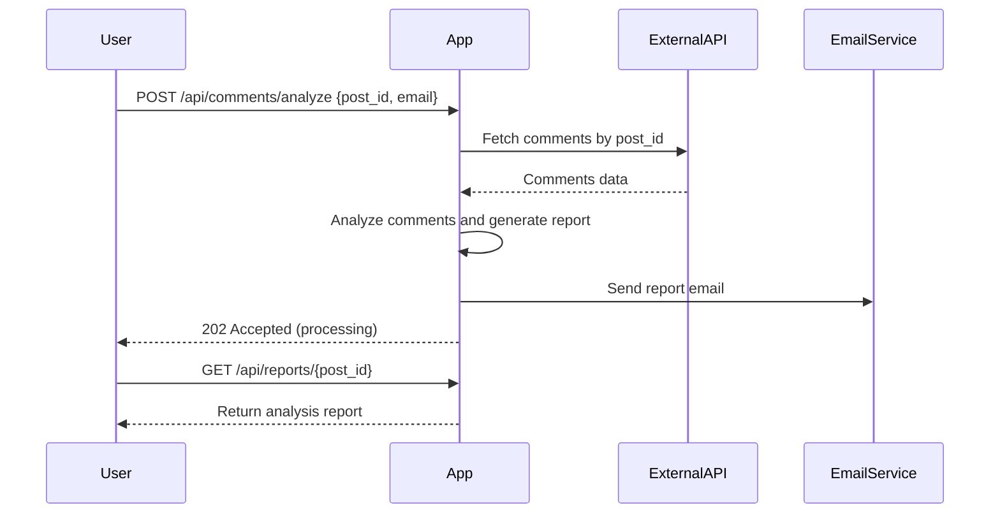

```markdown
# Functional Requirements for Comments Analysis Application

## API Endpoints

### 1. Ingest and Analyze Comments  
**POST** `/api/comments/analyze`  
- **Description:** Fetch comments data from external API by `post_id`, analyze comments, generate a report, and store the result.  
- **Request body:**  
```json
{
  "post_id": 1,
  "email": "user@example.com"
}
```  
- **Response:**  
```json
{
  "status": "processing",
  "message": "Analysis started and email will be sent upon completion."
}
```  

### 2. Retrieve Analysis Report  
**GET** `/api/reports/{post_id}`  
- **Description:** Retrieve the analysis report for a given `post_id`.  
- **Response:**  
```json
{
  "post_id": 1,
  "summary": {
    "total_comments": 5,
    "sentiment_score": 0.75,
    "keywords": ["voluptate", "dolor", "accusantium"]
  },
  "details": [
    {
      "comment_id": 1,
      "sentiment": "positive",
      "keywords": ["magna", "voluptate"]
    }
    // more comments
  ]
}
```

---

## Business Logic Notes  
- The POST `/api/comments/analyze` endpoint triggers:  
  - Fetch comments by `post_id` from external API.  
  - Perform comment analysis (e.g., sentiment, keywords).  
  - Generate and store the report.  
  - Send the report by email automatically.  
- The GET `/api/reports/{post_id}` endpoint returns the stored report.

---

## User-App Interaction Sequence Diagram


```mermaid
sequenceDiagram
    participant User
    participant App
    participant ExternalAPI
    participant EmailService

    User->>App: POST /api/comments/analyze {post_id, email}
    App->>ExternalAPI: Fetch comments by post_id
    ExternalAPI-->>App: Comments data
    App->>App: Analyze comments and generate report
    App->>EmailService: Send report email
    App-->>User: 202 Accepted (processing)
    User->>App: GET /api/reports/{post_id}
    App-->>User: Return analysis report
```

---

## Summary Journey Diagram

```mermaid
flowchart TD
    A[User] -->|Submit post_id + email| B[POST /api/comments/analyze]
    B --> C[Fetch comments from External API]
    C --> D[Analyze comments & generate report]
    D --> E[Store report]
    D --> F[Send report email]
    A -->|Request report| G[GET /api/reports/{post_id}]
    G --> H[Return stored report]
```
```