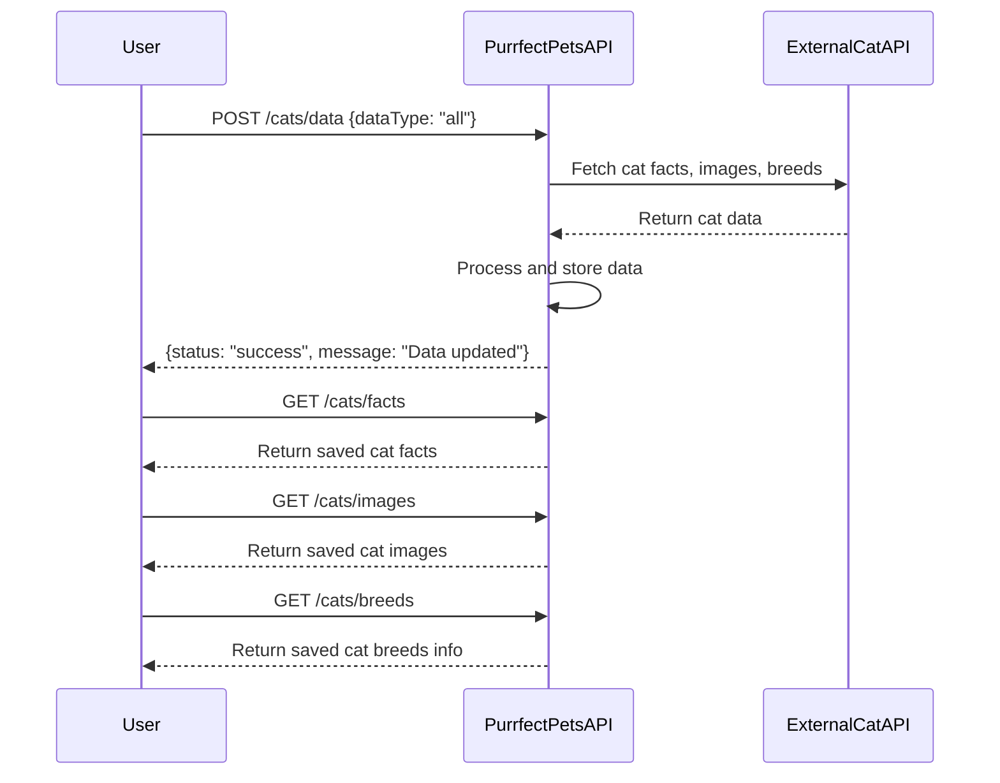

```markdown
# Purrfect Pets API - Functional Requirements

## API Endpoints

### 1. POST /cats/data
- **Description:** Trigger fetching or updating live cat data from external sources (e.g., cat facts, images, breeds). Performs any business logic or calculations.
- **Request:**
  ```json
  {
    "source": "string",       // Optional: specify external source or "all"
    "dataType": "string"      // Optional: "facts", "images", "breeds", or "all"
  }
  ```
- **Response:**
  ```json
  {
    "status": "success",
    "fetchedDataCount": 20,
    "message": "Data updated successfully"
  }
  ```

### 2. GET /cats/facts
- **Description:** Retrieve stored cat facts.
- **Response:**
  ```json
  {
    "facts": [
      "Cats sleep 70% of their lives.",
      "A group of cats is called a clowder."
    ]
  }
  ```

### 3. GET /cats/images
- **Description:** Retrieve stored cat images URLs.
- **Response:**
  ```json
  {
    "images": [
      "https://example.com/cat1.jpg",
      "https://example.com/cat2.jpg"
    ]
  }
  ```

### 4. GET /cats/breeds
- **Description:** Retrieve stored cat breeds information.
- **Response:**
  ```json
  {
    "breeds": [
      {
        "name": "Siamese",
        "origin": "Thailand",
        "description": "Sleek and social cats."
      }
    ]
  }
  ```

---

## User-App Interaction Sequence


```mermaid
sequenceDiagram
    participant User
    participant PurrfectPetsAPI
    participant ExternalCatAPI

    User->>PurrfectPetsAPI: POST /cats/data {dataType: "all"}
    PurrfectPetsAPI->>ExternalCatAPI: Fetch cat facts, images, breeds
    ExternalCatAPI-->>PurrfectPetsAPI: Return cat data
    PurrfectPetsAPI->>PurrfectPetsAPI: Process and store data
    PurrfectPetsAPI-->>User: {status: "success", message: "Data updated"}

    User->>PurrfectPetsAPI: GET /cats/facts
    PurrfectPetsAPI-->>User: Return saved cat facts

    User->>PurrfectPetsAPI: GET /cats/images
    PurrfectPetsAPI-->>User: Return saved cat images

    User->>PurrfectPetsAPI: GET /cats/breeds
    PurrfectPetsAPI-->>User: Return saved cat breeds info
```

---

## User Journey Overview

```mermaid
graph LR
    A[User] --> B[Request data update (POST /cats/data)]
    B --> C[App fetches external cat data]
    C --> D[App stores processed data]
    A --> E[Retrieve cat facts (GET /cats/facts)]
    A --> F[Retrieve cat images (GET /cats/images)]
    A --> G[Retrieve cat breeds info (GET /cats/breeds)]
```
```