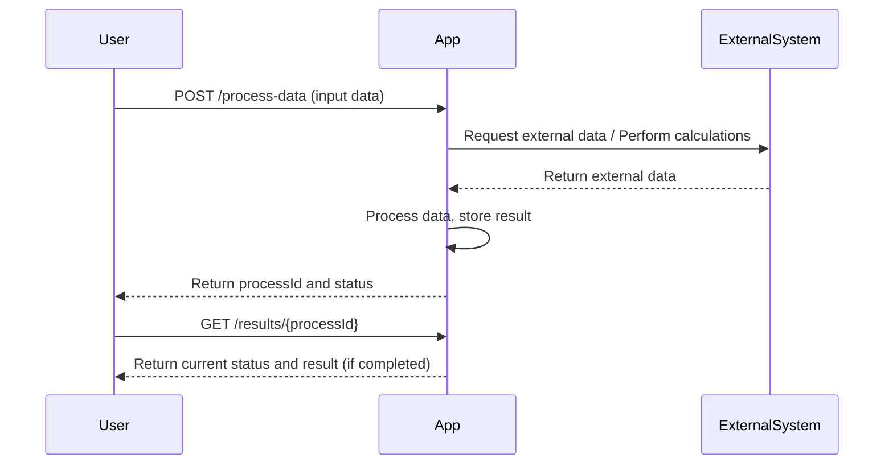

```markdown
# Functional Requirements Specification

## Overview
The application will expose RESTful API endpoints following these rules:
- **POST** endpoints handle business logic, invoke external data sources, perform calculations, and create or update resources.
- **GET** endpoints are used only for retrieving application results and do not invoke external data sources.

---

## API Endpoints

### 1. POST /process-data
- **Description:** Accepts input data, performs business logic including external data retrieval or calculations, and stores the result.
- **Request Body:**  
  ```json
  {
    "input": "string or structured data depending on use case"
  }
  ```
- **Response:**  
  ```json
  {
    "processId": "string (unique identifier)",
    "status": "processing | completed | failed",
    "result": "optional, included if processing is synchronous"
  }
  ```
- **Notes:**  
  - This endpoint triggers the core processing workflow.
  - Processing may be synchronous or asynchronous depending on complexity.

---

### 2. GET /results/{processId}
- **Description:** Retrieves the result of a previously processed request identified by `processId`.
- **Request Parameters:**  
  - `processId` (path parameter): Unique identifier of the processed data.
- **Response:**  
  ```json
  {
    "processId": "string",
    "status": "completed | processing | failed",
    "result": "structured result data or null if not ready"
  }
  ```
- **Notes:**  
  - This endpoint only reads stored application results.
  - No external data calls or calculations are performed here.

---

## User-App Interaction Sequence


```mermaid
sequenceDiagram
    participant User
    participant App
    participant ExternalSystem

    User->>App: POST /process-data (input data)
    App->>ExternalSystem: Request external data / Perform calculations
    ExternalSystem-->>App: Return external data
    App->>App: Process data, store result
    App-->>User: Return processId and status

    User->>App: GET /results/{processId}
    App-->>User: Return current status and result (if completed)
```

---

## Summary

- All business logic and external interactions are triggered via POST /process-data.
- GET /results/{processId} provides read-only access to results.
- The system ensures separation of concerns and adheres to RESTful conventions.
```