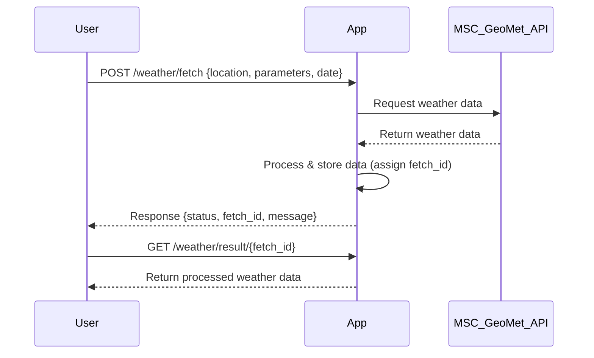
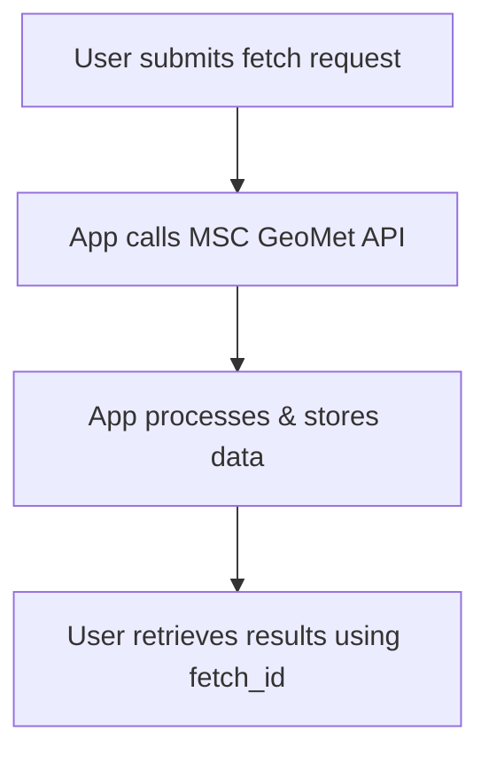

```markdown
# Functional Requirements for Weather Data App (MSC GeoMet)

## API Endpoints

### 1. POST /weather/fetch
- **Purpose:** Trigger fetching weather data from MSC GeoMet API and perform any necessary processing/calculations.
- **Request Body (JSON):**
  ```json
  {
    "location": "string",          // e.g., city name or coordinates
    "parameters": ["string"],      // e.g., ["temperature", "humidity", "wind_speed"]
    "date": "YYYY-MM-DD"           // optional, for specific date forecast or current weather if omitted
  }
  ```
- **Response (JSON):**
  ```json
  {
    "status": "success",
    "fetch_id": "string",          // unique ID to retrieve results later
    "message": "Data fetching started"
  }
  ```

### 2. GET /weather/result/{fetch_id}
- **Purpose:** Retrieve the processed weather data results by fetch ID.
- **Response (JSON):**
  ```json
  {
    "fetch_id": "string",
    "location": "string",
    "parameters": {
      "temperature": 23.4,
      "humidity": 56,
      "wind_speed": 5.4
    },
    "date": "YYYY-MM-DD",
    "retrieved_at": "ISO8601 timestamp"
  }
  ```

---

## Business Logic
- POST endpoint `/weather/fetch` calls MSC GeoMet API with requested parameters.
- Processes and stores the data internally linked to a unique `fetch_id`.
- GET endpoint `/weather/result/{fetch_id}` returns the stored results.

---

## User-App Interaction Sequence


```mermaid
sequenceDiagram
    participant User
    participant App
    participant MSC_GeoMet_API

    User->>App: POST /weather/fetch {location, parameters, date}
    App->>MSC_GeoMet_API: Request weather data
    MSC_GeoMet_API-->>App: Return weather data
    App->>App: Process & store data (assign fetch_id)
    App-->>User: Response {status, fetch_id, message}

    User->>App: GET /weather/result/{fetch_id}
    App-->>User: Return processed weather data
```

---

## User Journey Overview


```mermaid
flowchart TD
    A[User submits fetch request] --> B[App calls MSC GeoMet API]
    B --> C[App processes & stores data]
    C --> D[User retrieves results using fetch_id]
```
```