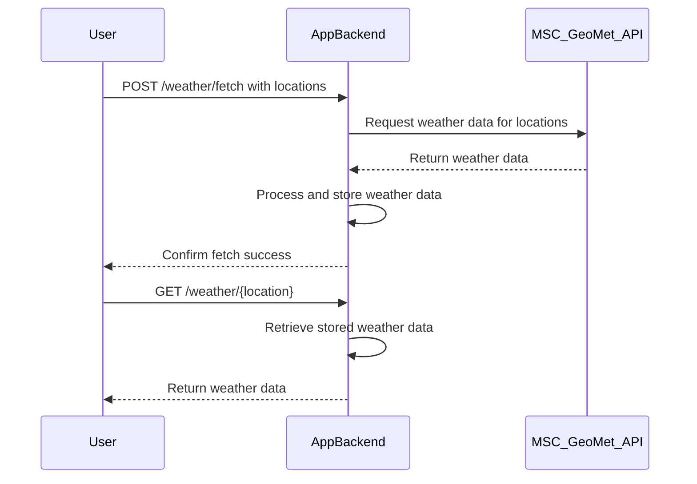

```markdown
# Functional Requirements for Weather Data App

## API Endpoints

### 1. POST /weather/fetch  
**Description:** Trigger fetching weather data from MSC GeoMet API for given locations. Contains business logic for external API call and data processing.  
**Request:**  
```json
{
  "locations": [
    {
      "city": "string",
      "country": "string"
    }
  ]
}
```  
**Response:**  
```json
{
  "status": "success",
  "message": "Weather data fetched and stored successfully",
  "fetchedAt": "ISO8601 timestamp"
}
```

### 2. GET /weather/{location}  
**Description:** Retrieve stored weather data for a specified location. No external calls here, just fetching app results.  
**Request:** None (location in URL path)  
**Response:**  
```json
{
  "location": {
    "city": "string",
    "country": "string"
  },
  "weatherData": {
    "temperature": "number",
    "humidity": "number",
    "conditions": "string",
    "timestamp": "ISO8601 timestamp"
  }
}
```

---

## Business Logic  
- POST `/weather/fetch` invokes MSC GeoMet API for each location, processes data, and stores results in app state.  
- GET `/weather/{location}` reads from stored data and returns latest weather info.

---

## User-App Interaction Sequence


```mermaid
sequenceDiagram
    participant User
    participant AppBackend
    participant MSC_GeoMet_API

    User->>AppBackend: POST /weather/fetch with locations
    AppBackend->>MSC_GeoMet_API: Request weather data for locations
    MSC_GeoMet_API-->>AppBackend: Return weather data
    AppBackend->>AppBackend: Process and store weather data
    AppBackend-->>User: Confirm fetch success

    User->>AppBackend: GET /weather/{location}
    AppBackend->>AppBackend: Retrieve stored weather data
    AppBackend-->>User: Return weather data
```

---

## Summary  
- POST endpoint for external API calls and data processing  
- GET endpoint for retrieving stored results  
- Clear request and response JSON formats  
- Sequence diagram illustrates data flow and interactions

---

Example response you can copy-paste if no other preferences:  
```
- POST /weather/fetch receives list of locations, calls GeoMet API, processes and stores data  
- GET /weather/{location} returns latest stored weather info for that location  
- Request and response formats as described above  
- Sequence diagram matches described interactions
```
```