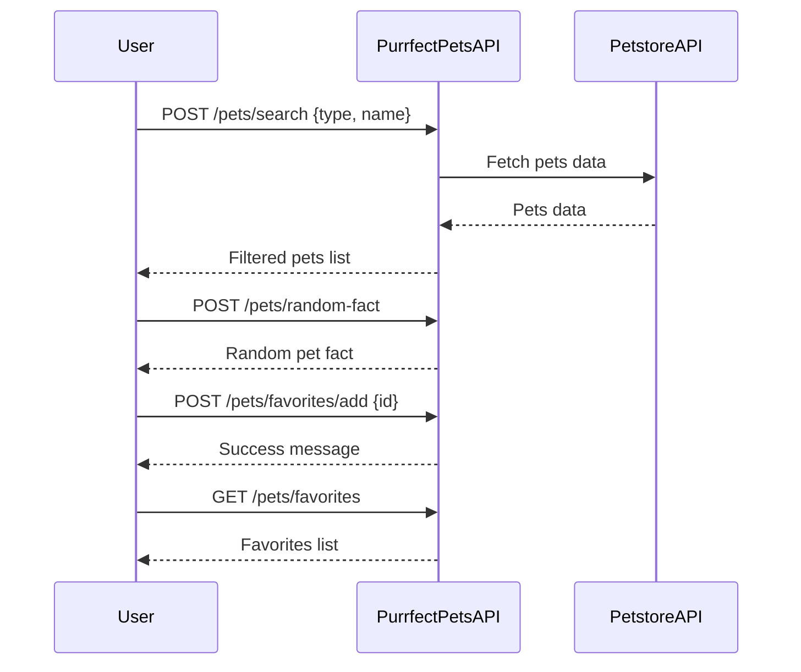

```markdown
# Purrfect Pets API - Functional Requirements

## API Endpoints

### 1. POST /pets/search  
- **Description:** Search for pets by type or name by invoking Petstore API and applying filters.  
- **Request:**  
```json
{
  "type": "string (optional)",
  "name": "string (optional)"
}
```  
- **Response:**  
```json
{
  "pets": [
    {
      "id": "integer",
      "name": "string",
      "type": "string",
      "age": "integer",
      "description": "string"
    }
  ]
}
```

### 2. POST /pets/random-fact  
- **Description:** Returns a fun random pet fact (static or dynamically selected).  
- **Request:**  
```json
{}
```  
- **Response:**  
```json
{
  "fact": "string"
}
```

### 3. GET /pets/favorites  
- **Description:** Retrieve the list of favorited pets stored locally.  
- **Response:**  
```json
{
  "favorites": [
    {
      "id": "integer",
      "name": "string",
      "type": "string",
      "age": "integer"
    }
  ]
}
```

### 4. POST /pets/favorites/add  
- **Description:** Add a pet to favorites (local storage).  
- **Request:**  
```json
{
  "id": "integer"
}
```  
- **Response:**  
```json
{
  "success": true,
  "message": "Pet added to favorites."
}
```

---

## User-App Interaction Sequence


```mermaid
sequenceDiagram
    participant User
    participant PurrfectPetsAPI
    participant PetstoreAPI

    User->>PurrfectPetsAPI: POST /pets/search {type, name}
    PurrfectPetsAPI->>PetstoreAPI: Fetch pets data
    PetstoreAPI-->>PurrfectPetsAPI: Pets data
    PurrfectPetsAPI-->>User: Filtered pets list

    User->>PurrfectPetsAPI: POST /pets/random-fact
    PurrfectPetsAPI-->>User: Random pet fact

    User->>PurrfectPetsAPI: POST /pets/favorites/add {id}
    PurrfectPetsAPI-->>User: Success message

    User->>PurrfectPetsAPI: GET /pets/favorites
    PurrfectPetsAPI-->>User: Favorites list
```

---

## Notes  
- POST endpoints handle all external API calls and business logic.  
- GET endpoints only serve locally stored or calculated data.  
- Data stored locally: favorites list.  
- Petstore API is external data source for pet info.
```